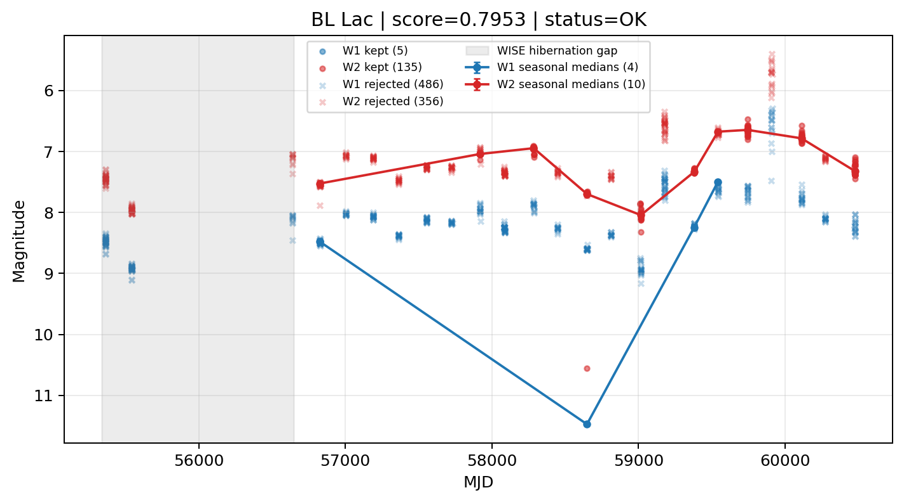

# Candidate Card: BL Lac (Rank 3)

## Basic Metadata

- `source_id`: `BL Lac`
- `canonical_id`: `BL Lac`
- `source_id_normalized`: `BL LAC`
- `canonical_id_normalized`: `BL LAC`
- `score`: `0.795333`
- `status`: `OK`
- `final_label`: `Known blazar`

## Sampling / Variability Summary

- `n_points` (results table): `247`
- `baseline_days`: `5114.36`
- `baseline_years`: `14.002`
- `band_coverage`: `W1,W2`
- `delta_mag`: `0.825`
- `delta_mag_method`: `seasonal_median_flux`

## Coordinates

- `ra`: `330.680400`
- `dec`: `42.277800`
- `coordinate_source`: `benchmark_master`

## WISE Light Curve

## WISE QA / Rejection Accounting

| Metric | Value |
| --- | --- |
| Raw points total | 982 |
| Raw points W1 | 491 |
| Raw points W2 | 491 |
| Kept points total | 140 |
| Kept points W1 | 5 |
| Kept points W2 | 135 |
| Fraction rejected | 0.857434 |
| Reject: missing time | 0 |
| Reject: missing mag | 0 |
| Reject: invalid band | 0 |
| Reject: cc_flags | 842 |
| Reject: qual_frame | 0 |
| Reject: moon_lev | 0 |

## Flag Summary

### `cc_flags`

| value | count | fraction |
| --- | --- | --- |
| hh00 | 694 | 0.706721 |
| h000 | 218 | 0.221996 |
| d000 | 42 | 0.0427699 |
| hg00 | 12 | 0.01222 |
| 0000 | 10 | 0.0101833 |
| HH00 | 2 | 0.00203666 |
| dg00 | 2 | 0.00203666 |
| dd00 | 2 | 0.00203666 |

### `qual_frame`

| value | count | fraction |
| --- | --- | --- |
| <NA> | 982 | 1 |

### `moon_lev`

| value | count | fraction |
| --- | --- | --- |
| 00 | 830 | 0.845214 |
| 0000 | 152 | 0.154786 |

### `qi_fact`

| value | count | fraction |
| --- | --- | --- |
| 1.0 | 588 | 0.598778 |
| 0.5 | 328 | 0.334012 |
| 0.0 | 66 | 0.0672098 |

### `saa_sep`

| value | count | fraction |
| --- | --- | --- |
| 51.0 | 16 | 0.0162933 |
| 68.0 | 12 | 0.01222 |
| 97.0 | 12 | 0.01222 |
| 69.0 | 10 | 0.0101833 |
| 54.0 | 8 | 0.00814664 |
| 50.0 | 8 | 0.00814664 |
| 129.0 | 8 | 0.00814664 |
| 76.0 | 8 | 0.00814664 |

### `ph_qual`

| value | count | fraction |
| --- | --- | --- |
| AA | 830 | 0.845214 |
| <NA> | 152 | 0.154786 |

## Coverage Summary

- Seasonal bins (W1): `4`
- Seasonal bins (W2): `10`
- Pre-gap coverage: `False`
- Post-gap coverage: `True`
- Both-sides coverage: `False`

## Systematics Verdict

- Verdict: `CAUTION`
- Summary: Variability signal is present but data quality/coverage limitations weaken confidence.
- QA-dominated signal check: Not obviously dominated by flagged/low-quality points

Reasons:
- High QA rejection fraction (85.7%)
- No clean coverage on both sides of WISE hibernation gap

## Catalog Checks

- Known blazar match: `YES` via `source_id` token `BL LAC`
- Known CLAGN match: `NO`
- Gaia metrics: not provided / no match

## Final Label

**Known blazar**

- Rank 3 with score=0.7953
- Sampling: n_points=247, baseline_years=14.002344949760436, band_coverage=W1,W2
- QA rejection fraction=85.7% (main causes summarized in card QA section)
- Systematics verdict=CAUTION: Variability signal is present but data quality/coverage limitations weaken confidence.
- Known blazar catalog match=YES
- Dataset metadata class=blazar

## Reproducibility

- `run_timestamp_utc`: `2026-02-27T09:32:13.978969+00:00`
- `results_file`: `data/results.csv`
- `wise_file`: `data/wise/BL Lac.csv`
- `score_threshold`: `0.7`
