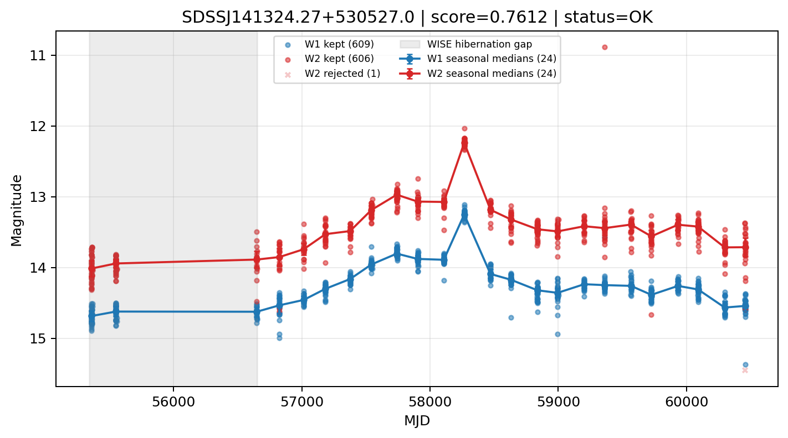

# Candidate Card: SDSSJ141324.27+530527.0 (Rank 4)

## Basic Metadata

- `source_id`: `SDSSJJ141324.27+530527.0`
- `canonical_id`: `SDSSJ141324.27+530527.0`
- `source_id_normalized`: `SDSSJ141324.27+530527.0`
- `score`: `0.761227`
- `status`: `OK`
- `final_label`: `Needs more data`
- `stage_a_positive`: `True`
- `gate_blazar_veto`: `True`
- `gate_wise_qc_pass`: `True`
- `gate_data_sufficient`: `False`
- `decision_trace`: `stage_a_positive=pass;gate_blazar_veto=pass;gate_wise_qc_pass=pass;gate_data_sufficient=fail;gate_state_change_ratio_pass=pass;gate_transient_spike_pass=pass`

## Sampling / Variability Summary

- `n_points` (results table): `404`
- `baseline_days`: `5098.95`
- `baseline_years`: `13.960`
- `band_coverage`: `W1,W2`
- `delta_mag`: `0.092`
- `delta_mag_method`: `seasonal_median_flux`

## Coordinates

- `ra`: `213.351160`
- `dec`: `53.090840`
- `coordinate_source`: `benchmark_master`

## WISE Light Curve

## WISE QA / Rejection Accounting

| Metric | Value |
| --- | --- |
| Raw points total | 1218 |
| Raw points W1 | 609 |
| Raw points W2 | 609 |
| Kept points total | 1215 |
| Kept points W1 | 609 |
| Kept points W2 | 606 |
| Fraction rejected | 0.00246305 |
| Reject: missing time | 0 |
| Reject: missing mag | 2 |
| Reject: invalid band | 0 |
| Reject: cc_flags | 1 |
| Reject: qual_frame | 0 |
| Reject: moon_lev | 0 |

### QA Reject Reason Counts

| reject_reason | count |
| --- | --- |
| reject_cc_flags | 1 |
| reject_invalid_band | 0 |
| reject_missing_mag | 2 |
| reject_missing_time | 0 |
| reject_moon_lev | 0 |
| reject_qual_frame | 0 |

## Flag Summary

### `cc_flags`

| value | count | fraction |
| --- | --- | --- |
| 0000 | 1216 | 0.998358 |
| 0D00 | 2 | 0.00164204 |

### `qual_frame`

| value | count | fraction |
| --- | --- | --- |
| <NA> | 1218 | 1 |

### `moon_lev`

| value | count | fraction |
| --- | --- | --- |
| 00 | 1030 | 0.845649 |
| 0000 | 188 | 0.154351 |

### `qi_fact`

| value | count | fraction |
| --- | --- | --- |
| 1.0 | 884 | 0.72578 |
| 0.5 | 316 | 0.259442 |
| 0.0 | 18 | 0.0147783 |

### `saa_sep`

| value | count | fraction |
| --- | --- | --- |
| 71.0 | 16 | 0.0131363 |
| 76.0 | 12 | 0.00985222 |
| 110.0 | 12 | 0.00985222 |
| 120.0 | 8 | 0.00656814 |
| 111.0 | 8 | 0.00656814 |
| 94.0 | 8 | 0.00656814 |
| 85.0 | 8 | 0.00656814 |
| 101.0 | 8 | 0.00656814 |

### `ph_qual`

| value | count | fraction |
| --- | --- | --- |
| AA | 686 | 0.563218 |
| AB | 320 | 0.262726 |
| <NA> | 188 | 0.154351 |
| BB | 10 | 0.00821018 |
| AU | 6 | 0.00492611 |
| AX | 4 | 0.00328407 |
| UA | 2 | 0.00164204 |
| AC | 2 | 0.00164204 |

## Coverage Summary

- Seasonal bins (W1): `24`
- Seasonal bins (W2): `24`
- Pre-gap coverage: `False`
- Post-gap coverage: `True`
- Both-sides coverage: `False`

## Systematics Verdict

- Verdict: `CAUTION`
- Summary: Variability signal is present but data quality/coverage limitations weaken confidence.
- QA-dominated signal check: Not obviously dominated by flagged/low-quality points

Reasons:
- No clean coverage on both sides of WISE hibernation gap

## Catalog Checks

- Known blazar match: `NO`
- Known CLAGN match: `NO`
- Gaia metrics: not provided / no match

## Final Label

**Needs more data**

- Rank 4 with score=0.7612
- Sampling: n_points=404, baseline_years=13.960157302340855, band_coverage=W1,W2
- QA rejection fraction=0.2% (main causes summarized in card QA section)
- Systematics verdict=CAUTION: Variability signal is present but data quality/coverage limitations weaken confidence.
- Known blazar catalog match=NO
- Dataset metadata class=clagn

## Reproducibility

- `run_timestamp_utc`: `2026-02-28T17:09:43.673413+00:00`
- `results_file`: `data/real_clagn/benchmark_scores.csv`
- `wise_file`: `data/wise/SDSSJ141324.27+530527.0.csv`
- `score_threshold`: `0.0`
- `t_recall`: `0.3493918746`
