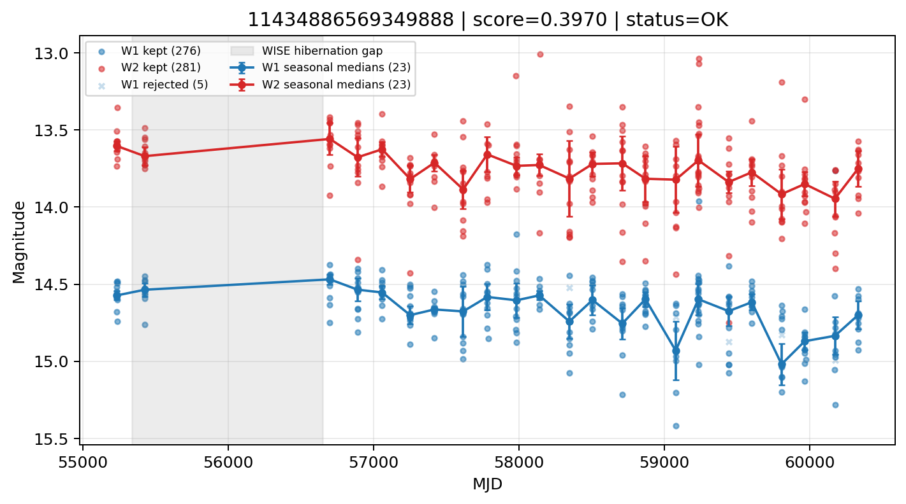

# Candidate Card: 11434886569349888 (Rank 100)

## Basic Metadata

- `source_id`: `11434886569349888`
- `canonical_id`: `11434886569349888`
- `score`: `0.396972`
- `status`: `OK`
- `final_label`: `Rejected`
- `stage_a_positive`: `True`
- `gate_blazar_veto`: `True`
- `gate_wise_qc_pass`: `True`
- `gate_data_sufficient`: `True`
- `decision_trace`: `stage_a_positive=pass;gate_blazar_veto=pass;gate_wise_qc_pass=pass;gate_data_sufficient=pass;gate_state_change_ratio_pass=pass;gate_transient_spike_pass=pass`

## Sampling / Variability Summary

- `n_points` (results table): `155`
- `baseline_days`: `5099.02`
- `baseline_years`: `13.960`
- `band_coverage`: `W1,W2`
- `delta_mag`: `-0.258`
- `delta_mag_method`: `seasonal_median_flux`

## Coordinates

- `ra`: `54.136758`
- `dec`: `8.377478`
- `coordinate_source`: `benchmark_master`

## WISE Light Curve

## WISE QA / Rejection Accounting

| Metric | Value |
| --- | --- |
| Raw points total | 562 |
| Raw points W1 | 281 |
| Raw points W2 | 281 |
| Kept points total | 557 |
| Kept points W1 | 276 |
| Kept points W2 | 281 |
| Fraction rejected | 0.0088968 |
| Reject: missing time | 0 |
| Reject: missing mag | 0 |
| Reject: invalid band | 0 |
| Reject: cc_flags | 5 |
| Reject: qual_frame | 0 |
| Reject: moon_lev | 0 |

### QA Reject Reason Counts

| reject_reason | count |
| --- | --- |
| reject_cc_flags | 5 |
| reject_invalid_band | 0 |
| reject_missing_mag | 0 |
| reject_missing_time | 0 |
| reject_moon_lev | 0 |
| reject_qual_frame | 0 |

## Flag Summary

### `cc_flags`

| value | count | fraction |
| --- | --- | --- |
| 0000 | 552 | 0.982206 |
| g000 | 10 | 0.0177936 |

### `qual_frame`

| value | count | fraction |
| --- | --- | --- |
| <NA> | 562 | 1 |

### `moon_lev`

| value | count | fraction |
| --- | --- | --- |
| 00 | 486 | 0.864769 |
| 0000 | 46 | 0.0818505 |
| 11 | 26 | 0.0462633 |
| 01 | 4 | 0.00711744 |

### `qi_fact`

| value | count | fraction |
| --- | --- | --- |
| 1.0 | 374 | 0.66548 |
| 0.0 | 106 | 0.188612 |
| 0.5 | 82 | 0.145907 |

### `saa_sep`

| value | count | fraction |
| --- | --- | --- |
| 25.0 | 4 | 0.00711744 |
| 115.0 | 4 | 0.00711744 |
| 35.33100128173828 | 2 | 0.00355872 |
| 69.38800048828125 | 2 | 0.00355872 |
| 90.20899963378906 | 2 | 0.00355872 |
| 109.79299926757812 | 2 | 0.00355872 |
| 29.891000747680664 | 2 | 0.00355872 |
| 21.215999603271484 | 2 | 0.00355872 |

### `ph_qual`

| value | count | fraction |
| --- | --- | --- |
| AB | 368 | 0.654804 |
| BB | 82 | 0.145907 |
| <NA> | 46 | 0.0818505 |
| AA | 40 | 0.0711744 |
| BC | 12 | 0.0213523 |
| AC | 6 | 0.0106762 |
| BU | 4 | 0.00711744 |
| AU | 4 | 0.00711744 |

## Coverage Summary

- Seasonal bins (W1): `23`
- Seasonal bins (W2): `23`
- Pre-gap coverage: `True`
- Post-gap coverage: `True`
- Both-sides coverage: `True`

## Systematics Verdict

- Verdict: `PASS`
- Summary: QA-clean points and seasonal coverage support the observed variability signal.
- QA-dominated signal check: Not obviously dominated by flagged/low-quality points

Reasons:
- Seasonal trend supported by sufficient QA-clean W1/W2 points

## Catalog Checks

- Known blazar match: `NO`
- Known CLAGN match: `NO`
- Gaia metrics: not provided / no match

## Final Label

**Rejected**

- Rank 100 with score=0.3970
- Sampling: n_points=155, baseline_years=13.96036742669406, band_coverage=W1,W2
- QA rejection fraction=0.9% (main causes summarized in card QA section)
- Systematics verdict=PASS: QA-clean points and seasonal coverage support the observed variability signal.
- Known blazar catalog match=NO
- Dataset metadata class=star
- Rejected because dataset metadata class=star is a known contaminant class

## Reproducibility

- `run_timestamp_utc`: `2026-02-28T17:09:43.673413+00:00`
- `results_file`: `data/real_clagn/benchmark_scores.csv`
- `wise_file`: `data/wise/11434886569349888.csv`
- `score_threshold`: `0.0`
- `t_recall`: `0.3493918746`
