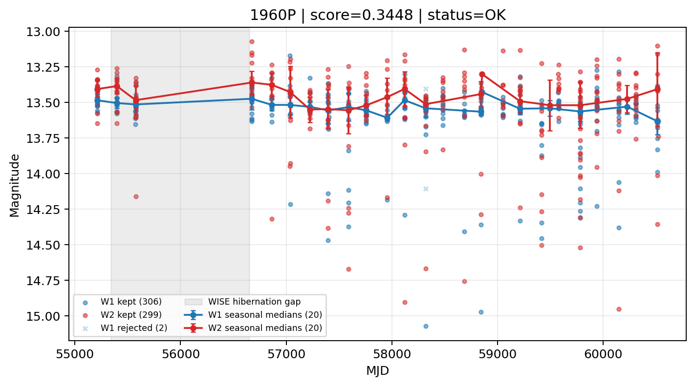

# Candidate Card: 1960P (Rank 108)

## Basic Metadata

- `source_id`: `1960P`
- `canonical_id`: `1960P`
- `score`: `0.344832`
- `status`: `OK`
- `final_label`: `Rejected`
- `stage_a_positive`: `False`
- `gate_blazar_veto`: `True`
- `gate_wise_qc_pass`: `True`
- `gate_data_sufficient`: `True`
- `decision_trace`: `stage_a_positive=fail;gate_blazar_veto=pass;gate_wise_qc_pass=pass;gate_data_sufficient=pass;gate_state_change_ratio_pass=pass;gate_transient_spike_pass=pass`

## Sampling / Variability Summary

- `n_points` (results table): `240`
- `baseline_days`: `5301.10`
- `baseline_years`: `14.514`
- `band_coverage`: `W1,W2`
- `delta_mag`: `-0.052`
- `delta_mag_method`: `seasonal_median_flux`

## Coordinates

- `ra`: `16.541833`
- `dec`: `31.406556`
- `coordinate_source`: `benchmark_master`

## WISE Light Curve

## WISE QA / Rejection Accounting

| Metric | Value |
| --- | --- |
| Raw points total | 616 |
| Raw points W1 | 308 |
| Raw points W2 | 308 |
| Kept points total | 605 |
| Kept points W1 | 306 |
| Kept points W2 | 299 |
| Fraction rejected | 0.0178571 |
| Reject: missing time | 0 |
| Reject: missing mag | 9 |
| Reject: invalid band | 0 |
| Reject: cc_flags | 2 |
| Reject: qual_frame | 0 |
| Reject: moon_lev | 0 |

### QA Reject Reason Counts

| reject_reason | count |
| --- | --- |
| reject_cc_flags | 2 |
| reject_invalid_band | 0 |
| reject_missing_mag | 9 |
| reject_missing_time | 0 |
| reject_moon_lev | 0 |
| reject_qual_frame | 0 |

## Flag Summary

### `cc_flags`

| value | count | fraction |
| --- | --- | --- |
| 0000 | 612 | 0.993506 |
| g000 | 4 | 0.00649351 |

### `qual_frame`

| value | count | fraction |
| --- | --- | --- |
| <NA> | 616 | 1 |

### `moon_lev`

| value | count | fraction |
| --- | --- | --- |
| 00 | 516 | 0.837662 |
| 0000 | 66 | 0.107143 |
| 0111 | 16 | 0.025974 |
| 0011 | 14 | 0.0227273 |
| 01 | 4 | 0.00649351 |

### `qi_fact`

| value | count | fraction |
| --- | --- | --- |
| 1.0 | 528 | 0.857143 |
| 0.5 | 68 | 0.11039 |
| 0.0 | 20 | 0.0324675 |

### `saa_sep`

| value | count | fraction |
| --- | --- | --- |
| 85.0 | 6 | 0.00974026 |
| 60.617000579833984 | 4 | 0.00649351 |
| 52.0 | 4 | 0.00649351 |
| 55.87799835205078 | 4 | 0.00649351 |
| 45.69599914550781 | 4 | 0.00649351 |
| 77.64700317382812 | 4 | 0.00649351 |
| 44.0 | 4 | 0.00649351 |
| 57.58100128173828 | 4 | 0.00649351 |

### `ph_qual`

| value | count | fraction |
| --- | --- | --- |
| AB | 258 | 0.418831 |
| AA | 242 | 0.392857 |
| <NA> | 96 | 0.155844 |
| AC | 14 | 0.0227273 |
| AX | 2 | 0.00324675 |
| BB | 2 | 0.00324675 |
| AU | 2 | 0.00324675 |

## Coverage Summary

- Seasonal bins (W1): `20`
- Seasonal bins (W2): `20`
- Pre-gap coverage: `True`
- Post-gap coverage: `True`
- Both-sides coverage: `True`

## Systematics Verdict

- Verdict: `PASS`
- Summary: QA-clean points and seasonal coverage support the observed variability signal.
- QA-dominated signal check: Not obviously dominated by flagged/low-quality points

Reasons:
- Seasonal trend supported by sufficient QA-clean W1/W2 points

## Catalog Checks

- Known blazar match: `NO`
- Known CLAGN match: `NO`
- Gaia metrics: not provided / no match

## Final Label

**Rejected**

- Rank 108 with score=0.3448
- Sampling: n_points=240, baseline_years=14.513613134620105, band_coverage=W1,W2
- QA rejection fraction=1.8% (main causes summarized in card QA section)
- Systematics verdict=PASS: QA-clean points and seasonal coverage support the observed variability signal.
- Known blazar catalog match=NO
- Dataset metadata class=sn

## Reproducibility

- `run_timestamp_utc`: `2026-02-28T17:09:43.673413+00:00`
- `results_file`: `data/real_clagn/benchmark_scores.csv`
- `wise_file`: `data/wise/1960P.csv`
- `score_threshold`: `0.0`
- `t_recall`: `0.3493918746`
