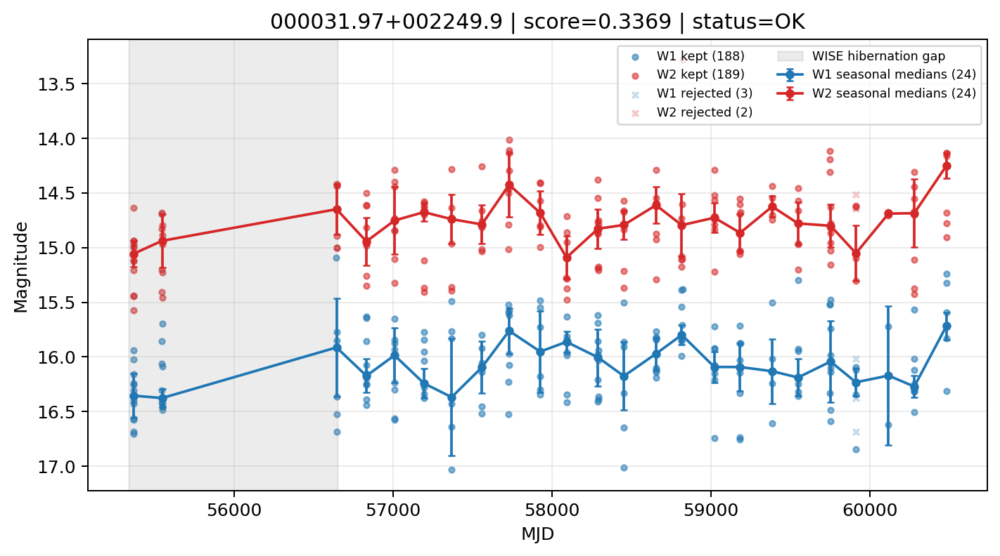

# Candidate Card: 000031.97+002249.9 (Rank 110)

## Basic Metadata

- `source_id`: `000031.97+002249.9`
- `canonical_id`: `000031.97+002249.9`
- `score`: `0.336906`
- `status`: `OK`
- `final_label`: `Rejected`
- `stage_a_positive`: `False`
- `gate_blazar_veto`: `True`
- `gate_wise_qc_pass`: `True`
- `gate_data_sufficient`: `False`
- `decision_trace`: `stage_a_positive=fail;gate_blazar_veto=pass;gate_wise_qc_pass=pass;gate_data_sufficient=fail;gate_state_change_ratio_pass=pass;gate_transient_spike_pass=pass`

## Sampling / Variability Summary

- `n_points` (results table): `95`
- `baseline_days`: `5113.71`
- `baseline_years`: `14.001`
- `band_coverage`: `W1,W2`
- `delta_mag`: `0.115`
- `delta_mag_method`: `seasonal_median_flux`

## Coordinates

- `ra`: `0.133230`
- `dec`: `0.380531`
- `coordinate_source`: `benchmark_master`

## WISE Light Curve

## WISE QA / Rejection Accounting

| Metric | Value |
| --- | --- |
| Raw points total | 382 |
| Raw points W1 | 191 |
| Raw points W2 | 191 |
| Kept points total | 377 |
| Kept points W1 | 188 |
| Kept points W2 | 189 |
| Fraction rejected | 0.013089 |
| Reject: missing time | 0 |
| Reject: missing mag | 0 |
| Reject: invalid band | 0 |
| Reject: cc_flags | 5 |
| Reject: qual_frame | 0 |
| Reject: moon_lev | 0 |

### QA Reject Reason Counts

| reject_reason | count |
| --- | --- |
| reject_cc_flags | 5 |
| reject_invalid_band | 0 |
| reject_missing_mag | 0 |
| reject_missing_time | 0 |
| reject_moon_lev | 0 |
| reject_qual_frame | 0 |

## Flag Summary

### `cc_flags`

| value | count | fraction |
| --- | --- | --- |
| 0000 | 372 | 0.973822 |
| d000 | 6 | 0.0157068 |
| 0d00 | 4 | 0.0104712 |

### `qual_frame`

| value | count | fraction |
| --- | --- | --- |
| <NA> | 382 | 1 |

### `moon_lev`

| value | count | fraction |
| --- | --- | --- |
| 00 | 310 | 0.811518 |
| 0000 | 46 | 0.120419 |
| 11 | 14 | 0.0366492 |
| 01 | 12 | 0.0314136 |

### `qi_fact`

| value | count | fraction |
| --- | --- | --- |
| 1.0 | 288 | 0.753927 |
| 0.5 | 92 | 0.240838 |
| 0.0 | 2 | 0.0052356 |

### `saa_sep`

| value | count | fraction |
| --- | --- | --- |
| 11.937000274658203 | 4 | 0.0104712 |
| 10.0 | 4 | 0.0104712 |
| 46.0 | 4 | 0.0104712 |
| 13.0 | 4 | 0.0104712 |
| 92.0 | 2 | 0.0052356 |
| 26.40999984741211 | 2 | 0.0052356 |
| 103.3740005493164 | 2 | 0.0052356 |
| 61.63999938964844 | 2 | 0.0052356 |

### `ph_qual`

| value | count | fraction |
| --- | --- | --- |
| BU | 138 | 0.361257 |
| BC | 86 | 0.225131 |
| <NA> | 46 | 0.120419 |
| BB | 36 | 0.0942408 |
| CU | 24 | 0.0628272 |
| CC | 18 | 0.0471204 |
| CB | 16 | 0.0418848 |
| UB | 12 | 0.0314136 |

## Coverage Summary

- Seasonal bins (W1): `24`
- Seasonal bins (W2): `24`
- Pre-gap coverage: `False`
- Post-gap coverage: `True`
- Both-sides coverage: `False`

## Systematics Verdict

- Verdict: `CAUTION`
- Summary: Variability signal is present but data quality/coverage limitations weaken confidence.
- QA-dominated signal check: Not obviously dominated by flagged/low-quality points

Reasons:
- No clean coverage on both sides of WISE hibernation gap

## Catalog Checks

- Known blazar match: `NO`
- Known CLAGN match: `NO`
- Gaia metrics: not provided / no match

## Final Label

**Rejected**

- Rank 110 with score=0.3369
- Sampling: n_points=95, baseline_years=14.000574980451756, band_coverage=W1,W2
- QA rejection fraction=1.3% (main causes summarized in card QA section)
- Systematics verdict=CAUTION: Variability signal is present but data quality/coverage limitations weaken confidence.
- Known blazar catalog match=NO
- Dataset metadata class=normal_agn

## Reproducibility

- `run_timestamp_utc`: `2026-02-28T17:09:43.673413+00:00`
- `results_file`: `data/real_clagn/benchmark_scores.csv`
- `wise_file`: `data/wise/000031.97+002249.9.csv`
- `score_threshold`: `0.0`
- `t_recall`: `0.3493918746`
