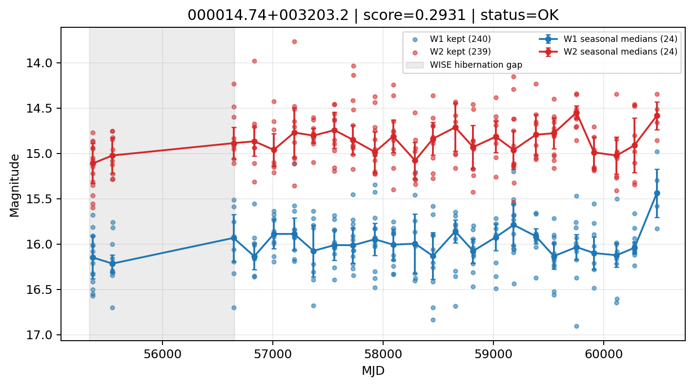

# Candidate Card: 000014.74+003203.2 (Rank 115)

## Basic Metadata

- `source_id`: `000014.74+003203.2`
- `canonical_id`: `000014.74+003203.2`
- `score`: `0.293050`
- `status`: `OK`
- `final_label`: `Rejected`
- `stage_a_positive`: `False`
- `gate_blazar_veto`: `True`
- `gate_wise_qc_pass`: `True`
- `gate_data_sufficient`: `False`
- `decision_trace`: `stage_a_positive=fail;gate_blazar_veto=pass;gate_wise_qc_pass=pass;gate_data_sufficient=fail;gate_state_change_ratio_pass=pass;gate_transient_spike_pass=pass`

## Sampling / Variability Summary

- `n_points` (results table): `118`
- `baseline_days`: `5113.71`
- `baseline_years`: `14.001`
- `band_coverage`: `W1,W2`
- `delta_mag`: `-0.043`
- `delta_mag_method`: `seasonal_median_flux`

## Coordinates

- `ra`: `0.061434`
- `dec`: `0.534246`
- `coordinate_source`: `benchmark_master`

## WISE Light Curve

## WISE QA / Rejection Accounting

| Metric | Value |
| --- | --- |
| Raw points total | 480 |
| Raw points W1 | 240 |
| Raw points W2 | 240 |
| Kept points total | 479 |
| Kept points W1 | 240 |
| Kept points W2 | 239 |
| Fraction rejected | 0.00208333 |
| Reject: missing time | 0 |
| Reject: missing mag | 1 |
| Reject: invalid band | 0 |
| Reject: cc_flags | 0 |
| Reject: qual_frame | 0 |
| Reject: moon_lev | 0 |

### QA Reject Reason Counts

| reject_reason | count |
| --- | --- |
| reject_cc_flags | 0 |
| reject_invalid_band | 0 |
| reject_missing_mag | 1 |
| reject_missing_time | 0 |
| reject_moon_lev | 0 |
| reject_qual_frame | 0 |

## Flag Summary

### `cc_flags`

| value | count | fraction |
| --- | --- | --- |
| 0000 | 480 | 1 |

### `qual_frame`

| value | count | fraction |
| --- | --- | --- |
| <NA> | 480 | 1 |

### `moon_lev`

| value | count | fraction |
| --- | --- | --- |
| 00 | 406 | 0.845833 |
| 0000 | 50 | 0.104167 |
| 11 | 14 | 0.0291667 |
| 01 | 10 | 0.0208333 |

### `qi_fact`

| value | count | fraction |
| --- | --- | --- |
| 1.0 | 330 | 0.6875 |
| 0.5 | 148 | 0.308333 |
| 0.0 | 2 | 0.00416667 |

### `saa_sep`

| value | count | fraction |
| --- | --- | --- |
| 15.0 | 4 | 0.00833333 |
| 10.0 | 4 | 0.00833333 |
| 29.79400062561035 | 4 | 0.00833333 |
| 25.0 | 2 | 0.00416667 |
| 52.108001708984375 | 2 | 0.00416667 |
| 11.61299991607666 | 2 | 0.00416667 |
| 23.304000854492188 | 2 | 0.00416667 |
| 105.81900024414062 | 2 | 0.00416667 |

### `ph_qual`

| value | count | fraction |
| --- | --- | --- |
| BU | 216 | 0.45 |
| BC | 102 | 0.2125 |
| <NA> | 50 | 0.104167 |
| BB | 44 | 0.0916667 |
| CU | 24 | 0.05 |
| CC | 16 | 0.0333333 |
| CB | 12 | 0.025 |
| UC | 6 | 0.0125 |

## Coverage Summary

- Seasonal bins (W1): `24`
- Seasonal bins (W2): `24`
- Pre-gap coverage: `False`
- Post-gap coverage: `True`
- Both-sides coverage: `False`

## Systematics Verdict

- Verdict: `CAUTION`
- Summary: Variability signal is present but data quality/coverage limitations weaken confidence.
- QA-dominated signal check: Not obviously dominated by flagged/low-quality points

Reasons:
- No clean coverage on both sides of WISE hibernation gap

## Catalog Checks

- Known blazar match: `NO`
- Known CLAGN match: `NO`
- Gaia metrics: not provided / no match

## Final Label

**Rejected**

- Rank 115 with score=0.2931
- Sampling: n_points=118, baseline_years=14.000574980451756, band_coverage=W1,W2
- QA rejection fraction=0.2% (main causes summarized in card QA section)
- Systematics verdict=CAUTION: Variability signal is present but data quality/coverage limitations weaken confidence.
- Known blazar catalog match=NO
- Dataset metadata class=normal_agn

## Reproducibility

- `run_timestamp_utc`: `2026-02-28T17:09:43.673413+00:00`
- `results_file`: `data/real_clagn/benchmark_scores.csv`
- `wise_file`: `data/wise/000014.74+003203.2.csv`
- `score_threshold`: `0.0`
- `t_recall`: `0.3493918746`
