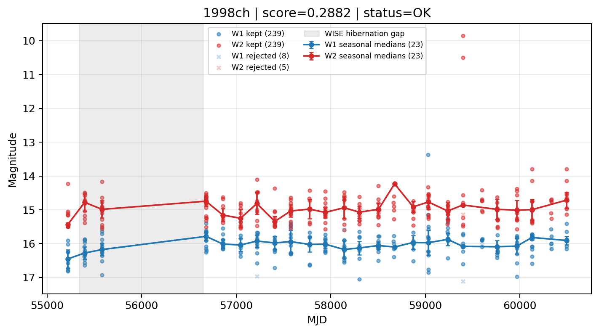

# Candidate Card: 1998ch (Rank 117)

## Basic Metadata

- `source_id`: `1998ch`
- `canonical_id`: `1998ch`
- `source_id_normalized`: `1998CH`
- `canonical_id_normalized`: `1998CH`
- `score`: `0.288207`
- `status`: `OK`
- `final_label`: `Rejected`
- `stage_a_positive`: `False`
- `gate_blazar_veto`: `True`
- `gate_wise_qc_pass`: `True`
- `gate_data_sufficient`: `True`
- `decision_trace`: `stage_a_positive=fail;gate_blazar_veto=pass;gate_wise_qc_pass=pass;gate_data_sufficient=pass;gate_state_change_ratio_pass=pass;gate_transient_spike_pass=pass`

## Sampling / Variability Summary

- `n_points` (results table): `77`
- `baseline_days`: `5274.18`
- `baseline_years`: `14.440`
- `band_coverage`: `W1,W2`
- `delta_mag`: `0.264`
- `delta_mag_method`: `seasonal_median_flux`

## Coordinates

- `ra`: `202.305458`
- `dec`: `-29.290778`
- `coordinate_source`: `benchmark_master`

## WISE Light Curve

## WISE QA / Rejection Accounting

| Metric | Value |
| --- | --- |
| Raw points total | 494 |
| Raw points W1 | 247 |
| Raw points W2 | 247 |
| Kept points total | 478 |
| Kept points W1 | 239 |
| Kept points W2 | 239 |
| Fraction rejected | 0.0323887 |
| Reject: missing time | 0 |
| Reject: missing mag | 3 |
| Reject: invalid band | 0 |
| Reject: cc_flags | 13 |
| Reject: qual_frame | 0 |
| Reject: moon_lev | 0 |

### QA Reject Reason Counts

| reject_reason | count |
| --- | --- |
| reject_cc_flags | 13 |
| reject_invalid_band | 0 |
| reject_missing_mag | 3 |
| reject_missing_time | 0 |
| reject_moon_lev | 0 |
| reject_qual_frame | 0 |

## Flag Summary

### `cc_flags`

| value | count | fraction |
| --- | --- | --- |
| 0000 | 474 | 0.959514 |
| g000 | 6 | 0.0121457 |
| gg00 | 6 | 0.0121457 |
| 0H00 | 4 | 0.00809717 |
| H000 | 2 | 0.00404858 |
| D000 | 2 | 0.00404858 |

### `qual_frame`

| value | count | fraction |
| --- | --- | --- |
| <NA> | 494 | 1 |

### `moon_lev`

| value | count | fraction |
| --- | --- | --- |
| 00 | 398 | 0.805668 |
| 0000 | 60 | 0.121457 |
| 01 | 24 | 0.048583 |
| 0111 | 6 | 0.0121457 |
| 0011 | 6 | 0.0121457 |

### `qi_fact`

| value | count | fraction |
| --- | --- | --- |
| 1.0 | 322 | 0.651822 |
| 0.5 | 170 | 0.34413 |
| 0.0 | 2 | 0.00404858 |

### `saa_sep`

| value | count | fraction |
| --- | --- | --- |
| 78.0 | 6 | 0.0121457 |
| -21.0 | 4 | 0.00809717 |
| 57.0 | 4 | 0.00809717 |
| 86.30000305175781 | 4 | 0.00809717 |
| 41.0 | 4 | 0.00809717 |
| 83.6989974975586 | 4 | 0.00809717 |
| 30.20800018310547 | 2 | 0.00404858 |
| 11.354000091552734 | 2 | 0.00404858 |

### `ph_qual`

| value | count | fraction |
| --- | --- | --- |
| BU | 316 | 0.639676 |
| <NA> | 72 | 0.145749 |
| CU | 40 | 0.0809717 |
| BC | 38 | 0.0769231 |
| CB | 6 | 0.0121457 |
| UU | 6 | 0.0121457 |
| BB | 4 | 0.00809717 |
| CC | 4 | 0.00809717 |

## Coverage Summary

- Seasonal bins (W1): `23`
- Seasonal bins (W2): `23`
- Pre-gap coverage: `True`
- Post-gap coverage: `True`
- Both-sides coverage: `True`

## Systematics Verdict

- Verdict: `PASS`
- Summary: QA-clean points and seasonal coverage support the observed variability signal.
- QA-dominated signal check: Not obviously dominated by flagged/low-quality points

Reasons:
- Seasonal trend supported by sufficient QA-clean W1/W2 points

## Catalog Checks

- Known blazar match: `NO`
- Known CLAGN match: `NO`
- Gaia metrics: not provided / no match

## Final Label

**Rejected**

- Rank 117 with score=0.2882
- Sampling: n_points=77, baseline_years=14.43993052473648, band_coverage=W1,W2
- QA rejection fraction=3.2% (main causes summarized in card QA section)
- Systematics verdict=PASS: QA-clean points and seasonal coverage support the observed variability signal.
- Known blazar catalog match=NO
- Dataset metadata class=sn

## Reproducibility

- `run_timestamp_utc`: `2026-02-28T17:09:43.673413+00:00`
- `results_file`: `data/real_clagn/benchmark_scores.csv`
- `wise_file`: `data/wise/1998ch.csv`
- `score_threshold`: `0.0`
- `t_recall`: `0.3493918746`
