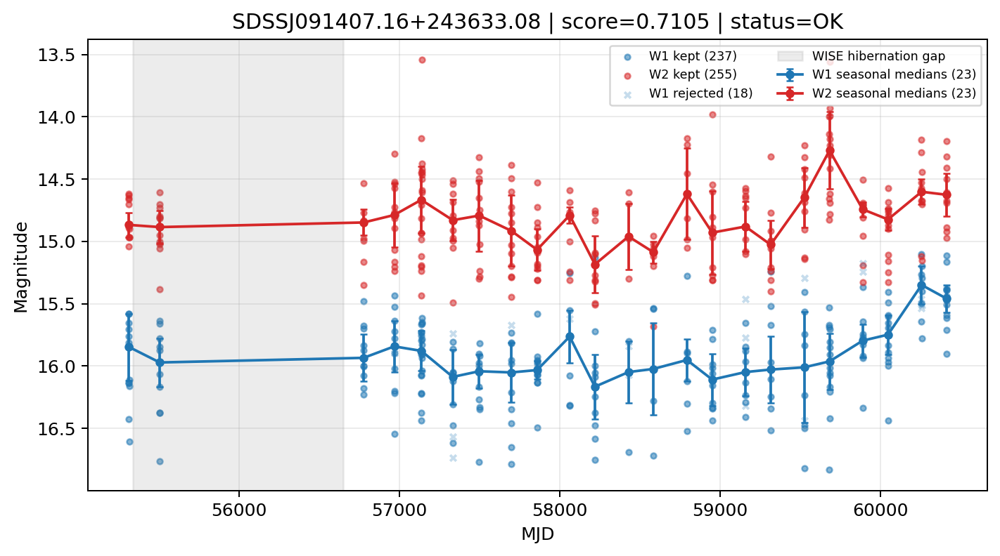

# Candidate Card: SDSSJ091407.16+243633.08 (Rank 11)

## Basic Metadata

- `source_id`: `SDSSJJ091407.16+243633.08`
- `canonical_id`: `SDSSJ091407.16+243633.08`
- `source_id_normalized`: `SDSSJ091407.16+243633.08`
- `score`: `0.710498`
- `status`: `OK`
- `final_label`: `Known AGN`
- `stage_a_positive`: `True`
- `gate_blazar_veto`: `True`
- `gate_wise_qc_pass`: `True`
- `gate_data_sufficient`: `True`
- `decision_trace`: `stage_a_positive=pass;gate_blazar_veto=pass;gate_wise_qc_pass=pass;gate_data_sufficient=pass;gate_state_change_ratio_pass=pass;gate_transient_spike_pass=pass`

## Sampling / Variability Summary

- `n_points` (results table): `160`
- `baseline_days`: `5095.68`
- `baseline_years`: `13.951`
- `band_coverage`: `W1,W2`
- `delta_mag`: `0.473`
- `delta_mag_method`: `seasonal_median_flux`

## Coordinates

- `ra`: `138.529840`
- `dec`: `24.609190`
- `coordinate_source`: `benchmark_master`

## WISE Light Curve

## WISE QA / Rejection Accounting

| Metric | Value |
| --- | --- |
| Raw points total | 512 |
| Raw points W1 | 256 |
| Raw points W2 | 256 |
| Kept points total | 492 |
| Kept points W1 | 237 |
| Kept points W2 | 255 |
| Fraction rejected | 0.0390625 |
| Reject: missing time | 0 |
| Reject: missing mag | 2 |
| Reject: invalid band | 0 |
| Reject: cc_flags | 18 |
| Reject: qual_frame | 0 |
| Reject: moon_lev | 0 |

### QA Reject Reason Counts

| reject_reason | count |
| --- | --- |
| reject_cc_flags | 18 |
| reject_invalid_band | 0 |
| reject_missing_mag | 2 |
| reject_missing_time | 0 |
| reject_moon_lev | 0 |
| reject_qual_frame | 0 |

## Flag Summary

### `cc_flags`

| value | count | fraction |
| --- | --- | --- |
| 0000 | 476 | 0.929688 |
| g000 | 36 | 0.0703125 |

### `qual_frame`

| value | count | fraction |
| --- | --- | --- |
| <NA> | 512 | 1 |

### `moon_lev`

| value | count | fraction |
| --- | --- | --- |
| 00 | 422 | 0.824219 |
| 0000 | 50 | 0.0976562 |
| 11 | 22 | 0.0429688 |
| 01 | 18 | 0.0351562 |

### `qi_fact`

| value | count | fraction |
| --- | --- | --- |
| 1.0 | 454 | 0.886719 |
| 0.5 | 56 | 0.109375 |
| 0.0 | 2 | 0.00390625 |

### `saa_sep`

| value | count | fraction |
| --- | --- | --- |
| 103.0 | 6 | 0.0117188 |
| 81.0 | 4 | 0.0078125 |
| 69.0 | 4 | 0.0078125 |
| 33.0 | 2 | 0.00390625 |
| 59.19900131225586 | 2 | 0.00390625 |
| 103.10199737548828 | 2 | 0.00390625 |
| 71.25900268554688 | 2 | 0.00390625 |
| 126.49199676513672 | 2 | 0.00390625 |

### `ph_qual`

| value | count | fraction |
| --- | --- | --- |
| BU | 166 | 0.324219 |
| BC | 122 | 0.238281 |
| BB | 94 | 0.183594 |
| <NA> | 50 | 0.0976562 |
| CC | 28 | 0.0546875 |
| CU | 16 | 0.03125 |
| UB | 12 | 0.0234375 |
| CB | 12 | 0.0234375 |

## Coverage Summary

- Seasonal bins (W1): `23`
- Seasonal bins (W2): `23`
- Pre-gap coverage: `True`
- Post-gap coverage: `True`
- Both-sides coverage: `True`

## Systematics Verdict

- Verdict: `PASS`
- Summary: QA-clean points and seasonal coverage support the observed variability signal.
- QA-dominated signal check: Not obviously dominated by flagged/low-quality points

Reasons:
- Seasonal trend supported by sufficient QA-clean W1/W2 points

## Catalog Checks

- Known blazar match: `NO`
- Known CLAGN match: `NO`
- Gaia metrics: not provided / no match

## Final Label

**Known AGN**

- Rank 11 with score=0.7105
- Sampling: n_points=160, baseline_years=13.9512129322108, band_coverage=W1,W2
- QA rejection fraction=3.9% (main causes summarized in card QA section)
- Systematics verdict=PASS: QA-clean points and seasonal coverage support the observed variability signal.
- Known blazar catalog match=NO
- Dataset metadata class=clagn

## Reproducibility

- `run_timestamp_utc`: `2026-02-28T17:09:43.673413+00:00`
- `results_file`: `data/real_clagn/benchmark_scores.csv`
- `wise_file`: `data/wise/SDSSJ091407.16+243633.08.csv`
- `score_threshold`: `0.0`
- `t_recall`: `0.3493918746`
