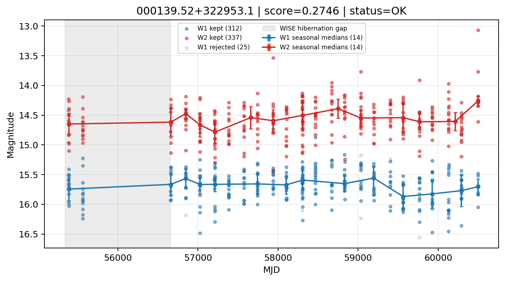

# Candidate Card: 000139.52+322953.1 (Rank 122)

## Basic Metadata

- `source_id`: `000139.52+322953.1`
- `canonical_id`: `000139.52+322953.1`
- `score`: `0.274577`
- `status`: `OK`
- `final_label`: `Rejected`
- `stage_a_positive`: `False`
- `gate_blazar_veto`: `True`
- `gate_wise_qc_pass`: `True`
- `gate_data_sufficient`: `False`
- `decision_trace`: `stage_a_positive=fail;gate_blazar_veto=pass;gate_wise_qc_pass=pass;gate_data_sufficient=fail;gate_state_change_ratio_pass=pass;gate_transient_spike_pass=pass`

## Sampling / Variability Summary

- `n_points` (results table): `186`
- `baseline_days`: `5114.11`
- `baseline_years`: `14.002`
- `band_coverage`: `W1,W2`
- `delta_mag`: `0.133`
- `delta_mag_method`: `seasonal_median_flux`

## Coordinates

- `ra`: `0.414669`
- `dec`: `32.498100`
- `coordinate_source`: `benchmark_master`

## WISE Light Curve

## WISE QA / Rejection Accounting

| Metric | Value |
| --- | --- |
| Raw points total | 674 |
| Raw points W1 | 337 |
| Raw points W2 | 337 |
| Kept points total | 649 |
| Kept points W1 | 312 |
| Kept points W2 | 337 |
| Fraction rejected | 0.037092 |
| Reject: missing time | 0 |
| Reject: missing mag | 0 |
| Reject: invalid band | 0 |
| Reject: cc_flags | 25 |
| Reject: qual_frame | 0 |
| Reject: moon_lev | 0 |

### QA Reject Reason Counts

| reject_reason | count |
| --- | --- |
| reject_cc_flags | 25 |
| reject_invalid_band | 0 |
| reject_missing_mag | 0 |
| reject_missing_time | 0 |
| reject_moon_lev | 0 |
| reject_qual_frame | 0 |

## Flag Summary

### `cc_flags`

| value | count | fraction |
| --- | --- | --- |
| 0000 | 624 | 0.925816 |
| g000 | 50 | 0.074184 |

### `qual_frame`

| value | count | fraction |
| --- | --- | --- |
| <NA> | 674 | 1 |

### `moon_lev`

| value | count | fraction |
| --- | --- | --- |
| 00 | 620 | 0.919881 |
| 0000 | 54 | 0.0801187 |

### `qi_fact`

| value | count | fraction |
| --- | --- | --- |
| 1.0 | 428 | 0.635015 |
| 0.5 | 212 | 0.31454 |
| 0.0 | 34 | 0.0504451 |

### `saa_sep`

| value | count | fraction |
| --- | --- | --- |
| 42.0 | 6 | 0.00890208 |
| 99.0 | 6 | 0.00890208 |
| 47.867000579833984 | 4 | 0.00593472 |
| 38.0 | 4 | 0.00593472 |
| 62.0 | 4 | 0.00593472 |
| 119.0 | 2 | 0.00296736 |
| 70.89399719238281 | 2 | 0.00296736 |
| 42.52899932861328 | 2 | 0.00296736 |

### `ph_qual`

| value | count | fraction |
| --- | --- | --- |
| BB | 428 | 0.635015 |
| BC | 128 | 0.189911 |
| <NA> | 54 | 0.0801187 |
| BU | 48 | 0.0712166 |
| UB | 6 | 0.00890208 |
| CU | 4 | 0.00593472 |
| CB | 4 | 0.00593472 |
| AB | 2 | 0.00296736 |

## Coverage Summary

- Seasonal bins (W1): `14`
- Seasonal bins (W2): `14`
- Pre-gap coverage: `False`
- Post-gap coverage: `True`
- Both-sides coverage: `False`

## Systematics Verdict

- Verdict: `CAUTION`
- Summary: Variability signal is present but data quality/coverage limitations weaken confidence.
- QA-dominated signal check: Not obviously dominated by flagged/low-quality points

Reasons:
- No clean coverage on both sides of WISE hibernation gap

## Catalog Checks

- Known blazar match: `NO`
- Known CLAGN match: `NO`
- Gaia metrics: not provided / no match

## Final Label

**Rejected**

- Rank 122 with score=0.2746
- Sampling: n_points=186, baseline_years=14.00167465809721, band_coverage=W1,W2
- QA rejection fraction=3.7% (main causes summarized in card QA section)
- Systematics verdict=CAUTION: Variability signal is present but data quality/coverage limitations weaken confidence.
- Known blazar catalog match=NO
- Dataset metadata class=normal_agn

## Reproducibility

- `run_timestamp_utc`: `2026-02-28T17:09:43.673413+00:00`
- `results_file`: `data/real_clagn/benchmark_scores.csv`
- `wise_file`: `data/wise/000139.52+322953.1.csv`
- `score_threshold`: `0.0`
- `t_recall`: `0.3493918746`
