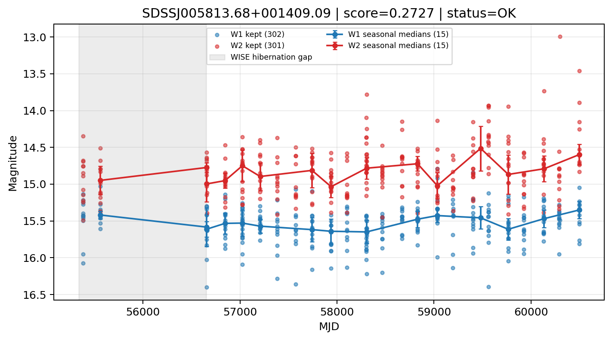

# Candidate Card: SDSSJ005813.68+001409.09 (Rank 125)

## Basic Metadata

- `source_id`: `SDSSJJ005813.68+001409.09`
- `canonical_id`: `SDSSJ005813.68+001409.09`
- `source_id_normalized`: `SDSSJ005813.68+001409.09`
- `score`: `0.272742`
- `status`: `OK`
- `final_label`: `Rejected`
- `stage_a_positive`: `False`
- `gate_blazar_veto`: `True`
- `gate_wise_qc_pass`: `True`
- `gate_data_sufficient`: `False`
- `decision_trace`: `stage_a_positive=fail;gate_blazar_veto=pass;gate_wise_qc_pass=pass;gate_data_sufficient=fail;gate_state_change_ratio_pass=pass;gate_transient_spike_pass=pass`

## Sampling / Variability Summary

- `n_points` (results table): `83`
- `baseline_days`: `5114.02`
- `baseline_years`: `14.001`
- `band_coverage`: `W1,W2`
- `delta_mag`: `0.076`
- `delta_mag_method`: `seasonal_median_flux`

## Coordinates

- `ra`: `14.557030`
- `dec`: `0.235860`
- `coordinate_source`: `benchmark_master`

## WISE Light Curve

## WISE QA / Rejection Accounting

| Metric | Value |
| --- | --- |
| Raw points total | 604 |
| Raw points W1 | 302 |
| Raw points W2 | 302 |
| Kept points total | 603 |
| Kept points W1 | 302 |
| Kept points W2 | 301 |
| Fraction rejected | 0.00165563 |
| Reject: missing time | 0 |
| Reject: missing mag | 1 |
| Reject: invalid band | 0 |
| Reject: cc_flags | 0 |
| Reject: qual_frame | 0 |
| Reject: moon_lev | 0 |

### QA Reject Reason Counts

| reject_reason | count |
| --- | --- |
| reject_cc_flags | 0 |
| reject_invalid_band | 0 |
| reject_missing_mag | 1 |
| reject_missing_time | 0 |
| reject_moon_lev | 0 |
| reject_qual_frame | 0 |

## Flag Summary

### `cc_flags`

| value | count | fraction |
| --- | --- | --- |
| 0000 | 604 | 1 |

### `qual_frame`

| value | count | fraction |
| --- | --- | --- |
| <NA> | 604 | 1 |

### `moon_lev`

| value | count | fraction |
| --- | --- | --- |
| 00 | 514 | 0.850993 |
| 0000 | 46 | 0.0761589 |
| 11 | 24 | 0.0397351 |
| 01 | 16 | 0.0264901 |
| 0011 | 4 | 0.00662252 |

### `qi_fact`

| value | count | fraction |
| --- | --- | --- |
| 0.5 | 354 | 0.586093 |
| 1.0 | 206 | 0.34106 |
| 0.0 | 44 | 0.0728477 |

### `saa_sep`

| value | count | fraction |
| --- | --- | --- |
| 7.0 | 4 | 0.00662252 |
| 102.0 | 4 | 0.00662252 |
| 19.0 | 2 | 0.00331126 |
| 90.2979965209961 | 2 | 0.00331126 |
| 35.77299880981445 | 2 | 0.00331126 |
| 106.26899719238281 | 2 | 0.00331126 |
| 124.54499816894531 | 2 | 0.00331126 |
| 27.125 | 2 | 0.00331126 |

### `ph_qual`

| value | count | fraction |
| --- | --- | --- |
| BU | 282 | 0.466887 |
| BC | 166 | 0.274834 |
| BB | 82 | 0.135762 |
| <NA> | 50 | 0.0827815 |
| CU | 12 | 0.0198675 |
| CB | 4 | 0.00662252 |
| CC | 4 | 0.00662252 |
| AU | 2 | 0.00331126 |

## Coverage Summary

- Seasonal bins (W1): `15`
- Seasonal bins (W2): `15`
- Pre-gap coverage: `False`
- Post-gap coverage: `True`
- Both-sides coverage: `False`

## Systematics Verdict

- Verdict: `CAUTION`
- Summary: Variability signal is present but data quality/coverage limitations weaken confidence.
- QA-dominated signal check: Not obviously dominated by flagged/low-quality points

Reasons:
- No clean coverage on both sides of WISE hibernation gap

## Catalog Checks

- Known blazar match: `NO`
- Known CLAGN match: `NO`
- Gaia metrics: not provided / no match

## Final Label

**Rejected**

- Rank 125 with score=0.2727
- Sampling: n_points=83, baseline_years=14.001427470855589, band_coverage=W1,W2
- QA rejection fraction=0.2% (main causes summarized in card QA section)
- Systematics verdict=CAUTION: Variability signal is present but data quality/coverage limitations weaken confidence.
- Known blazar catalog match=NO
- Dataset metadata class=clagn

## Reproducibility

- `run_timestamp_utc`: `2026-02-28T17:09:43.673413+00:00`
- `results_file`: `data/real_clagn/benchmark_scores.csv`
- `wise_file`: `data/wise/SDSSJ005813.68+001409.09.csv`
- `score_threshold`: `0.0`
- `t_recall`: `0.3493918746`
