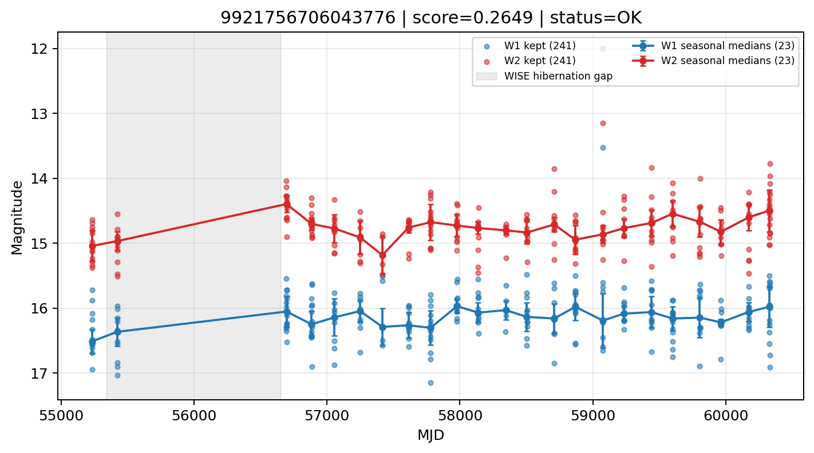

# Candidate Card: 9921756706043776 (Rank 129)

## Basic Metadata

- `source_id`: `9921756706043776`
- `canonical_id`: `9921756706043776`
- `score`: `0.264947`
- `status`: `OK`
- `final_label`: `Rejected`
- `stage_a_positive`: `False`
- `gate_blazar_veto`: `True`
- `gate_wise_qc_pass`: `True`
- `gate_data_sufficient`: `True`
- `decision_trace`: `stage_a_positive=fail;gate_blazar_veto=pass;gate_wise_qc_pass=pass;gate_data_sufficient=pass;gate_state_change_ratio_pass=pass;gate_transient_spike_pass=pass`

## Sampling / Variability Summary

- `n_points` (results table): `103`
- `baseline_days`: `5098.83`
- `baseline_years`: `13.960`
- `band_coverage`: `W1,W2`
- `delta_mag`: `0.184`
- `delta_mag_method`: `seasonal_median_flux`

## Coordinates

- `ra`: `51.670465`
- `dec`: `7.444067`
- `coordinate_source`: `benchmark_master`

## WISE Light Curve

## WISE QA / Rejection Accounting

| Metric | Value |
| --- | --- |
| Raw points total | 482 |
| Raw points W1 | 241 |
| Raw points W2 | 241 |
| Kept points total | 482 |
| Kept points W1 | 241 |
| Kept points W2 | 241 |
| Fraction rejected | 0 |
| Reject: missing time | 0 |
| Reject: missing mag | 0 |
| Reject: invalid band | 0 |
| Reject: cc_flags | 0 |
| Reject: qual_frame | 0 |
| Reject: moon_lev | 0 |

### QA Reject Reason Counts

| reject_reason | count |
| --- | --- |
| reject_cc_flags | 0 |
| reject_invalid_band | 0 |
| reject_missing_mag | 0 |
| reject_missing_time | 0 |
| reject_moon_lev | 0 |
| reject_qual_frame | 0 |

## Flag Summary

### `cc_flags`

| value | count | fraction |
| --- | --- | --- |
| 0000 | 482 | 1 |

### `qual_frame`

| value | count | fraction |
| --- | --- | --- |
| <NA> | 482 | 1 |

### `moon_lev`

| value | count | fraction |
| --- | --- | --- |
| 00 | 382 | 0.792531 |
| 0000 | 46 | 0.0954357 |
| 11 | 32 | 0.06639 |
| 01 | 22 | 0.0456432 |

### `qi_fact`

| value | count | fraction |
| --- | --- | --- |
| 1.0 | 332 | 0.688797 |
| 0.5 | 104 | 0.215768 |
| 0.0 | 46 | 0.0954357 |

### `saa_sep`

| value | count | fraction |
| --- | --- | --- |
| 47.12099838256836 | 4 | 0.00829876 |
| 84.8550033569336 | 4 | 0.00829876 |
| 12.0 | 4 | 0.00829876 |
| 118.7969970703125 | 2 | 0.00414938 |
| 18.89299964904785 | 2 | 0.00414938 |
| 103.12000274658203 | 2 | 0.00414938 |
| 43.56399917602539 | 2 | 0.00414938 |
| 16.15999984741211 | 2 | 0.00414938 |

### `ph_qual`

| value | count | fraction |
| --- | --- | --- |
| BU | 112 | 0.232365 |
| BB | 108 | 0.224066 |
| BC | 90 | 0.186722 |
| <NA> | 46 | 0.0954357 |
| CB | 38 | 0.0788382 |
| CC | 34 | 0.0705394 |
| CU | 20 | 0.0414938 |
| UC | 14 | 0.0290456 |

## Coverage Summary

- Seasonal bins (W1): `23`
- Seasonal bins (W2): `23`
- Pre-gap coverage: `True`
- Post-gap coverage: `True`
- Both-sides coverage: `True`

## Systematics Verdict

- Verdict: `PASS`
- Summary: QA-clean points and seasonal coverage support the observed variability signal.
- QA-dominated signal check: Not obviously dominated by flagged/low-quality points

Reasons:
- Seasonal trend supported by sufficient QA-clean W1/W2 points

## Catalog Checks

- Known blazar match: `NO`
- Known CLAGN match: `NO`
- Gaia metrics: not provided / no match

## Final Label

**Rejected**

- Rank 129 with score=0.2649
- Sampling: n_points=103, baseline_years=13.959827736810414, band_coverage=W1,W2
- QA rejection fraction=0.0% (main causes summarized in card QA section)
- Systematics verdict=PASS: QA-clean points and seasonal coverage support the observed variability signal.
- Known blazar catalog match=NO
- Dataset metadata class=star

## Reproducibility

- `run_timestamp_utc`: `2026-02-28T17:09:43.673413+00:00`
- `results_file`: `data/real_clagn/benchmark_scores.csv`
- `wise_file`: `data/wise/9921756706043776.csv`
- `score_threshold`: `0.0`
- `t_recall`: `0.3493918746`
