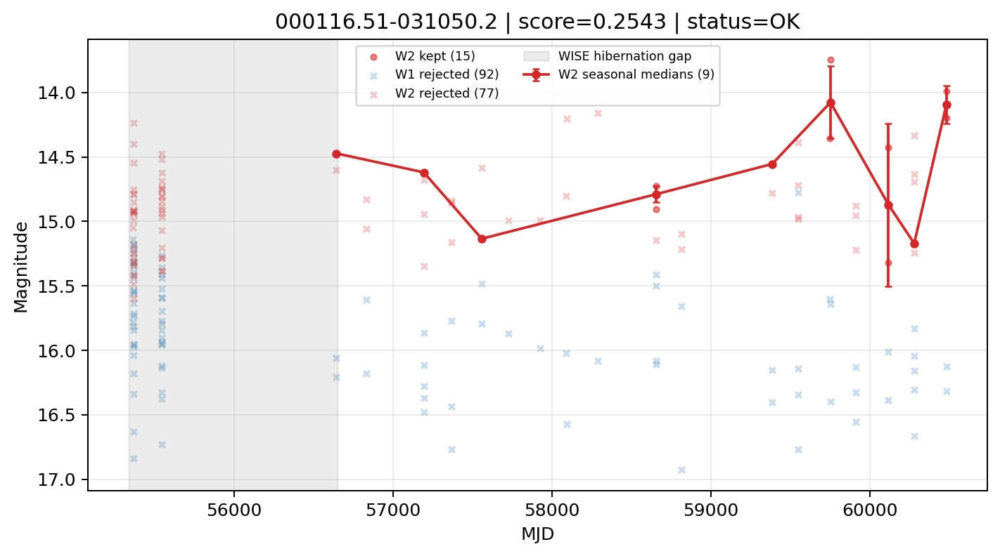

# Candidate Card: 000116.51-031050.2 (Rank 133)

## Basic Metadata

- `source_id`: `000116.51-031050.2`
- `canonical_id`: `000116.51-031050.2`
- `score`: `0.254291`
- `status`: `OK`
- `final_label`: `Rejected`
- `stage_a_positive`: `False`
- `gate_blazar_veto`: `True`
- `gate_wise_qc_pass`: `True`
- `gate_data_sufficient`: `False`
- `decision_trace`: `stage_a_positive=fail;gate_blazar_veto=pass;gate_wise_qc_pass=pass;gate_data_sufficient=fail;gate_state_change_ratio_pass=pass;gate_transient_spike_pass=pass`

## Sampling / Variability Summary

- `n_points` (results table): `43`
- `baseline_days`: `4911.61`
- `baseline_years`: `13.447`
- `band_coverage`: `W1,W2`
- `delta_mag`: `0.000`
- `delta_mag_method`: `seasonal_median_flux`

## Coordinates

- `ra`: `0.318829`
- `dec`: `-3.180623`
- `coordinate_source`: `benchmark_master`

## WISE Light Curve

## WISE QA / Rejection Accounting

| Metric | Value |
| --- | --- |
| Raw points total | 184 |
| Raw points W1 | 92 |
| Raw points W2 | 92 |
| Kept points total | 15 |
| Kept points W1 | 0 |
| Kept points W2 | 15 |
| Fraction rejected | 0.918478 |
| Reject: missing time | 0 |
| Reject: missing mag | 0 |
| Reject: invalid band | 0 |
| Reject: cc_flags | 169 |
| Reject: qual_frame | 0 |
| Reject: moon_lev | 0 |

### QA Reject Reason Counts

| reject_reason | count |
| --- | --- |
| reject_cc_flags | 169 |
| reject_invalid_band | 0 |
| reject_missing_mag | 0 |
| reject_missing_time | 0 |
| reject_moon_lev | 0 |
| reject_qual_frame | 0 |

## Flag Summary

### `cc_flags`

| value | count | fraction |
| --- | --- | --- |
| hH00 | 92 | 0.5 |
| HH00 | 58 | 0.315217 |
| H000 | 30 | 0.163043 |
| Hh00 | 4 | 0.0217391 |

### `qual_frame`

| value | count | fraction |
| --- | --- | --- |
| <NA> | 184 | 1 |

### `moon_lev`

| value | count | fraction |
| --- | --- | --- |
| 00 | 86 | 0.467391 |
| 0000 | 72 | 0.391304 |
| 0011 | 20 | 0.108696 |
| 11 | 4 | 0.0217391 |
| 01 | 2 | 0.0108696 |

### `qi_fact`

| value | count | fraction |
| --- | --- | --- |
| 1.0 | 130 | 0.706522 |
| 0.5 | 48 | 0.26087 |
| 0.0 | 6 | 0.0326087 |

### `saa_sep`

| value | count | fraction |
| --- | --- | --- |
| 71.0 | 8 | 0.0434783 |
| 2.0 | 8 | 0.0434783 |
| 40.0 | 8 | 0.0434783 |
| 83.0 | 8 | 0.0434783 |
| 92.0 | 4 | 0.0217391 |
| 9.0 | 4 | 0.0217391 |
| 32.0 | 4 | 0.0217391 |
| 25.0 | 4 | 0.0217391 |

### `ph_qual`

| value | count | fraction |
| --- | --- | --- |
| <NA> | 92 | 0.5 |
| BC | 28 | 0.152174 |
| UC | 16 | 0.0869565 |
| BU | 12 | 0.0652174 |
| UB | 12 | 0.0652174 |
| BB | 6 | 0.0326087 |
| CB | 6 | 0.0326087 |
| UU | 4 | 0.0217391 |

## Coverage Summary

- Seasonal bins (W1): `0`
- Seasonal bins (W2): `9`
- Pre-gap coverage: `False`
- Post-gap coverage: `True`
- Both-sides coverage: `False`

## Systematics Verdict

- Verdict: `CAUTION`
- Summary: Variability signal is present but data quality/coverage limitations weaken confidence.
- QA-dominated signal check: Not obviously dominated by flagged/low-quality points

Reasons:
- High QA rejection fraction (91.8%)
- No clean coverage on both sides of WISE hibernation gap
- Only one band has usable seasonal support

## Catalog Checks

- Known blazar match: `NO`
- Known CLAGN match: `NO`
- Gaia metrics: not provided / no match

## Final Label

**Rejected**

- Rank 133 with score=0.2543
- Sampling: n_points=43, baseline_years=13.447257462861067, band_coverage=W1,W2
- QA rejection fraction=91.8% (main causes summarized in card QA section)
- Systematics verdict=CAUTION: Variability signal is present but data quality/coverage limitations weaken confidence.
- Known blazar catalog match=NO
- Dataset metadata class=normal_agn

## Reproducibility

- `run_timestamp_utc`: `2026-02-28T17:09:43.673413+00:00`
- `results_file`: `data/real_clagn/benchmark_scores.csv`
- `wise_file`: `data/wise/000116.51-031050.2.csv`
- `score_threshold`: `0.0`
- `t_recall`: `0.3493918746`
