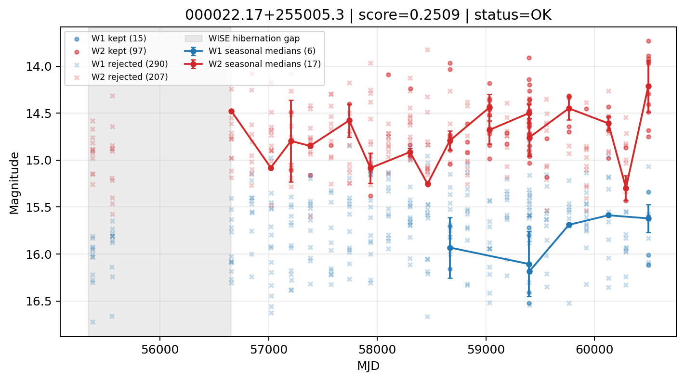

# Candidate Card: 000022.17+255005.3 (Rank 135)

## Basic Metadata

- `source_id`: `000022.17+255005.3`
- `canonical_id`: `000022.17+255005.3`
- `score`: `0.250891`
- `status`: `OK`
- `final_label`: `Rejected`
- `stage_a_positive`: `False`
- `gate_blazar_veto`: `True`
- `gate_wise_qc_pass`: `True`
- `gate_data_sufficient`: `False`
- `decision_trace`: `stage_a_positive=fail;gate_blazar_veto=pass;gate_wise_qc_pass=pass;gate_data_sufficient=fail;gate_state_change_ratio_pass=pass;gate_transient_spike_pass=pass`

## Sampling / Variability Summary

- `n_points` (results table): `221`
- `baseline_days`: `5116.75`
- `baseline_years`: `14.009`
- `band_coverage`: `W1,W2`
- `delta_mag`: `0.046`
- `delta_mag_method`: `seasonal_median_flux`

## Coordinates

- `ra`: `0.092398`
- `dec`: `25.834825`
- `coordinate_source`: `benchmark_master`

## WISE Light Curve

## WISE QA / Rejection Accounting

| Metric | Value |
| --- | --- |
| Raw points total | 610 |
| Raw points W1 | 305 |
| Raw points W2 | 305 |
| Kept points total | 112 |
| Kept points W1 | 15 |
| Kept points W2 | 97 |
| Fraction rejected | 0.816393 |
| Reject: missing time | 0 |
| Reject: missing mag | 1 |
| Reject: invalid band | 0 |
| Reject: cc_flags | 497 |
| Reject: qual_frame | 0 |
| Reject: moon_lev | 0 |

### QA Reject Reason Counts

| reject_reason | count |
| --- | --- |
| reject_cc_flags | 497 |
| reject_invalid_band | 0 |
| reject_missing_mag | 1 |
| reject_missing_time | 0 |
| reject_moon_lev | 0 |
| reject_qual_frame | 0 |

## Flag Summary

### `cc_flags`

| value | count | fraction |
| --- | --- | --- |
| HH00 | 368 | 0.603279 |
| H000 | 166 | 0.272131 |
| HHH0 | 46 | 0.0754098 |
| 0000 | 30 | 0.0491803 |

### `qual_frame`

| value | count | fraction |
| --- | --- | --- |
| <NA> | 610 | 1 |

### `moon_lev`

| value | count | fraction |
| --- | --- | --- |
| 00 | 564 | 0.92459 |
| 0000 | 32 | 0.052459 |
| 0011 | 14 | 0.0229508 |

### `qi_fact`

| value | count | fraction |
| --- | --- | --- |
| 1.0 | 528 | 0.865574 |
| 0.5 | 74 | 0.121311 |
| 0.0 | 8 | 0.0131148 |

### `saa_sep`

| value | count | fraction |
| --- | --- | --- |
| 62.2760009765625 | 4 | 0.00655738 |
| 93.43499755859375 | 4 | 0.00655738 |
| 66.0 | 4 | 0.00655738 |
| 33.0 | 4 | 0.00655738 |
| 81.0 | 4 | 0.00655738 |
| 80.85600280761719 | 4 | 0.00655738 |
| 31.0 | 2 | 0.00327869 |
| 109.40299987792969 | 2 | 0.00327869 |

### `ph_qual`

| value | count | fraction |
| --- | --- | --- |
| BU | 192 | 0.314754 |
| BC | 164 | 0.268852 |
| BB | 128 | 0.209836 |
| <NA> | 46 | 0.0754098 |
| CU | 24 | 0.0393443 |
| UB | 14 | 0.0229508 |
| UU | 12 | 0.0196721 |
| CB | 12 | 0.0196721 |

## Coverage Summary

- Seasonal bins (W1): `6`
- Seasonal bins (W2): `17`
- Pre-gap coverage: `False`
- Post-gap coverage: `True`
- Both-sides coverage: `False`

## Systematics Verdict

- Verdict: `CAUTION`
- Summary: Variability signal is present but data quality/coverage limitations weaken confidence.
- QA-dominated signal check: Not obviously dominated by flagged/low-quality points

Reasons:
- High QA rejection fraction (81.6%)
- No clean coverage on both sides of WISE hibernation gap

## Catalog Checks

- Known blazar match: `NO`
- Known CLAGN match: `NO`
- Gaia metrics: not provided / no match

## Final Label

**Rejected**

- Rank 135 with score=0.2509
- Sampling: n_points=221, baseline_years=14.00888675635866, band_coverage=W1,W2
- QA rejection fraction=81.6% (main causes summarized in card QA section)
- Systematics verdict=CAUTION: Variability signal is present but data quality/coverage limitations weaken confidence.
- Known blazar catalog match=NO
- Dataset metadata class=normal_agn

## Reproducibility

- `run_timestamp_utc`: `2026-02-28T17:09:43.673413+00:00`
- `results_file`: `data/real_clagn/benchmark_scores.csv`
- `wise_file`: `data/wise/000022.17+255005.3.csv`
- `score_threshold`: `0.0`
- `t_recall`: `0.3493918746`
