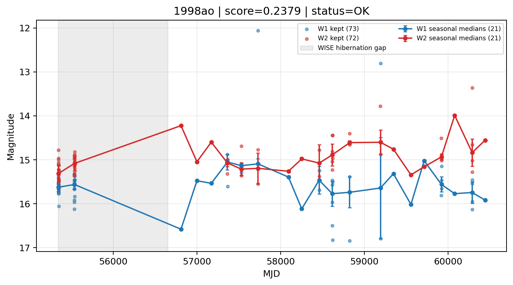

# Candidate Card: 1998ao (Rank 142)

## Basic Metadata

- `source_id`: `1998ao`
- `canonical_id`: `1998ao`
- `source_id_normalized`: `1998AO`
- `canonical_id_normalized`: `1998AO`
- `score`: `0.237939`
- `status`: `OK`
- `final_label`: `Rejected`
- `stage_a_positive`: `False`
- `gate_blazar_veto`: `True`
- `gate_wise_qc_pass`: `True`
- `gate_data_sufficient`: `False`
- `decision_trace`: `stage_a_positive=fail;gate_blazar_veto=pass;gate_wise_qc_pass=pass;gate_data_sufficient=fail;gate_state_change_ratio_pass=pass;gate_transient_spike_pass=pass`

## Sampling / Variability Summary

- `n_points` (results table): `43`
- `baseline_days`: `4939.79`
- `baseline_years`: `13.524`
- `band_coverage`: `W1,W2`
- `delta_mag`: `0.063`
- `delta_mag_method`: `seasonal_median_flux`

## Coordinates

- `ra`: `151.810750`
- `dec`: `-26.393083`
- `coordinate_source`: `benchmark_master`

## WISE Light Curve

## WISE QA / Rejection Accounting

| Metric | Value |
| --- | --- |
| Raw points total | 146 |
| Raw points W1 | 73 |
| Raw points W2 | 73 |
| Kept points total | 145 |
| Kept points W1 | 73 |
| Kept points W2 | 72 |
| Fraction rejected | 0.00684932 |
| Reject: missing time | 0 |
| Reject: missing mag | 1 |
| Reject: invalid band | 0 |
| Reject: cc_flags | 0 |
| Reject: qual_frame | 0 |
| Reject: moon_lev | 0 |

### QA Reject Reason Counts

| reject_reason | count |
| --- | --- |
| reject_cc_flags | 0 |
| reject_invalid_band | 0 |
| reject_missing_mag | 1 |
| reject_missing_time | 0 |
| reject_moon_lev | 0 |
| reject_qual_frame | 0 |

## Flag Summary

### `cc_flags`

| value | count | fraction |
| --- | --- | --- |
| 0000 | 146 | 1 |

### `qual_frame`

| value | count | fraction |
| --- | --- | --- |
| <NA> | 146 | 1 |

### `moon_lev`

| value | count | fraction |
| --- | --- | --- |
| 00 | 82 | 0.561644 |
| 0000 | 64 | 0.438356 |

### `qi_fact`

| value | count | fraction |
| --- | --- | --- |
| 1.0 | 132 | 0.90411 |
| 0.5 | 8 | 0.0547945 |
| 0.0 | 6 | 0.0410959 |

### `saa_sep`

| value | count | fraction |
| --- | --- | --- |
| 85.0 | 6 | 0.0410959 |
| 45.0 | 4 | 0.0273973 |
| -21.0 | 4 | 0.0273973 |
| 51.0 | 4 | 0.0273973 |
| 63.07699966430664 | 4 | 0.0273973 |
| 42.82899856567383 | 2 | 0.0136986 |
| 53.72800064086914 | 2 | 0.0136986 |
| -2.997999906539917 | 2 | 0.0136986 |

### `ph_qual`

| value | count | fraction |
| --- | --- | --- |
| <NA> | 64 | 0.438356 |
| BU | 26 | 0.178082 |
| BC | 22 | 0.150685 |
| BB | 12 | 0.0821918 |
| AU | 6 | 0.0410959 |
| CU | 4 | 0.0273973 |
| AC | 4 | 0.0273973 |
| CB | 2 | 0.0136986 |

## Coverage Summary

- Seasonal bins (W1): `21`
- Seasonal bins (W2): `21`
- Pre-gap coverage: `False`
- Post-gap coverage: `True`
- Both-sides coverage: `False`

## Systematics Verdict

- Verdict: `CAUTION`
- Summary: Variability signal is present but data quality/coverage limitations weaken confidence.
- QA-dominated signal check: Not obviously dominated by flagged/low-quality points

Reasons:
- No clean coverage on both sides of WISE hibernation gap

## Catalog Checks

- Known blazar match: `NO`
- Known CLAGN match: `NO`
- Gaia metrics: not provided / no match

## Final Label

**Rejected**

- Rank 142 with score=0.2379
- Sampling: n_points=43, baseline_years=13.52442082568105, band_coverage=W1,W2
- QA rejection fraction=0.7% (main causes summarized in card QA section)
- Systematics verdict=CAUTION: Variability signal is present but data quality/coverage limitations weaken confidence.
- Known blazar catalog match=NO
- Dataset metadata class=sn

## Reproducibility

- `run_timestamp_utc`: `2026-02-28T17:09:43.673413+00:00`
- `results_file`: `data/real_clagn/benchmark_scores.csv`
- `wise_file`: `data/wise/1998ao.csv`
- `score_threshold`: `0.0`
- `t_recall`: `0.3493918746`
