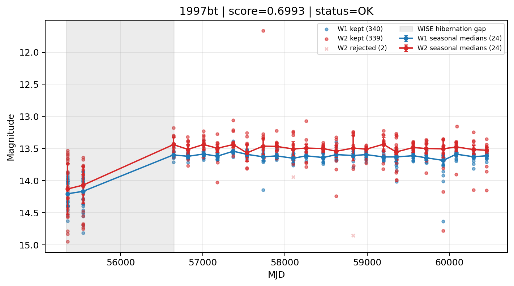

# Candidate Card: 1997bt (Rank 14)

## Basic Metadata

- `source_id`: `1997bt`
- `canonical_id`: `1997bt`
- `source_id_normalized`: `1997BT`
- `canonical_id_normalized`: `1997BT`
- `score`: `0.699311`
- `status`: `OK`
- `final_label`: `Needs more data`
- `stage_a_positive`: `True`
- `gate_blazar_veto`: `True`
- `gate_wise_qc_pass`: `True`
- `gate_data_sufficient`: `False`
- `decision_trace`: `stage_a_positive=pass;gate_blazar_veto=pass;gate_wise_qc_pass=pass;gate_data_sufficient=fail;gate_state_change_ratio_pass=pass;gate_transient_spike_pass=pass`

## Sampling / Variability Summary

- `n_points` (results table): `197`
- `baseline_days`: `5098.22`
- `baseline_years`: `13.958`
- `band_coverage`: `W1,W2`
- `delta_mag`: `0.590`
- `delta_mag_method`: `seasonal_median_flux`

## Coordinates

- `ra`: `166.562917`
- `dec`: `-11.606861`
- `coordinate_source`: `benchmark_master`

## WISE Light Curve

## WISE QA / Rejection Accounting

| Metric | Value |
| --- | --- |
| Raw points total | 682 |
| Raw points W1 | 341 |
| Raw points W2 | 341 |
| Kept points total | 679 |
| Kept points W1 | 340 |
| Kept points W2 | 339 |
| Fraction rejected | 0.00439883 |
| Reject: missing time | 0 |
| Reject: missing mag | 1 |
| Reject: invalid band | 0 |
| Reject: cc_flags | 2 |
| Reject: qual_frame | 0 |
| Reject: moon_lev | 0 |

### QA Reject Reason Counts

| reject_reason | count |
| --- | --- |
| reject_cc_flags | 2 |
| reject_invalid_band | 0 |
| reject_missing_mag | 1 |
| reject_missing_time | 0 |
| reject_moon_lev | 0 |
| reject_qual_frame | 0 |

## Flag Summary

### `cc_flags`

| value | count | fraction |
| --- | --- | --- |
| 0000 | 678 | 0.994135 |
| 0H00 | 2 | 0.00293255 |
| 0D00 | 2 | 0.00293255 |

### `qual_frame`

| value | count | fraction |
| --- | --- | --- |
| <NA> | 682 | 1 |

### `moon_lev`

| value | count | fraction |
| --- | --- | --- |
| 00 | 566 | 0.829912 |
| 0000 | 100 | 0.146628 |
| 01 | 8 | 0.0117302 |
| 11 | 8 | 0.0117302 |

### `qi_fact`

| value | count | fraction |
| --- | --- | --- |
| 1.0 | 564 | 0.826979 |
| 0.5 | 92 | 0.134897 |
| 0.0 | 26 | 0.0381232 |

### `saa_sep`

| value | count | fraction |
| --- | --- | --- |
| 15.0 | 8 | 0.0117302 |
| 88.0 | 8 | 0.0117302 |
| 72.0 | 8 | 0.0117302 |
| 44.0 | 4 | 0.0058651 |
| -9.098999977111816 | 4 | 0.0058651 |
| 86.0 | 4 | 0.0058651 |
| 67.0 | 4 | 0.0058651 |
| 46.0 | 4 | 0.0058651 |

### `ph_qual`

| value | count | fraction |
| --- | --- | --- |
| AA | 300 | 0.439883 |
| AB | 272 | 0.398827 |
| <NA> | 100 | 0.146628 |
| AC | 6 | 0.00879765 |
| XB | 2 | 0.00293255 |
| AU | 2 | 0.00293255 |

## Coverage Summary

- Seasonal bins (W1): `24`
- Seasonal bins (W2): `24`
- Pre-gap coverage: `False`
- Post-gap coverage: `True`
- Both-sides coverage: `False`

## Systematics Verdict

- Verdict: `CAUTION`
- Summary: Variability signal is present but data quality/coverage limitations weaken confidence.
- QA-dominated signal check: Not obviously dominated by flagged/low-quality points

Reasons:
- No clean coverage on both sides of WISE hibernation gap

## Catalog Checks

- Known blazar match: `NO`
- Known CLAGN match: `NO`
- Gaia metrics: not provided / no match

## Final Label

**Needs more data**

- Rank 14 with score=0.6993
- Sampling: n_points=197, baseline_years=13.958163807282688, band_coverage=W1,W2
- QA rejection fraction=0.4% (main causes summarized in card QA section)
- Systematics verdict=CAUTION: Variability signal is present but data quality/coverage limitations weaken confidence.
- Known blazar catalog match=NO
- Dataset metadata class=sn

## Reproducibility

- `run_timestamp_utc`: `2026-02-28T17:09:43.673413+00:00`
- `results_file`: `data/real_clagn/benchmark_scores.csv`
- `wise_file`: `data/wise/1997bt.csv`
- `score_threshold`: `0.0`
- `t_recall`: `0.3493918746`
