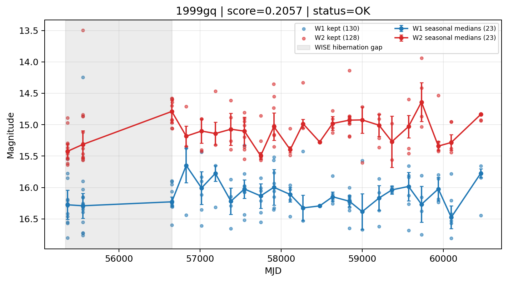

# Candidate Card: 1999gq (Rank 150)

## Basic Metadata

- `source_id`: `1999gq`
- `canonical_id`: `1999gq`
- `source_id_normalized`: `1999GQ`
- `canonical_id_normalized`: `1999GQ`
- `score`: `0.205728`
- `status`: `OK`
- `final_label`: `Rejected`
- `stage_a_positive`: `False`
- `gate_blazar_veto`: `True`
- `gate_wise_qc_pass`: `True`
- `gate_data_sufficient`: `False`
- `decision_trace`: `stage_a_positive=fail;gate_blazar_veto=pass;gate_wise_qc_pass=pass;gate_data_sufficient=fail;gate_state_change_ratio_pass=pass;gate_transient_spike_pass=pass`

## Sampling / Variability Summary

- `n_points` (results table): `51`
- `baseline_days`: `5097.94`
- `baseline_years`: `13.957`
- `band_coverage`: `W1,W2`
- `delta_mag`: `0.431`
- `delta_mag_method`: `seasonal_median_flux`

## Coordinates

- `ra`: `188.451333`
- `dec`: `15.180056`
- `coordinate_source`: `benchmark_master`

## WISE Light Curve

## WISE QA / Rejection Accounting

| Metric | Value |
| --- | --- |
| Raw points total | 260 |
| Raw points W1 | 130 |
| Raw points W2 | 130 |
| Kept points total | 258 |
| Kept points W1 | 130 |
| Kept points W2 | 128 |
| Fraction rejected | 0.00769231 |
| Reject: missing time | 0 |
| Reject: missing mag | 2 |
| Reject: invalid band | 0 |
| Reject: cc_flags | 0 |
| Reject: qual_frame | 0 |
| Reject: moon_lev | 0 |

### QA Reject Reason Counts

| reject_reason | count |
| --- | --- |
| reject_cc_flags | 0 |
| reject_invalid_band | 0 |
| reject_missing_mag | 2 |
| reject_missing_time | 0 |
| reject_moon_lev | 0 |
| reject_qual_frame | 0 |

## Flag Summary

### `cc_flags`

| value | count | fraction |
| --- | --- | --- |
| 0000 | 260 | 1 |

### `qual_frame`

| value | count | fraction |
| --- | --- | --- |
| <NA> | 260 | 1 |

### `moon_lev`

| value | count | fraction |
| --- | --- | --- |
| 00 | 198 | 0.761538 |
| 0000 | 50 | 0.192308 |
| 01 | 6 | 0.0230769 |
| 11 | 4 | 0.0153846 |
| 0011 | 2 | 0.00769231 |

### `qi_fact`

| value | count | fraction |
| --- | --- | --- |
| 1.0 | 198 | 0.761538 |
| 0.5 | 60 | 0.230769 |
| 0.0 | 2 | 0.00769231 |

### `saa_sep`

| value | count | fraction |
| --- | --- | --- |
| 27.0 | 6 | 0.0230769 |
| 72.89800262451172 | 4 | 0.0153846 |
| 58.112998962402344 | 4 | 0.0153846 |
| 107.0 | 4 | 0.0153846 |
| 14.397000312805176 | 4 | 0.0153846 |
| 57.71200180053711 | 2 | 0.00769231 |
| 36.5620002746582 | 2 | 0.00769231 |
| 123.6969985961914 | 2 | 0.00769231 |

### `ph_qual`

| value | count | fraction |
| --- | --- | --- |
| BU | 116 | 0.446154 |
| <NA> | 52 | 0.2 |
| CU | 40 | 0.153846 |
| UU | 20 | 0.0769231 |
| BC | 14 | 0.0538462 |
| UC | 6 | 0.0230769 |
| BB | 6 | 0.0230769 |
| UB | 2 | 0.00769231 |

## Coverage Summary

- Seasonal bins (W1): `23`
- Seasonal bins (W2): `23`
- Pre-gap coverage: `False`
- Post-gap coverage: `True`
- Both-sides coverage: `False`

## Systematics Verdict

- Verdict: `CAUTION`
- Summary: Variability signal is present but data quality/coverage limitations weaken confidence.
- QA-dominated signal check: Not obviously dominated by flagged/low-quality points

Reasons:
- No clean coverage on both sides of WISE hibernation gap

## Catalog Checks

- Known blazar match: `NO`
- Known CLAGN match: `NO`
- Gaia metrics: not provided / no match

## Final Label

**Rejected**

- Rank 150 with score=0.2057
- Sampling: n_points=51, baseline_years=13.957388833757705, band_coverage=W1,W2
- QA rejection fraction=0.8% (main causes summarized in card QA section)
- Systematics verdict=CAUTION: Variability signal is present but data quality/coverage limitations weaken confidence.
- Known blazar catalog match=NO
- Dataset metadata class=sn

## Reproducibility

- `run_timestamp_utc`: `2026-02-28T17:09:43.673413+00:00`
- `results_file`: `data/real_clagn/benchmark_scores.csv`
- `wise_file`: `data/wise/1999gq.csv`
- `score_threshold`: `0.0`
- `t_recall`: `0.3493918746`
