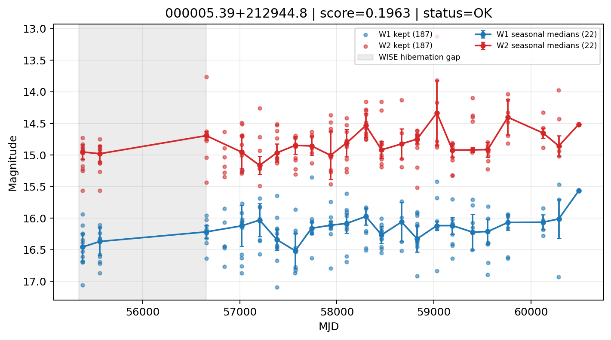

# Candidate Card: 000005.39+212944.8 (Rank 153)

## Basic Metadata

- `source_id`: `000005.39+212944.8`
- `canonical_id`: `000005.39+212944.8`
- `score`: `0.196251`
- `status`: `OK`
- `final_label`: `Rejected`
- `stage_a_positive`: `False`
- `gate_blazar_veto`: `True`
- `gate_wise_qc_pass`: `True`
- `gate_data_sufficient`: `False`
- `decision_trace`: `stage_a_positive=fail;gate_blazar_veto=pass;gate_wise_qc_pass=pass;gate_data_sufficient=fail;gate_state_change_ratio_pass=pass;gate_transient_spike_pass=pass`

## Sampling / Variability Summary

- `n_points` (results table): `109`
- `baseline_days`: `4911.13`
- `baseline_years`: `13.446`
- `band_coverage`: `W1,W2`
- `delta_mag`: `0.209`
- `delta_mag_method`: `seasonal_median_flux`

## Coordinates

- `ra`: `0.022476`
- `dec`: `21.495785`
- `coordinate_source`: `benchmark_master`

## WISE Light Curve

## WISE QA / Rejection Accounting

| Metric | Value |
| --- | --- |
| Raw points total | 374 |
| Raw points W1 | 187 |
| Raw points W2 | 187 |
| Kept points total | 374 |
| Kept points W1 | 187 |
| Kept points W2 | 187 |
| Fraction rejected | 0 |
| Reject: missing time | 0 |
| Reject: missing mag | 0 |
| Reject: invalid band | 0 |
| Reject: cc_flags | 0 |
| Reject: qual_frame | 0 |
| Reject: moon_lev | 0 |

### QA Reject Reason Counts

| reject_reason | count |
| --- | --- |
| reject_cc_flags | 0 |
| reject_invalid_band | 0 |
| reject_missing_mag | 0 |
| reject_missing_time | 0 |
| reject_moon_lev | 0 |
| reject_qual_frame | 0 |

## Flag Summary

### `cc_flags`

| value | count | fraction |
| --- | --- | --- |
| 0000 | 374 | 1 |

### `qual_frame`

| value | count | fraction |
| --- | --- | --- |
| <NA> | 374 | 1 |

### `moon_lev`

| value | count | fraction |
| --- | --- | --- |
| 00 | 320 | 0.855615 |
| 0000 | 46 | 0.122995 |
| 01 | 8 | 0.0213904 |

### `qi_fact`

| value | count | fraction |
| --- | --- | --- |
| 1.0 | 354 | 0.946524 |
| 0.5 | 14 | 0.0374332 |
| 0.0 | 6 | 0.0160428 |

### `saa_sep`

| value | count | fraction |
| --- | --- | --- |
| 105.0 | 2 | 0.00534759 |
| 48.79999923706055 | 2 | 0.00534759 |
| 62.340999603271484 | 2 | 0.00534759 |
| 28.805999755859375 | 2 | 0.00534759 |
| 28.04800033569336 | 2 | 0.00534759 |
| 128.8000030517578 | 2 | 0.00534759 |
| 54.4640007019043 | 2 | 0.00534759 |
| 68.21399688720703 | 2 | 0.00534759 |

### `ph_qual`

| value | count | fraction |
| --- | --- | --- |
| BU | 98 | 0.262032 |
| BC | 80 | 0.213904 |
| BB | 52 | 0.139037 |
| <NA> | 46 | 0.122995 |
| CC | 30 | 0.0802139 |
| CU | 22 | 0.0588235 |
| UB | 20 | 0.0534759 |
| CB | 14 | 0.0374332 |

## Coverage Summary

- Seasonal bins (W1): `22`
- Seasonal bins (W2): `22`
- Pre-gap coverage: `False`
- Post-gap coverage: `True`
- Both-sides coverage: `False`

## Systematics Verdict

- Verdict: `CAUTION`
- Summary: Variability signal is present but data quality/coverage limitations weaken confidence.
- QA-dominated signal check: Not obviously dominated by flagged/low-quality points

Reasons:
- No clean coverage on both sides of WISE hibernation gap

## Catalog Checks

- Known blazar match: `NO`
- Known CLAGN match: `NO`
- Gaia metrics: not provided / no match

## Final Label

**Rejected**

- Rank 153 with score=0.1963
- Sampling: n_points=109, baseline_years=13.445943207200548, band_coverage=W1,W2
- QA rejection fraction=0.0% (main causes summarized in card QA section)
- Systematics verdict=CAUTION: Variability signal is present but data quality/coverage limitations weaken confidence.
- Known blazar catalog match=NO
- Dataset metadata class=normal_agn

## Reproducibility

- `run_timestamp_utc`: `2026-02-28T17:09:43.673413+00:00`
- `results_file`: `data/real_clagn/benchmark_scores.csv`
- `wise_file`: `data/wise/000005.39+212944.8.csv`
- `score_threshold`: `0.0`
- `t_recall`: `0.3493918746`
