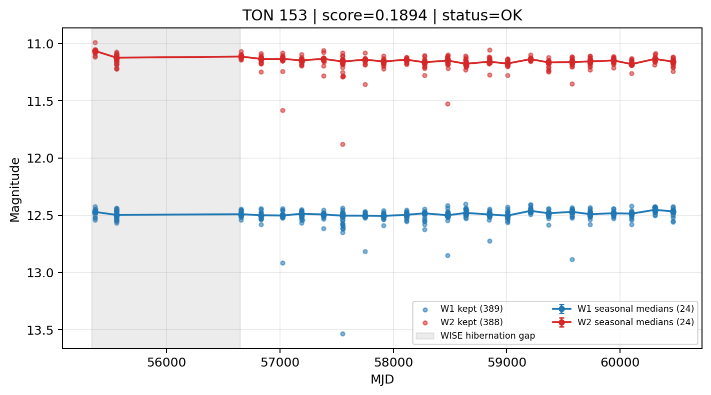

# Candidate Card: TON 153 (Rank 155)

## Basic Metadata

- `source_id`: `TON 153`
- `canonical_id`: `TON 153`
- `score`: `0.189389`
- `status`: `OK`
- `final_label`: `Rejected`
- `stage_a_positive`: `False`
- `gate_blazar_veto`: `False`
- `gate_wise_qc_pass`: `True`
- `gate_data_sufficient`: `False`
- `decision_trace`: `stage_a_positive=fail;gate_blazar_veto=fail;gate_wise_qc_pass=pass;gate_data_sufficient=fail;gate_state_change_ratio_pass=pass;gate_transient_spike_pass=pass`

## Sampling / Variability Summary

- `n_points` (results table): `281`
- `baseline_days`: `5095.66`
- `baseline_years`: `13.951`
- `band_coverage`: `W1,W2`
- `delta_mag`: `0.017`
- `delta_mag_method`: `seasonal_median_flux`

## Coordinates

- `ra`: `199.984300`
- `dec`: `27.468900`
- `coordinate_source`: `benchmark_master`

## WISE Light Curve

## WISE QA / Rejection Accounting

| Metric | Value |
| --- | --- |
| Raw points total | 778 |
| Raw points W1 | 389 |
| Raw points W2 | 389 |
| Kept points total | 777 |
| Kept points W1 | 389 |
| Kept points W2 | 388 |
| Fraction rejected | 0.00128535 |
| Reject: missing time | 0 |
| Reject: missing mag | 1 |
| Reject: invalid band | 0 |
| Reject: cc_flags | 0 |
| Reject: qual_frame | 0 |
| Reject: moon_lev | 0 |

### QA Reject Reason Counts

| reject_reason | count |
| --- | --- |
| reject_cc_flags | 0 |
| reject_invalid_band | 0 |
| reject_missing_mag | 1 |
| reject_missing_time | 0 |
| reject_moon_lev | 0 |
| reject_qual_frame | 0 |

## Flag Summary

### `cc_flags`

| value | count | fraction |
| --- | --- | --- |
| 0000 | 778 | 1 |

### `qual_frame`

| value | count | fraction |
| --- | --- | --- |
| <NA> | 778 | 1 |

### `moon_lev`

| value | count | fraction |
| --- | --- | --- |
| 00 | 690 | 0.886889 |
| 0000 | 86 | 0.11054 |
| 0011 | 2 | 0.00257069 |

### `qi_fact`

| value | count | fraction |
| --- | --- | --- |
| 1.0 | 604 | 0.77635 |
| 0.5 | 140 | 0.179949 |
| 0.0 | 34 | 0.0437018 |

### `saa_sep`

| value | count | fraction |
| --- | --- | --- |
| 39.0 | 8 | 0.0102828 |
| 63.0 | 6 | 0.00771208 |
| 95.0 | 6 | 0.00771208 |
| 79.0 | 6 | 0.00771208 |
| 75.0 | 6 | 0.00771208 |
| 60.84299850463867 | 4 | 0.00514139 |
| 131.0 | 4 | 0.00514139 |
| 50.0 | 4 | 0.00514139 |

### `ph_qual`

| value | count | fraction |
| --- | --- | --- |
| AA | 688 | 0.884319 |
| <NA> | 88 | 0.113111 |
| AX | 2 | 0.00257069 |

## Coverage Summary

- Seasonal bins (W1): `24`
- Seasonal bins (W2): `24`
- Pre-gap coverage: `False`
- Post-gap coverage: `True`
- Both-sides coverage: `False`

## Systematics Verdict

- Verdict: `CAUTION`
- Summary: Variability signal is present but data quality/coverage limitations weaken confidence.
- QA-dominated signal check: Not obviously dominated by flagged/low-quality points

Reasons:
- No clean coverage on both sides of WISE hibernation gap

## Catalog Checks

- Known blazar match: `YES` via `source_id` token `TON 153`
- Known CLAGN match: `NO`
- Gaia metrics: not provided / no match

## Final Label

**Rejected**

- Rank 155 with score=0.1894
- Sampling: n_points=281, baseline_years=13.951162309486651, band_coverage=W1,W2
- QA rejection fraction=0.1% (main causes summarized in card QA section)
- Systematics verdict=CAUTION: Variability signal is present but data quality/coverage limitations weaken confidence.
- Known blazar catalog match=YES
- Dataset metadata class=blazar

## Reproducibility

- `run_timestamp_utc`: `2026-02-28T17:09:43.673413+00:00`
- `results_file`: `data/real_clagn/benchmark_scores.csv`
- `wise_file`: `data/wise/TON 153.csv`
- `score_threshold`: `0.0`
- `t_recall`: `0.3493918746`
