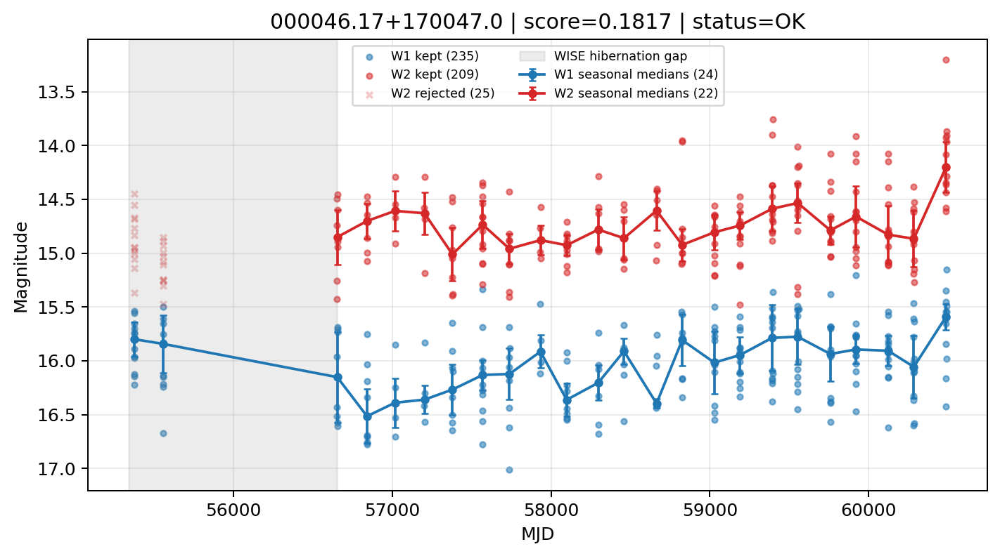

# Candidate Card: 000046.17+170047.0 (Rank 158)

## Basic Metadata

- `source_id`: `000046.17+170047.0`
- `canonical_id`: `000046.17+170047.0`
- `score`: `0.181676`
- `status`: `OK`
- `final_label`: `Rejected`
- `stage_a_positive`: `False`
- `gate_blazar_veto`: `True`
- `gate_wise_qc_pass`: `True`
- `gate_data_sufficient`: `False`
- `decision_trace`: `stage_a_positive=fail;gate_blazar_veto=pass;gate_wise_qc_pass=pass;gate_data_sufficient=fail;gate_state_change_ratio_pass=pass;gate_transient_spike_pass=pass`

## Sampling / Variability Summary

- `n_points` (results table): `140`
- `baseline_days`: `5116.36`
- `baseline_years`: `14.008`
- `band_coverage`: `W1,W2`
- `delta_mag`: `0.005`
- `delta_mag_method`: `seasonal_median_flux`

## Coordinates

- `ra`: `0.192390`
- `dec`: `17.013070`
- `coordinate_source`: `benchmark_master`

## WISE Light Curve

## WISE QA / Rejection Accounting

| Metric | Value |
| --- | --- |
| Raw points total | 470 |
| Raw points W1 | 235 |
| Raw points W2 | 235 |
| Kept points total | 444 |
| Kept points W1 | 235 |
| Kept points W2 | 209 |
| Fraction rejected | 0.0553191 |
| Reject: missing time | 0 |
| Reject: missing mag | 1 |
| Reject: invalid band | 0 |
| Reject: cc_flags | 25 |
| Reject: qual_frame | 0 |
| Reject: moon_lev | 0 |

### QA Reject Reason Counts

| reject_reason | count |
| --- | --- |
| reject_cc_flags | 25 |
| reject_invalid_band | 0 |
| reject_missing_mag | 1 |
| reject_missing_time | 0 |
| reject_moon_lev | 0 |
| reject_qual_frame | 0 |

## Flag Summary

### `cc_flags`

| value | count | fraction |
| --- | --- | --- |
| 0000 | 420 | 0.893617 |
| 0h00 | 50 | 0.106383 |

### `qual_frame`

| value | count | fraction |
| --- | --- | --- |
| <NA> | 470 | 1 |

### `moon_lev`

| value | count | fraction |
| --- | --- | --- |
| 00 | 402 | 0.855319 |
| 0000 | 50 | 0.106383 |
| 01 | 12 | 0.0255319 |
| 11 | 6 | 0.012766 |

### `qi_fact`

| value | count | fraction |
| --- | --- | --- |
| 1.0 | 390 | 0.829787 |
| 0.5 | 72 | 0.153191 |
| 0.0 | 8 | 0.0170213 |

### `saa_sep`

| value | count | fraction |
| --- | --- | --- |
| 25.0 | 4 | 0.00851064 |
| 52.0 | 4 | 0.00851064 |
| 42.0 | 4 | 0.00851064 |
| 35.0 | 4 | 0.00851064 |
| 24.0 | 4 | 0.00851064 |
| 27.0 | 4 | 0.00851064 |
| 62.82099914550781 | 2 | 0.00425532 |
| 29.479000091552734 | 2 | 0.00425532 |

### `ph_qual`

| value | count | fraction |
| --- | --- | --- |
| BC | 110 | 0.234043 |
| BU | 96 | 0.204255 |
| BB | 86 | 0.182979 |
| <NA> | 50 | 0.106383 |
| CB | 36 | 0.0765957 |
| CU | 30 | 0.0638298 |
| CC | 26 | 0.0553191 |
| UC | 16 | 0.0340426 |

## Coverage Summary

- Seasonal bins (W1): `24`
- Seasonal bins (W2): `22`
- Pre-gap coverage: `False`
- Post-gap coverage: `True`
- Both-sides coverage: `False`

## Systematics Verdict

- Verdict: `CAUTION`
- Summary: Variability signal is present but data quality/coverage limitations weaken confidence.
- QA-dominated signal check: Not obviously dominated by flagged/low-quality points

Reasons:
- No clean coverage on both sides of WISE hibernation gap

## Catalog Checks

- Known blazar match: `NO`
- Known CLAGN match: `NO`
- Gaia metrics: not provided / no match

## Final Label

**Rejected**

- Rank 158 with score=0.1817
- Sampling: n_points=140, baseline_years=14.007835611800136, band_coverage=W1,W2
- QA rejection fraction=5.5% (main causes summarized in card QA section)
- Systematics verdict=CAUTION: Variability signal is present but data quality/coverage limitations weaken confidence.
- Known blazar catalog match=NO
- Dataset metadata class=normal_agn

## Reproducibility

- `run_timestamp_utc`: `2026-02-28T17:09:43.673413+00:00`
- `results_file`: `data/real_clagn/benchmark_scores.csv`
- `wise_file`: `data/wise/000046.17+170047.0.csv`
- `score_threshold`: `0.0`
- `t_recall`: `0.3493918746`
