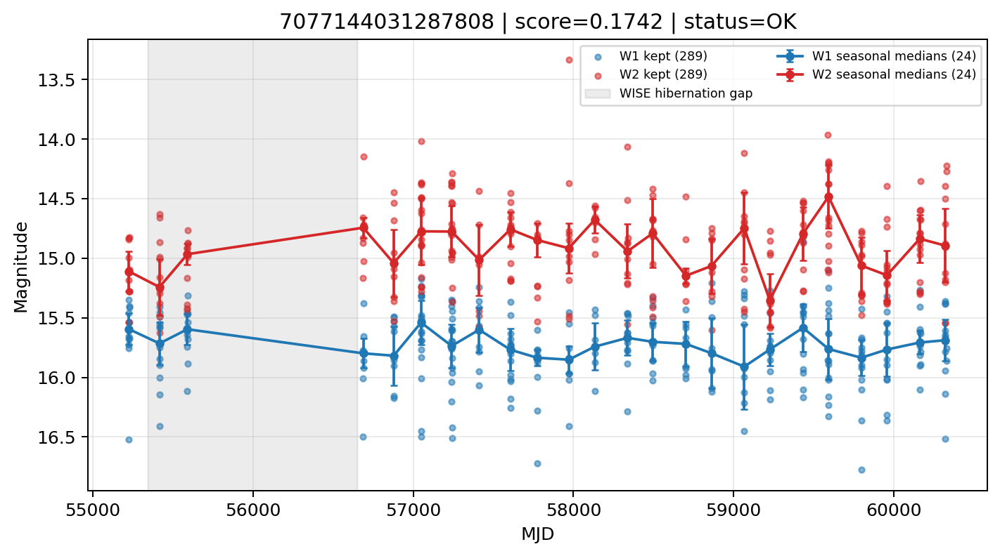

# Candidate Card: 7077144031287808 (Rank 163)

## Basic Metadata

- `source_id`: `7077144031287808`
- `canonical_id`: `7077144031287808`
- `score`: `0.174189`
- `status`: `OK`
- `final_label`: `Rejected`
- `stage_a_positive`: `False`
- `gate_blazar_veto`: `True`
- `gate_wise_qc_pass`: `True`
- `gate_data_sufficient`: `True`
- `decision_trace`: `stage_a_positive=fail;gate_blazar_veto=pass;gate_wise_qc_pass=pass;gate_data_sufficient=pass;gate_state_change_ratio_pass=pass;gate_transient_spike_pass=pass`

## Sampling / Variability Summary

- `n_points` (results table): `120`
- `baseline_days`: `5096.41`
- `baseline_years`: `13.953`
- `band_coverage`: `W1,W2`
- `delta_mag`: `-0.053`
- `delta_mag_method`: `seasonal_median_flux`

## Coordinates

- `ra`: `44.629947`
- `dec`: `5.815756`
- `coordinate_source`: `benchmark_master`

## WISE Light Curve

## WISE QA / Rejection Accounting

| Metric | Value |
| --- | --- |
| Raw points total | 578 |
| Raw points W1 | 289 |
| Raw points W2 | 289 |
| Kept points total | 578 |
| Kept points W1 | 289 |
| Kept points W2 | 289 |
| Fraction rejected | 0 |
| Reject: missing time | 0 |
| Reject: missing mag | 0 |
| Reject: invalid band | 0 |
| Reject: cc_flags | 0 |
| Reject: qual_frame | 0 |
| Reject: moon_lev | 0 |

### QA Reject Reason Counts

| reject_reason | count |
| --- | --- |
| reject_cc_flags | 0 |
| reject_invalid_band | 0 |
| reject_missing_mag | 0 |
| reject_missing_time | 0 |
| reject_moon_lev | 0 |
| reject_qual_frame | 0 |

## Flag Summary

### `cc_flags`

| value | count | fraction |
| --- | --- | --- |
| 0000 | 578 | 1 |

### `qual_frame`

| value | count | fraction |
| --- | --- | --- |
| <NA> | 578 | 1 |

### `moon_lev`

| value | count | fraction |
| --- | --- | --- |
| 00 | 416 | 0.719723 |
| 0000 | 74 | 0.128028 |
| 11 | 58 | 0.100346 |
| 01 | 30 | 0.0519031 |

### `qi_fact`

| value | count | fraction |
| --- | --- | --- |
| 1.0 | 300 | 0.519031 |
| 0.5 | 272 | 0.470588 |
| 0.0 | 6 | 0.0103806 |

### `saa_sep`

| value | count | fraction |
| --- | --- | --- |
| 71.0 | 6 | 0.0103806 |
| 73.0 | 6 | 0.0103806 |
| 9.0 | 4 | 0.00692042 |
| 113.0 | 4 | 0.00692042 |
| 38.0 | 4 | 0.00692042 |
| 21.0 | 4 | 0.00692042 |
| 115.0 | 4 | 0.00692042 |
| 33.0 | 4 | 0.00692042 |

### `ph_qual`

| value | count | fraction |
| --- | --- | --- |
| BU | 382 | 0.6609 |
| <NA> | 74 | 0.128028 |
| BC | 74 | 0.128028 |
| CU | 28 | 0.0484429 |
| BB | 12 | 0.0207612 |
| CC | 4 | 0.00692042 |
| UU | 2 | 0.00346021 |
| UC | 2 | 0.00346021 |

## Coverage Summary

- Seasonal bins (W1): `24`
- Seasonal bins (W2): `24`
- Pre-gap coverage: `True`
- Post-gap coverage: `True`
- Both-sides coverage: `True`

## Systematics Verdict

- Verdict: `PASS`
- Summary: QA-clean points and seasonal coverage support the observed variability signal.
- QA-dominated signal check: Not obviously dominated by flagged/low-quality points

Reasons:
- Seasonal trend supported by sufficient QA-clean W1/W2 points

## Catalog Checks

- Known blazar match: `NO`
- Known CLAGN match: `NO`
- Gaia metrics: not provided / no match

## Final Label

**Rejected**

- Rank 163 with score=0.1742
- Sampling: n_points=120, baseline_years=13.9532211152909, band_coverage=W1,W2
- QA rejection fraction=0.0% (main causes summarized in card QA section)
- Systematics verdict=PASS: QA-clean points and seasonal coverage support the observed variability signal.
- Known blazar catalog match=NO
- Dataset metadata class=star

## Reproducibility

- `run_timestamp_utc`: `2026-02-28T17:09:43.673413+00:00`
- `results_file`: `data/real_clagn/benchmark_scores.csv`
- `wise_file`: `data/wise/7077144031287808.csv`
- `score_threshold`: `0.0`
- `t_recall`: `0.3493918746`
