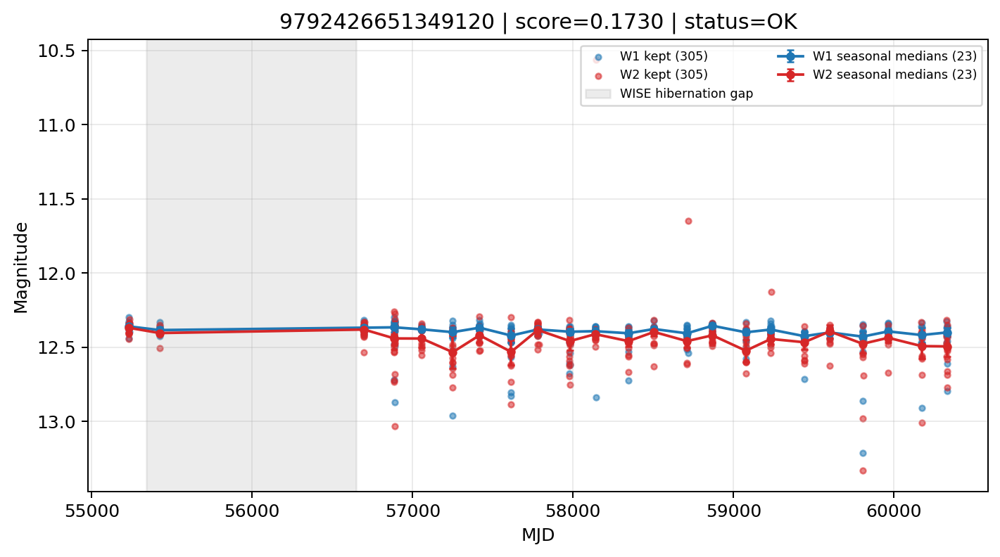

# Candidate Card: 9792426651349120 (Rank 164)

## Basic Metadata

- `source_id`: `9792426651349120`
- `canonical_id`: `9792426651349120`
- `score`: `0.172958`
- `status`: `OK`
- `final_label`: `Rejected`
- `stage_a_positive`: `False`
- `gate_blazar_veto`: `True`
- `gate_wise_qc_pass`: `True`
- `gate_data_sufficient`: `True`
- `decision_trace`: `stage_a_positive=fail;gate_blazar_veto=pass;gate_wise_qc_pass=pass;gate_data_sufficient=pass;gate_state_change_ratio_pass=pass;gate_transient_spike_pass=pass`

## Sampling / Variability Summary

- `n_points` (results table): `159`
- `baseline_days`: `5098.55`
- `baseline_years`: `13.959`
- `band_coverage`: `W1,W2`
- `delta_mag`: `-0.009`
- `delta_mag_method`: `seasonal_median_flux`

## Coordinates

- `ra`: `52.678281`
- `dec`: `7.150642`
- `coordinate_source`: `benchmark_master`

## WISE Light Curve

## WISE QA / Rejection Accounting

| Metric | Value |
| --- | --- |
| Raw points total | 610 |
| Raw points W1 | 305 |
| Raw points W2 | 305 |
| Kept points total | 610 |
| Kept points W1 | 305 |
| Kept points W2 | 305 |
| Fraction rejected | 0 |
| Reject: missing time | 0 |
| Reject: missing mag | 0 |
| Reject: invalid band | 0 |
| Reject: cc_flags | 0 |
| Reject: qual_frame | 0 |
| Reject: moon_lev | 0 |

### QA Reject Reason Counts

| reject_reason | count |
| --- | --- |
| reject_cc_flags | 0 |
| reject_invalid_band | 0 |
| reject_missing_mag | 0 |
| reject_missing_time | 0 |
| reject_moon_lev | 0 |
| reject_qual_frame | 0 |

## Flag Summary

### `cc_flags`

| value | count | fraction |
| --- | --- | --- |
| 0000 | 610 | 1 |

### `qual_frame`

| value | count | fraction |
| --- | --- | --- |
| <NA> | 610 | 1 |

### `moon_lev`

| value | count | fraction |
| --- | --- | --- |
| 00 | 482 | 0.790164 |
| 11 | 58 | 0.095082 |
| 0000 | 38 | 0.0622951 |
| 01 | 32 | 0.052459 |

### `qi_fact`

| value | count | fraction |
| --- | --- | --- |
| 1.0 | 416 | 0.681967 |
| 0.5 | 98 | 0.160656 |
| 0.0 | 96 | 0.157377 |

### `saa_sep`

| value | count | fraction |
| --- | --- | --- |
| 22.0 | 4 | 0.00655738 |
| 75.0 | 4 | 0.00655738 |
| 111.66999816894531 | 4 | 0.00655738 |
| 120.0 | 2 | 0.00327869 |
| 19.66699981689453 | 2 | 0.00327869 |
| 121.64399719238281 | 2 | 0.00327869 |
| 31.972000122070312 | 2 | 0.00327869 |
| 100.65399932861328 | 2 | 0.00327869 |

### `ph_qual`

| value | count | fraction |
| --- | --- | --- |
| AA | 552 | 0.904918 |
| <NA> | 38 | 0.0622951 |
| AB | 18 | 0.0295082 |
| BB | 2 | 0.00327869 |

## Coverage Summary

- Seasonal bins (W1): `23`
- Seasonal bins (W2): `23`
- Pre-gap coverage: `True`
- Post-gap coverage: `True`
- Both-sides coverage: `True`

## Systematics Verdict

- Verdict: `PASS`
- Summary: QA-clean points and seasonal coverage support the observed variability signal.
- QA-dominated signal check: Not obviously dominated by flagged/low-quality points

Reasons:
- Seasonal trend supported by sufficient QA-clean W1/W2 points

## Catalog Checks

- Known blazar match: `NO`
- Known CLAGN match: `NO`
- Gaia metrics: not provided / no match

## Final Label

**Rejected**

- Rank 164 with score=0.1730
- Sampling: n_points=159, baseline_years=13.959065627707044, band_coverage=W1,W2
- QA rejection fraction=0.0% (main causes summarized in card QA section)
- Systematics verdict=PASS: QA-clean points and seasonal coverage support the observed variability signal.
- Known blazar catalog match=NO
- Dataset metadata class=star

## Reproducibility

- `run_timestamp_utc`: `2026-02-28T17:09:43.673413+00:00`
- `results_file`: `data/real_clagn/benchmark_scores.csv`
- `wise_file`: `data/wise/9792426651349120.csv`
- `score_threshold`: `0.0`
- `t_recall`: `0.3493918746`
