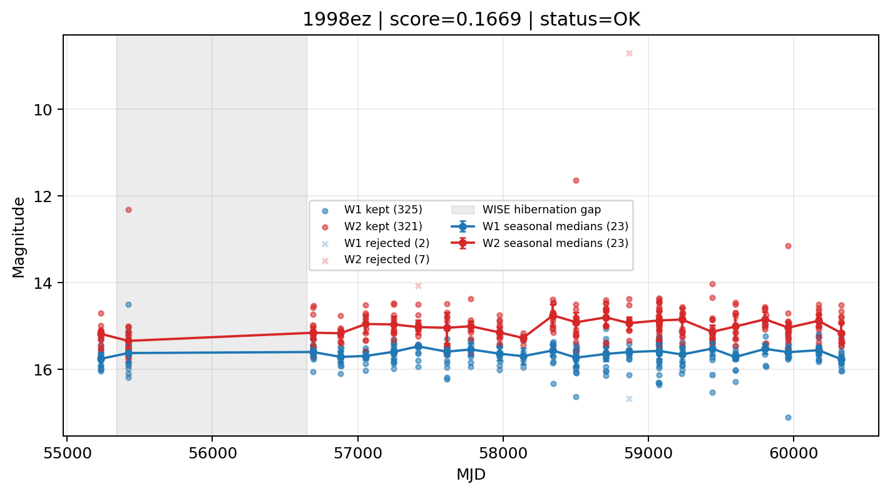

# Candidate Card: 1998ez (Rank 167)

## Basic Metadata

- `source_id`: `1998ez`
- `canonical_id`: `1998ez`
- `source_id_normalized`: `1998EZ`
- `canonical_id_normalized`: `1998EZ`
- `score`: `0.166870`
- `status`: `OK`
- `final_label`: `Rejected`
- `stage_a_positive`: `False`
- `gate_blazar_veto`: `True`
- `gate_wise_qc_pass`: `True`
- `gate_data_sufficient`: `True`
- `decision_trace`: `stage_a_positive=fail;gate_blazar_veto=pass;gate_wise_qc_pass=pass;gate_data_sufficient=pass;gate_state_change_ratio_pass=pass;gate_transient_spike_pass=pass`

## Sampling / Variability Summary

- `n_points` (results table): `129`
- `baseline_days`: `5099.46`
- `baseline_years`: `13.962`
- `band_coverage`: `W1,W2`
- `delta_mag`: `0.037`
- `delta_mag_method`: `seasonal_median_flux`

## Coordinates

- `ra`: `59.387208`
- `dec`: `-27.203778`
- `coordinate_source`: `benchmark_master`

## WISE Light Curve

## WISE QA / Rejection Accounting

| Metric | Value |
| --- | --- |
| Raw points total | 656 |
| Raw points W1 | 328 |
| Raw points W2 | 328 |
| Kept points total | 646 |
| Kept points W1 | 325 |
| Kept points W2 | 321 |
| Fraction rejected | 0.0152439 |
| Reject: missing time | 0 |
| Reject: missing mag | 1 |
| Reject: invalid band | 0 |
| Reject: cc_flags | 9 |
| Reject: qual_frame | 0 |
| Reject: moon_lev | 0 |

### QA Reject Reason Counts

| reject_reason | count |
| --- | --- |
| reject_cc_flags | 9 |
| reject_invalid_band | 0 |
| reject_missing_mag | 1 |
| reject_missing_time | 0 |
| reject_moon_lev | 0 |
| reject_qual_frame | 0 |

## Flag Summary

### `cc_flags`

| value | count | fraction |
| --- | --- | --- |
| 0000 | 638 | 0.972561 |
| 0D00 | 8 | 0.0121951 |
| H000 | 4 | 0.00609756 |
| 0H00 | 2 | 0.00304878 |
| 0d00 | 2 | 0.00304878 |
| 0h00 | 2 | 0.00304878 |

### `qual_frame`

| value | count | fraction |
| --- | --- | --- |
| <NA> | 656 | 1 |

### `moon_lev`

| value | count | fraction |
| --- | --- | --- |
| 00 | 590 | 0.89939 |
| 0000 | 66 | 0.10061 |

### `qi_fact`

| value | count | fraction |
| --- | --- | --- |
| 1.0 | 428 | 0.652439 |
| 0.5 | 176 | 0.268293 |
| 0.0 | 52 | 0.0792683 |

### `saa_sep`

| value | count | fraction |
| --- | --- | --- |
| 33.0 | 6 | 0.00914634 |
| 53.0 | 6 | 0.00914634 |
| -17.0 | 4 | 0.00609756 |
| -6.34499979019165 | 4 | 0.00609756 |
| 42.0 | 4 | 0.00609756 |
| -21.222999572753906 | 4 | 0.00609756 |
| 65.59600067138672 | 4 | 0.00609756 |
| 73.0 | 4 | 0.00609756 |

### `ph_qual`

| value | count | fraction |
| --- | --- | --- |
| BU | 360 | 0.54878 |
| BC | 164 | 0.25 |
| <NA> | 66 | 0.10061 |
| BB | 44 | 0.0670732 |
| CU | 6 | 0.00914634 |
| CC | 4 | 0.00609756 |
| AU | 2 | 0.00304878 |
| CB | 2 | 0.00304878 |

## Coverage Summary

- Seasonal bins (W1): `23`
- Seasonal bins (W2): `23`
- Pre-gap coverage: `True`
- Post-gap coverage: `True`
- Both-sides coverage: `True`

## Systematics Verdict

- Verdict: `PASS`
- Summary: QA-clean points and seasonal coverage support the observed variability signal.
- QA-dominated signal check: Not obviously dominated by flagged/low-quality points

Reasons:
- Seasonal trend supported by sufficient QA-clean W1/W2 points

## Catalog Checks

- Known blazar match: `NO`
- Known CLAGN match: `NO`
- Gaia metrics: not provided / no match

## Final Label

**Rejected**

- Rank 167 with score=0.1669
- Sampling: n_points=129, baseline_years=13.961572964599588, band_coverage=W1,W2
- QA rejection fraction=1.5% (main causes summarized in card QA section)
- Systematics verdict=PASS: QA-clean points and seasonal coverage support the observed variability signal.
- Known blazar catalog match=NO
- Dataset metadata class=sn

## Reproducibility

- `run_timestamp_utc`: `2026-02-28T17:09:43.673413+00:00`
- `results_file`: `data/real_clagn/benchmark_scores.csv`
- `wise_file`: `data/wise/1998ez.csv`
- `score_threshold`: `0.0`
- `t_recall`: `0.3493918746`
