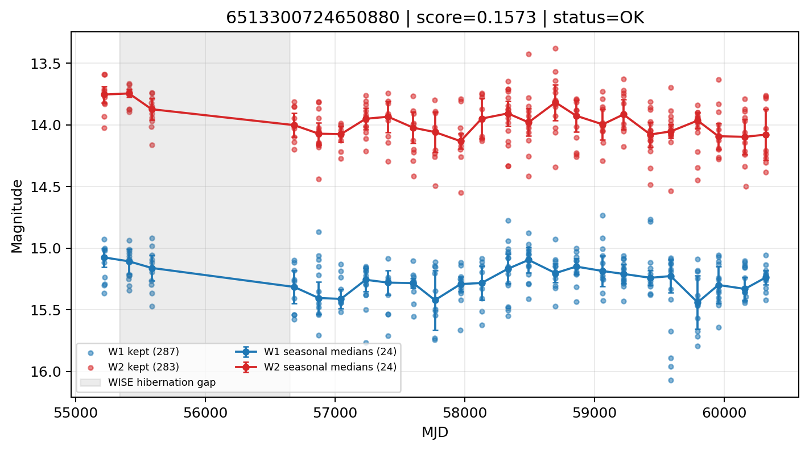

# Candidate Card: 6513300724650880 (Rank 171)

## Basic Metadata

- `source_id`: `6513300724650880`
- `canonical_id`: `6513300724650880`
- `score`: `0.157263`
- `status`: `OK`
- `final_label`: `Rejected`
- `stage_a_positive`: `False`
- `gate_blazar_veto`: `True`
- `gate_wise_qc_pass`: `True`
- `gate_data_sufficient`: `True`
- `decision_trace`: `stage_a_positive=fail;gate_blazar_veto=pass;gate_wise_qc_pass=pass;gate_data_sufficient=pass;gate_state_change_ratio_pass=pass;gate_transient_spike_pass=pass`

## Sampling / Variability Summary

- `n_points` (results table): `147`
- `baseline_days`: `5096.47`
- `baseline_years`: `13.953`
- `band_coverage`: `W1,W2`
- `delta_mag`: `-0.109`
- `delta_mag_method`: `seasonal_median_flux`

## Coordinates

- `ra`: `41.891626`
- `dec`: `5.871900`
- `coordinate_source`: `benchmark_master`

## WISE Light Curve

## WISE QA / Rejection Accounting

| Metric | Value |
| --- | --- |
| Raw points total | 574 |
| Raw points W1 | 287 |
| Raw points W2 | 287 |
| Kept points total | 570 |
| Kept points W1 | 287 |
| Kept points W2 | 283 |
| Fraction rejected | 0.00696864 |
| Reject: missing time | 0 |
| Reject: missing mag | 4 |
| Reject: invalid band | 0 |
| Reject: cc_flags | 0 |
| Reject: qual_frame | 0 |
| Reject: moon_lev | 0 |

### QA Reject Reason Counts

| reject_reason | count |
| --- | --- |
| reject_cc_flags | 0 |
| reject_invalid_band | 0 |
| reject_missing_mag | 4 |
| reject_missing_time | 0 |
| reject_moon_lev | 0 |
| reject_qual_frame | 0 |

## Flag Summary

### `cc_flags`

| value | count | fraction |
| --- | --- | --- |
| 0000 | 574 | 1 |

### `qual_frame`

| value | count | fraction |
| --- | --- | --- |
| <NA> | 574 | 1 |

### `moon_lev`

| value | count | fraction |
| --- | --- | --- |
| 00 | 484 | 0.843206 |
| 0000 | 62 | 0.108014 |
| 11 | 18 | 0.0313589 |
| 0111 | 6 | 0.010453 |
| 0011 | 4 | 0.00696864 |

### `qi_fact`

| value | count | fraction |
| --- | --- | --- |
| 1.0 | 342 | 0.595819 |
| 0.5 | 202 | 0.351916 |
| 0.0 | 30 | 0.0522648 |

### `saa_sep`

| value | count | fraction |
| --- | --- | --- |
| 15.0 | 4 | 0.00696864 |
| 24.0 | 4 | 0.00696864 |
| 107.0 | 4 | 0.00696864 |
| 16.268999099731445 | 4 | 0.00696864 |
| 82.08999633789062 | 2 | 0.00348432 |
| 82.31700134277344 | 2 | 0.00348432 |
| 16.812000274658203 | 2 | 0.00348432 |
| 19.93000030517578 | 2 | 0.00348432 |

### `ph_qual`

| value | count | fraction |
| --- | --- | --- |
| BB | 454 | 0.790941 |
| <NA> | 72 | 0.125436 |
| AB | 34 | 0.0592334 |
| BC | 8 | 0.0139373 |
| BU | 2 | 0.00348432 |
| BX | 2 | 0.00348432 |
| BA | 2 | 0.00348432 |

## Coverage Summary

- Seasonal bins (W1): `24`
- Seasonal bins (W2): `24`
- Pre-gap coverage: `True`
- Post-gap coverage: `True`
- Both-sides coverage: `True`

## Systematics Verdict

- Verdict: `PASS`
- Summary: QA-clean points and seasonal coverage support the observed variability signal.
- QA-dominated signal check: Not obviously dominated by flagged/low-quality points

Reasons:
- Seasonal trend supported by sufficient QA-clean W1/W2 points

## Catalog Checks

- Known blazar match: `NO`
- Known CLAGN match: `NO`
- Gaia metrics: not provided / no match

## Final Label

**Rejected**

- Rank 171 with score=0.1573
- Sampling: n_points=147, baseline_years=13.953374862422988, band_coverage=W1,W2
- QA rejection fraction=0.7% (main causes summarized in card QA section)
- Systematics verdict=PASS: QA-clean points and seasonal coverage support the observed variability signal.
- Known blazar catalog match=NO
- Dataset metadata class=star

## Reproducibility

- `run_timestamp_utc`: `2026-02-28T17:09:43.673413+00:00`
- `results_file`: `data/real_clagn/benchmark_scores.csv`
- `wise_file`: `data/wise/6513300724650880.csv`
- `score_threshold`: `0.0`
- `t_recall`: `0.3493918746`
