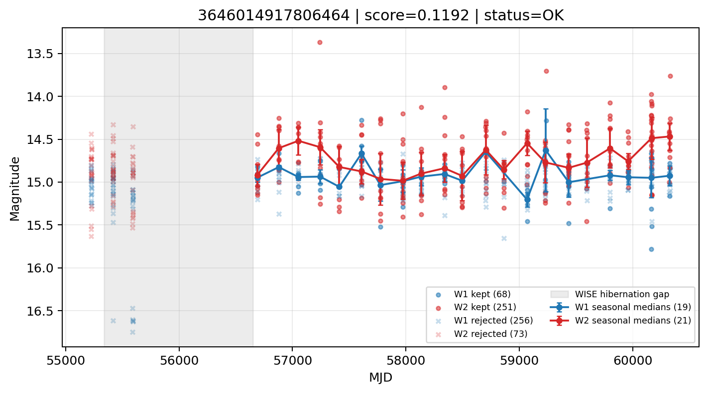

# Candidate Card: 3646014917806464 (Rank 181)

## Basic Metadata

- `source_id`: `3646014917806464`
- `canonical_id`: `3646014917806464`
- `score`: `0.119216`
- `status`: `OK`
- `final_label`: `Rejected`
- `stage_a_positive`: `False`
- `gate_blazar_veto`: `True`
- `gate_wise_qc_pass`: `True`
- `gate_data_sufficient`: `False`
- `decision_trace`: `stage_a_positive=fail;gate_blazar_veto=pass;gate_wise_qc_pass=pass;gate_data_sufficient=fail;gate_state_change_ratio_pass=pass;gate_transient_spike_pass=pass`

## Sampling / Variability Summary

- `n_points` (results table): `213`
- `baseline_days`: `5096.50`
- `baseline_years`: `13.953`
- `band_coverage`: `W1,W2`
- `delta_mag`: `0.091`
- `delta_mag_method`: `seasonal_median_flux`

## Coordinates

- `ra`: `46.854076`
- `dec`: `5.025384`
- `coordinate_source`: `benchmark_master`

## WISE Light Curve

## WISE QA / Rejection Accounting

| Metric | Value |
| --- | --- |
| Raw points total | 648 |
| Raw points W1 | 324 |
| Raw points W2 | 324 |
| Kept points total | 319 |
| Kept points W1 | 68 |
| Kept points W2 | 251 |
| Fraction rejected | 0.507716 |
| Reject: missing time | 0 |
| Reject: missing mag | 0 |
| Reject: invalid band | 0 |
| Reject: cc_flags | 329 |
| Reject: qual_frame | 0 |
| Reject: moon_lev | 0 |

### QA Reject Reason Counts

| reject_reason | count |
| --- | --- |
| reject_cc_flags | 329 |
| reject_invalid_band | 0 |
| reject_missing_mag | 0 |
| reject_missing_time | 0 |
| reject_moon_lev | 0 |
| reject_qual_frame | 0 |

## Flag Summary

### `cc_flags`

| value | count | fraction |
| --- | --- | --- |
| H000 | 352 | 0.54321 |
| hh00 | 146 | 0.225309 |
| 0000 | 136 | 0.209877 |
| h000 | 14 | 0.0216049 |

### `qual_frame`

| value | count | fraction |
| --- | --- | --- |
| <NA> | 648 | 1 |

### `moon_lev`

| value | count | fraction |
| --- | --- | --- |
| 00 | 474 | 0.731481 |
| 0000 | 146 | 0.225309 |
| 11 | 20 | 0.0308642 |
| 01 | 8 | 0.0123457 |

### `qi_fact`

| value | count | fraction |
| --- | --- | --- |
| 1.0 | 504 | 0.777778 |
| 0.5 | 128 | 0.197531 |
| 0.0 | 16 | 0.0246914 |

### `saa_sep`

| value | count | fraction |
| --- | --- | --- |
| 74.0 | 12 | 0.0185185 |
| 9.0 | 8 | 0.0123457 |
| 14.0 | 8 | 0.0123457 |
| 28.0 | 8 | 0.0123457 |
| 110.0 | 8 | 0.0123457 |
| 116.0 | 8 | 0.0123457 |
| 89.0 | 6 | 0.00925926 |
| 119.0 | 4 | 0.00617284 |

### `ph_qual`

| value | count | fraction |
| --- | --- | --- |
| <NA> | 146 | 0.225309 |
| AB | 104 | 0.160494 |
| BB | 104 | 0.160494 |
| BC | 96 | 0.148148 |
| AC | 84 | 0.12963 |
| BU | 74 | 0.114198 |
| AU | 38 | 0.058642 |
| UB | 2 | 0.00308642 |

## Coverage Summary

- Seasonal bins (W1): `19`
- Seasonal bins (W2): `21`
- Pre-gap coverage: `False`
- Post-gap coverage: `True`
- Both-sides coverage: `False`

## Systematics Verdict

- Verdict: `CAUTION`
- Summary: Variability signal is present but data quality/coverage limitations weaken confidence.
- QA-dominated signal check: Not obviously dominated by flagged/low-quality points

Reasons:
- High QA rejection fraction (50.8%)
- No clean coverage on both sides of WISE hibernation gap

## Catalog Checks

- Known blazar match: `NO`
- Known CLAGN match: `NO`
- Gaia metrics: not provided / no match

## Final Label

**Rejected**

- Rank 181 with score=0.1192
- Sampling: n_points=213, baseline_years=13.953456791375778, band_coverage=W1,W2
- QA rejection fraction=50.8% (main causes summarized in card QA section)
- Systematics verdict=CAUTION: Variability signal is present but data quality/coverage limitations weaken confidence.
- Known blazar catalog match=NO
- Dataset metadata class=star

## Reproducibility

- `run_timestamp_utc`: `2026-02-28T17:09:43.673413+00:00`
- `results_file`: `data/real_clagn/benchmark_scores.csv`
- `wise_file`: `data/wise/3646014917806464.csv`
- `score_threshold`: `0.0`
- `t_recall`: `0.3493918746`
