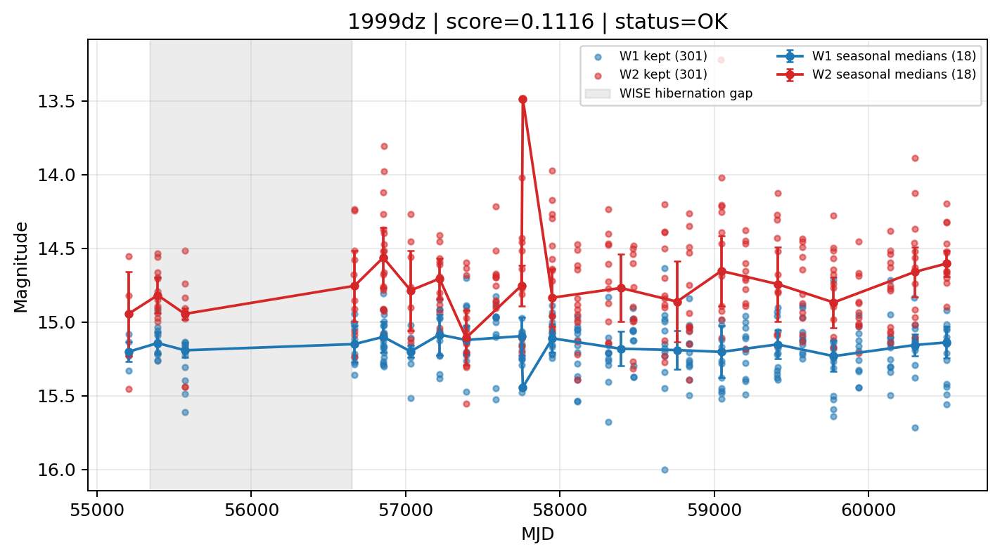

# Candidate Card: 1999dz (Rank 185)

## Basic Metadata

- `source_id`: `1999dz`
- `canonical_id`: `1999dz`
- `source_id_normalized`: `1999DZ`
- `canonical_id_normalized`: `1999DZ`
- `score`: `0.111602`
- `status`: `OK`
- `final_label`: `Rejected`
- `stage_a_positive`: `False`
- `gate_blazar_veto`: `True`
- `gate_wise_qc_pass`: `True`
- `gate_data_sufficient`: `True`
- `decision_trace`: `stage_a_positive=fail;gate_blazar_veto=pass;gate_wise_qc_pass=pass;gate_data_sufficient=pass;gate_state_change_ratio_pass=pass;gate_transient_spike_pass=pass`

## Sampling / Variability Summary

- `n_points` (results table): `191`
- `baseline_days`: `5299.97`
- `baseline_years`: `14.511`
- `band_coverage`: `W1,W2`
- `delta_mag`: `0.026`
- `delta_mag_method`: `seasonal_median_flux`

## Coordinates

- `ra`: `24.263500`
- `dec`: `0.032750`
- `coordinate_source`: `benchmark_master`

## WISE Light Curve

## WISE QA / Rejection Accounting

| Metric | Value |
| --- | --- |
| Raw points total | 602 |
| Raw points W1 | 301 |
| Raw points W2 | 301 |
| Kept points total | 602 |
| Kept points W1 | 301 |
| Kept points W2 | 301 |
| Fraction rejected | 0 |
| Reject: missing time | 0 |
| Reject: missing mag | 0 |
| Reject: invalid band | 0 |
| Reject: cc_flags | 0 |
| Reject: qual_frame | 0 |
| Reject: moon_lev | 0 |

### QA Reject Reason Counts

| reject_reason | count |
| --- | --- |
| reject_cc_flags | 0 |
| reject_invalid_band | 0 |
| reject_missing_mag | 0 |
| reject_missing_time | 0 |
| reject_moon_lev | 0 |
| reject_qual_frame | 0 |

## Flag Summary

### `cc_flags`

| value | count | fraction |
| --- | --- | --- |
| 0000 | 602 | 1 |

### `qual_frame`

| value | count | fraction |
| --- | --- | --- |
| <NA> | 602 | 1 |

### `moon_lev`

| value | count | fraction |
| --- | --- | --- |
| 00 | 518 | 0.860465 |
| 0000 | 56 | 0.0930233 |
| 11 | 28 | 0.0465116 |

### `qi_fact`

| value | count | fraction |
| --- | --- | --- |
| 1.0 | 454 | 0.754153 |
| 0.5 | 132 | 0.219269 |
| 0.0 | 16 | 0.0265781 |

### `saa_sep`

| value | count | fraction |
| --- | --- | --- |
| 44.0 | 4 | 0.00664452 |
| 7.0 | 4 | 0.00664452 |
| 117.0 | 4 | 0.00664452 |
| 20.148000717163086 | 4 | 0.00664452 |
| 64.0 | 4 | 0.00664452 |
| 76.0 | 2 | 0.00332226 |
| 72.0719985961914 | 2 | 0.00332226 |
| 16.62299919128418 | 2 | 0.00332226 |

### `ph_qual`

| value | count | fraction |
| --- | --- | --- |
| BU | 174 | 0.289037 |
| BB | 146 | 0.242525 |
| BC | 128 | 0.212625 |
| <NA> | 56 | 0.0930233 |
| AU | 34 | 0.0564784 |
| AC | 34 | 0.0564784 |
| AB | 28 | 0.0465116 |
| CU | 2 | 0.00332226 |

## Coverage Summary

- Seasonal bins (W1): `18`
- Seasonal bins (W2): `18`
- Pre-gap coverage: `True`
- Post-gap coverage: `True`
- Both-sides coverage: `True`

## Systematics Verdict

- Verdict: `PASS`
- Summary: QA-clean points and seasonal coverage support the observed variability signal.
- QA-dominated signal check: Not obviously dominated by flagged/low-quality points

Reasons:
- Seasonal trend supported by sufficient QA-clean W1/W2 points

## Catalog Checks

- Known blazar match: `NO`
- Known CLAGN match: `NO`
- Gaia metrics: not provided / no match

## Final Label

**Rejected**

- Rank 185 with score=0.1116
- Sampling: n_points=191, baseline_years=14.510530277700203, band_coverage=W1,W2
- QA rejection fraction=0.0% (main causes summarized in card QA section)
- Systematics verdict=PASS: QA-clean points and seasonal coverage support the observed variability signal.
- Known blazar catalog match=NO
- Dataset metadata class=sn

## Reproducibility

- `run_timestamp_utc`: `2026-02-28T17:09:43.673413+00:00`
- `results_file`: `data/real_clagn/benchmark_scores.csv`
- `wise_file`: `data/wise/1999dz.csv`
- `score_threshold`: `0.0`
- `t_recall`: `0.3493918746`
