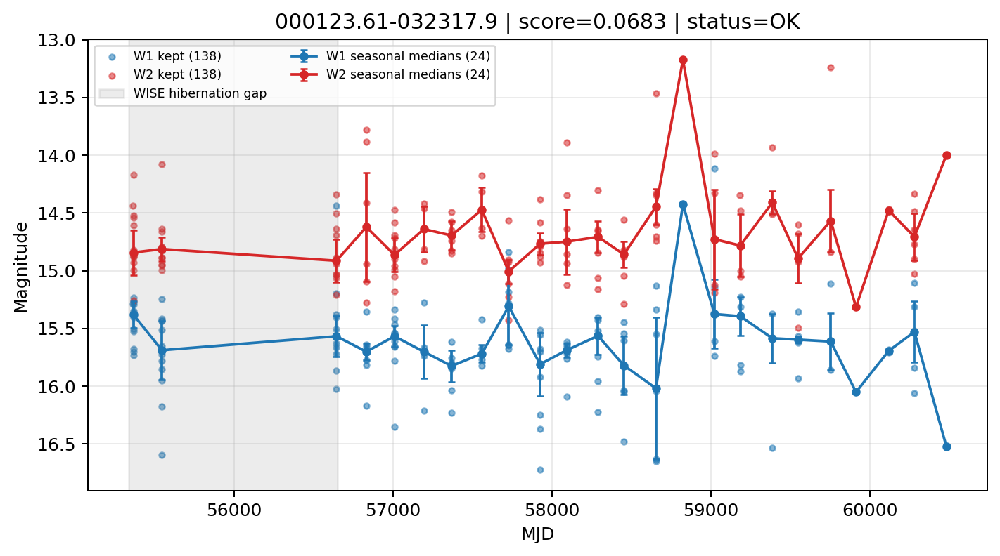

# Candidate Card: 000123.61-032317.9 (Rank 198)

## Basic Metadata

- `source_id`: `000123.61-032317.9`
- `canonical_id`: `000123.61-032317.9`
- `score`: `0.068289`
- `status`: `OK`
- `final_label`: `Rejected`
- `stage_a_positive`: `False`
- `gate_blazar_veto`: `True`
- `gate_wise_qc_pass`: `True`
- `gate_data_sufficient`: `False`
- `decision_trace`: `stage_a_positive=fail;gate_blazar_veto=pass;gate_wise_qc_pass=pass;gate_data_sufficient=fail;gate_state_change_ratio_pass=pass;gate_transient_spike_pass=pass`

## Sampling / Variability Summary

- `n_points` (results table): `73`
- `baseline_days`: `4912.00`
- `baseline_years`: `13.448`
- `band_coverage`: `W1,W2`
- `delta_mag`: `-0.141`
- `delta_mag_method`: `seasonal_median_flux`

## Coordinates

- `ra`: `0.348390`
- `dec`: `-3.388329`
- `coordinate_source`: `benchmark_master`

## WISE Light Curve

## WISE QA / Rejection Accounting

| Metric | Value |
| --- | --- |
| Raw points total | 276 |
| Raw points W1 | 138 |
| Raw points W2 | 138 |
| Kept points total | 276 |
| Kept points W1 | 138 |
| Kept points W2 | 138 |
| Fraction rejected | 0 |
| Reject: missing time | 0 |
| Reject: missing mag | 0 |
| Reject: invalid band | 0 |
| Reject: cc_flags | 0 |
| Reject: qual_frame | 0 |
| Reject: moon_lev | 0 |

### QA Reject Reason Counts

| reject_reason | count |
| --- | --- |
| reject_cc_flags | 0 |
| reject_invalid_band | 0 |
| reject_missing_mag | 0 |
| reject_missing_time | 0 |
| reject_moon_lev | 0 |
| reject_qual_frame | 0 |

## Flag Summary

### `cc_flags`

| value | count | fraction |
| --- | --- | --- |
| 0000 | 276 | 1 |

### `qual_frame`

| value | count | fraction |
| --- | --- | --- |
| <NA> | 276 | 1 |

### `moon_lev`

| value | count | fraction |
| --- | --- | --- |
| 00 | 220 | 0.797101 |
| 0000 | 36 | 0.130435 |
| 0011 | 12 | 0.0434783 |
| 11 | 6 | 0.0217391 |
| 01 | 2 | 0.00724638 |

### `qi_fact`

| value | count | fraction |
| --- | --- | --- |
| 1.000000 | 196 | 0.710145 |
| 0.500000 | 68 | 0.246377 |
| 0.000000 | 12 | 0.0434783 |

### `saa_sep`

| value | count | fraction |
| --- | --- | --- |
| 25.000000 | 4 | 0.0144928 |
| 71.000000 | 4 | 0.0144928 |
| 2.000000 | 4 | 0.0144928 |
| 16.556999 | 2 | 0.00724638 |
| 28.624001 | 2 | 0.00724638 |
| 18.084000 | 2 | 0.00724638 |
| 112.412003 | 2 | 0.00724638 |
| 116.641998 | 2 | 0.00724638 |

### `ph_qual`

| value | count | fraction |
| --- | --- | --- |
| BB | 88 | 0.318841 |
| BC | 62 | 0.224638 |
| BU | 50 | 0.181159 |
| <NA> | 48 | 0.173913 |
| CB | 10 | 0.0362319 |
| UC | 6 | 0.0217391 |
| AB | 4 | 0.0144928 |
| UB | 4 | 0.0144928 |

## Coverage Summary

- Seasonal bins (W1): `24`
- Seasonal bins (W2): `24`
- Pre-gap coverage: `False`
- Post-gap coverage: `True`
- Both-sides coverage: `False`

## Systematics Verdict

- Verdict: `CAUTION`
- Summary: Variability signal is present but data quality/coverage limitations weaken confidence.
- QA-dominated signal check: Not obviously dominated by flagged/low-quality points

Reasons:
- No clean coverage on both sides of WISE hibernation gap

## Catalog Checks

- Known blazar match: `NO`
- Known CLAGN match: `NO`
- Gaia metrics: not provided / no match

## Final Label

**Rejected**

- Rank 198 with score=0.0683
- Sampling: n_points=73, baseline_years=13.448318004353192, band_coverage=W1,W2
- QA rejection fraction=0.0% (main causes summarized in card QA section)
- Systematics verdict=CAUTION: Variability signal is present but data quality/coverage limitations weaken confidence.
- Known blazar catalog match=NO
- Dataset metadata class=normal_agn

## Reproducibility

- `run_timestamp_utc`: `2026-02-28T17:09:43.673413+00:00`
- `results_file`: `data/real_clagn/benchmark_scores.csv`
- `wise_file`: `data/wise/000123.61-032317.9.csv`
- `score_threshold`: `0.0`
- `t_recall`: `0.3493918746`
