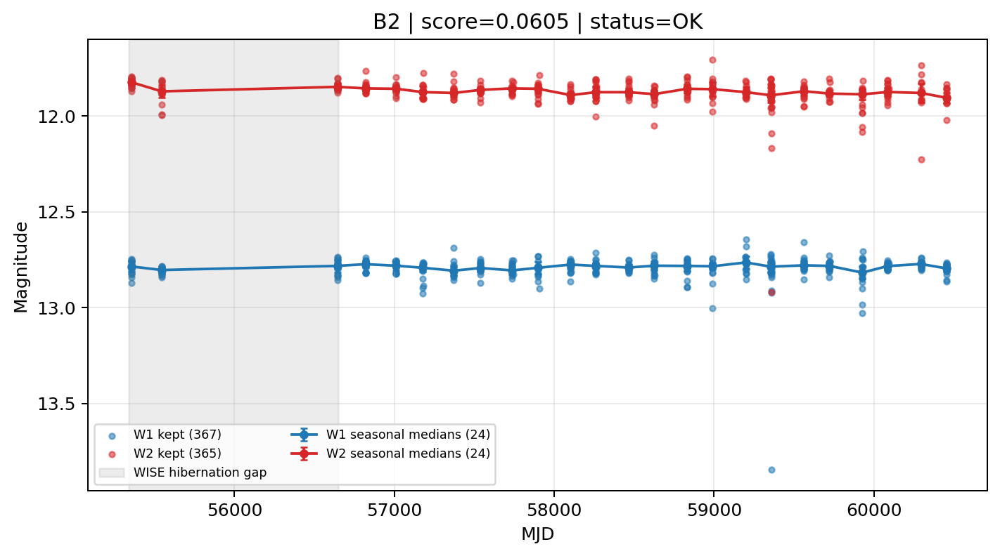

# Candidate Card: B2 (Rank 203)

## Basic Metadata

- `source_id`: `B2`
- `canonical_id`: `B2`
- `score`: `0.060473`
- `status`: `OK`
- `final_label`: `Rejected`
- `stage_a_positive`: `False`
- `gate_blazar_veto`: `False`
- `gate_wise_qc_pass`: `True`
- `gate_data_sufficient`: `False`
- `decision_trace`: `stage_a_positive=fail;gate_blazar_veto=fail;gate_wise_qc_pass=pass;gate_data_sufficient=fail;gate_state_change_ratio_pass=pass;gate_transient_spike_pass=pass`

## Sampling / Variability Summary

- `n_points` (results table): `220`
- `baseline_days`: `5098.47`
- `baseline_years`: `13.959`
- `band_coverage`: `W1,W2`
- `delta_mag`: `-0.003`
- `delta_mag_method`: `seasonal_median_flux`

## Coordinates

- `ra`: `187.104000`
- `dec`: `31.477100`
- `coordinate_source`: `benchmark_master`

## WISE Light Curve

## WISE QA / Rejection Accounting

| Metric | Value |
| --- | --- |
| Raw points total | 734 |
| Raw points W1 | 367 |
| Raw points W2 | 367 |
| Kept points total | 732 |
| Kept points W1 | 367 |
| Kept points W2 | 365 |
| Fraction rejected | 0.0027248 |
| Reject: missing time | 0 |
| Reject: missing mag | 2 |
| Reject: invalid band | 0 |
| Reject: cc_flags | 0 |
| Reject: qual_frame | 0 |
| Reject: moon_lev | 0 |

### QA Reject Reason Counts

| reject_reason | count |
| --- | --- |
| reject_cc_flags | 0 |
| reject_invalid_band | 0 |
| reject_missing_mag | 2 |
| reject_missing_time | 0 |
| reject_moon_lev | 0 |
| reject_qual_frame | 0 |

## Flag Summary

### `cc_flags`

| value | count | fraction |
| --- | --- | --- |
| 0000 | 734 | 1 |

### `qual_frame`

| value | count | fraction |
| --- | --- | --- |
| <NA> | 734 | 1 |

### `moon_lev`

| value | count | fraction |
| --- | --- | --- |
| 00 | 674 | 0.918256 |
| 0000 | 60 | 0.0817439 |

### `qi_fact`

| value | count | fraction |
| --- | --- | --- |
| 1.000000 | 488 | 0.66485 |
| 0.500000 | 230 | 0.313351 |
| 0.000000 | 16 | 0.0217984 |

### `saa_sep`

| value | count | fraction |
| --- | --- | --- |
| 54.000000 | 6 | 0.00817439 |
| 40.939999 | 4 | 0.00544959 |
| 116.000000 | 4 | 0.00544959 |
| 83.000000 | 4 | 0.00544959 |
| 67.260002 | 4 | 0.00544959 |
| 55.000000 | 4 | 0.00544959 |
| 102.000000 | 4 | 0.00544959 |
| 108.000000 | 4 | 0.00544959 |

### `ph_qual`

| value | count | fraction |
| --- | --- | --- |
| AA | 670 | 0.912807 |
| <NA> | 60 | 0.0817439 |
| AX | 4 | 0.00544959 |

## Coverage Summary

- Seasonal bins (W1): `24`
- Seasonal bins (W2): `24`
- Pre-gap coverage: `False`
- Post-gap coverage: `True`
- Both-sides coverage: `False`

## Systematics Verdict

- Verdict: `CAUTION`
- Summary: Variability signal is present but data quality/coverage limitations weaken confidence.
- QA-dominated signal check: Not obviously dominated by flagged/low-quality points

Reasons:
- No clean coverage on both sides of WISE hibernation gap

## Catalog Checks

- Known blazar match: `YES` via `source_id` token `B2`
- Known CLAGN match: `NO`
- Gaia metrics: not provided / no match

## Final Label

**Rejected**

- Rank 203 with score=0.0605
- Sampling: n_points=220, baseline_years=13.95885235734429, band_coverage=W1,W2
- QA rejection fraction=0.3% (main causes summarized in card QA section)
- Systematics verdict=CAUTION: Variability signal is present but data quality/coverage limitations weaken confidence.
- Known blazar catalog match=YES
- Dataset metadata class=blazar

## Reproducibility

- `run_timestamp_utc`: `2026-02-28T17:09:43.673413+00:00`
- `results_file`: `data/real_clagn/benchmark_scores.csv`
- `wise_file`: `data/wise/B2.csv`
- `score_threshold`: `0.0`
- `t_recall`: `0.3493918746`
