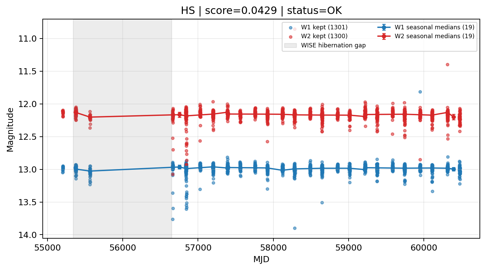

# Candidate Card: HS (Rank 207)

## Basic Metadata

- `source_id`: `HS`
- `canonical_id`: `HS`
- `score`: `0.042873`
- `status`: `OK`
- `final_label`: `Rejected`
- `stage_a_positive`: `False`
- `gate_blazar_veto`: `False`
- `gate_wise_qc_pass`: `True`
- `gate_data_sufficient`: `True`
- `decision_trace`: `stage_a_positive=fail;gate_blazar_veto=fail;gate_wise_qc_pass=pass;gate_data_sufficient=pass;gate_state_change_ratio_pass=pass;gate_transient_spike_pass=pass`

## Sampling / Variability Summary

- `n_points` (results table): `872`
- `baseline_days`: `5275.58`
- `baseline_years`: `14.444`
- `band_coverage`: `W1,W2`
- `delta_mag`: `-0.002`
- `delta_mag_method`: `seasonal_median_flux`

## Coordinates

- `ra`: `255.251700`
- `dec`: `64.202500`
- `coordinate_source`: `benchmark_master`

## WISE Light Curve

## WISE QA / Rejection Accounting

| Metric | Value |
| --- | --- |
| Raw points total | 2602 |
| Raw points W1 | 1301 |
| Raw points W2 | 1301 |
| Kept points total | 2601 |
| Kept points W1 | 1301 |
| Kept points W2 | 1300 |
| Fraction rejected | 0.00038432 |
| Reject: missing time | 0 |
| Reject: missing mag | 1 |
| Reject: invalid band | 0 |
| Reject: cc_flags | 0 |
| Reject: qual_frame | 0 |
| Reject: moon_lev | 0 |

### QA Reject Reason Counts

| reject_reason | count |
| --- | --- |
| reject_cc_flags | 0 |
| reject_invalid_band | 0 |
| reject_missing_mag | 1 |
| reject_missing_time | 0 |
| reject_moon_lev | 0 |
| reject_qual_frame | 0 |

## Flag Summary

### `cc_flags`

| value | count | fraction |
| --- | --- | --- |
| 0000 | 2602 | 1 |

### `qual_frame`

| value | count | fraction |
| --- | --- | --- |
| <NA> | 2602 | 1 |

### `moon_lev`

| value | count | fraction |
| --- | --- | --- |
| 00 | 2390 | 0.918524 |
| 0000 | 212 | 0.0814758 |

### `qi_fact`

| value | count | fraction |
| --- | --- | --- |
| 1.000000 | 1922 | 0.738663 |
| 0.500000 | 536 | 0.205995 |
| 0.000000 | 144 | 0.055342 |

### `saa_sep`

| value | count | fraction |
| --- | --- | --- |
| 84.000000 | 20 | 0.0076864 |
| 86.000000 | 18 | 0.00691776 |
| 98.000000 | 12 | 0.00461184 |
| 105.000000 | 12 | 0.00461184 |
| 107.000000 | 12 | 0.00461184 |
| 83.000000 | 10 | 0.0038432 |
| 87.000000 | 10 | 0.0038432 |
| 96.000000 | 10 | 0.0038432 |

### `ph_qual`

| value | count | fraction |
| --- | --- | --- |
| AA | 2388 | 0.917756 |
| <NA> | 212 | 0.0814758 |
| AX | 2 | 0.00076864 |

## Coverage Summary

- Seasonal bins (W1): `19`
- Seasonal bins (W2): `19`
- Pre-gap coverage: `True`
- Post-gap coverage: `True`
- Both-sides coverage: `True`

## Systematics Verdict

- Verdict: `PASS`
- Summary: QA-clean points and seasonal coverage support the observed variability signal.
- QA-dominated signal check: Not obviously dominated by flagged/low-quality points

Reasons:
- Seasonal trend supported by sufficient QA-clean W1/W2 points

## Catalog Checks

- Known blazar match: `YES` via `source_id` token `HS`
- Known CLAGN match: `NO`
- Gaia metrics: not provided / no match

## Final Label

**Rejected**

- Rank 207 with score=0.0429
- Sampling: n_points=872, baseline_years=14.44374223460644, band_coverage=W1,W2
- QA rejection fraction=0.0% (main causes summarized in card QA section)
- Systematics verdict=PASS: QA-clean points and seasonal coverage support the observed variability signal.
- Known blazar catalog match=YES
- Dataset metadata class=blazar

## Reproducibility

- `run_timestamp_utc`: `2026-02-28T17:09:43.673413+00:00`
- `results_file`: `data/real_clagn/benchmark_scores.csv`
- `wise_file`: `data/wise/HS.csv`
- `score_threshold`: `0.0`
- `t_recall`: `0.3493918746`
