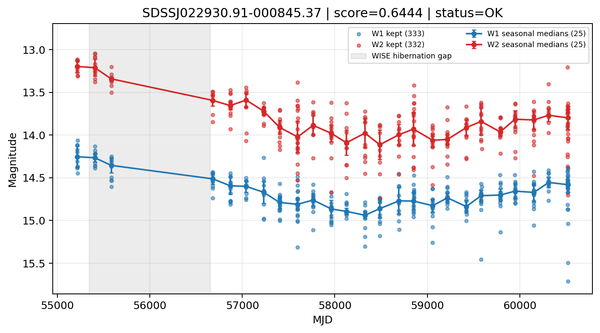

# Candidate Card: SDSSJ022930.91-000845.37 (Rank 23)

## Basic Metadata

- `source_id`: `SDSSJJ022930.91-000845.37`
- `canonical_id`: `SDSSJ022930.91-000845.37`
- `source_id_normalized`: `SDSSJ022930.91-000845.37`
- `score`: `0.644372`
- `status`: `OK`
- `final_label`: `Known AGN`
- `stage_a_positive`: `True`
- `gate_blazar_veto`: `True`
- `gate_wise_qc_pass`: `True`
- `gate_data_sufficient`: `True`
- `decision_trace`: `stage_a_positive=pass;gate_blazar_veto=pass;gate_wise_qc_pass=pass;gate_data_sufficient=pass;gate_state_change_ratio_pass=pass;gate_transient_spike_pass=pass`

## Sampling / Variability Summary

- `n_points` (results table): `208`
- `baseline_days`: `5304.72`
- `baseline_years`: `14.524`
- `band_coverage`: `W1,W2`
- `delta_mag`: `-0.301`
- `delta_mag_method`: `seasonal_median_flux`

## Coordinates

- `ra`: `37.378820`
- `dec`: `-0.145960`
- `coordinate_source`: `benchmark_master`

## WISE Light Curve

## WISE QA / Rejection Accounting

| Metric | Value |
| --- | --- |
| Raw points total | 666 |
| Raw points W1 | 333 |
| Raw points W2 | 333 |
| Kept points total | 665 |
| Kept points W1 | 333 |
| Kept points W2 | 332 |
| Fraction rejected | 0.0015015 |
| Reject: missing time | 0 |
| Reject: missing mag | 1 |
| Reject: invalid band | 0 |
| Reject: cc_flags | 0 |
| Reject: qual_frame | 0 |
| Reject: moon_lev | 0 |

### QA Reject Reason Counts

| reject_reason | count |
| --- | --- |
| reject_cc_flags | 0 |
| reject_invalid_band | 0 |
| reject_missing_mag | 1 |
| reject_missing_time | 0 |
| reject_moon_lev | 0 |
| reject_qual_frame | 0 |

## Flag Summary

### `cc_flags`

| value | count | fraction |
| --- | --- | --- |
| 0000 | 666 | 1 |

### `qual_frame`

| value | count | fraction |
| --- | --- | --- |
| <NA> | 666 | 1 |

### `moon_lev`

| value | count | fraction |
| --- | --- | --- |
| 00 | 546 | 0.81982 |
| 0000 | 66 | 0.0990991 |
| 11 | 36 | 0.0540541 |
| 01 | 16 | 0.024024 |
| 0111 | 2 | 0.003003 |

### `qi_fact`

| value | count | fraction |
| --- | --- | --- |
| 1.0 | 488 | 0.732733 |
| 0.5 | 138 | 0.207207 |
| 0.0 | 40 | 0.0600601 |

### `saa_sep`

| value | count | fraction |
| --- | --- | --- |
| 29.0 | 6 | 0.00900901 |
| 12.0 | 6 | 0.00900901 |
| 28.0 | 4 | 0.00600601 |
| 21.0 | 4 | 0.00600601 |
| 49.61800003051758 | 4 | 0.00600601 |
| 88.0 | 4 | 0.00600601 |
| 43.30099868774414 | 4 | 0.00600601 |
| 28.992000579833984 | 2 | 0.003003 |

### `ph_qual`

| value | count | fraction |
| --- | --- | --- |
| AB | 424 | 0.636637 |
| BB | 114 | 0.171171 |
| <NA> | 68 | 0.102102 |
| AA | 28 | 0.042042 |
| BC | 12 | 0.018018 |
| AC | 8 | 0.012012 |
| BU | 6 | 0.00900901 |
| AU | 4 | 0.00600601 |

## Coverage Summary

- Seasonal bins (W1): `25`
- Seasonal bins (W2): `25`
- Pre-gap coverage: `True`
- Post-gap coverage: `True`
- Both-sides coverage: `True`

## Systematics Verdict

- Verdict: `PASS`
- Summary: QA-clean points and seasonal coverage support the observed variability signal.
- QA-dominated signal check: Not obviously dominated by flagged/low-quality points

Reasons:
- Seasonal trend supported by sufficient QA-clean W1/W2 points

## Catalog Checks

- Known blazar match: `NO`
- Known CLAGN match: `NO`
- Gaia metrics: not provided / no match

## Final Label

**Known AGN**

- Rank 23 with score=0.6444
- Sampling: n_points=208, baseline_years=14.523520468364142, band_coverage=W1,W2
- QA rejection fraction=0.2% (main causes summarized in card QA section)
- Systematics verdict=PASS: QA-clean points and seasonal coverage support the observed variability signal.
- Known blazar catalog match=NO
- Dataset metadata class=clagn

## Reproducibility

- `run_timestamp_utc`: `2026-02-28T17:09:43.673413+00:00`
- `results_file`: `data/real_clagn/benchmark_scores.csv`
- `wise_file`: `data/wise/SDSSJ022930.91-000845.37.csv`
- `score_threshold`: `0.0`
- `t_recall`: `0.3493918746`
