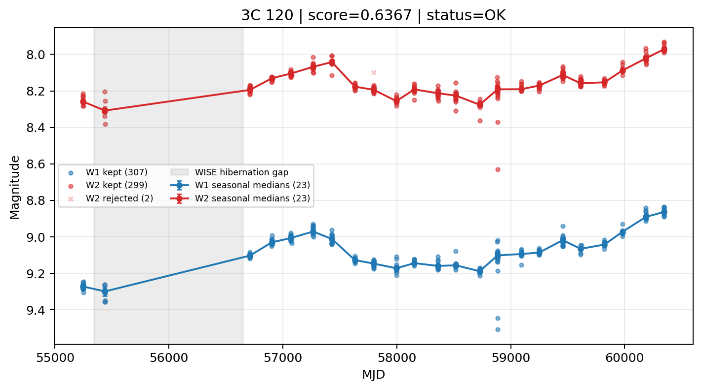

# Candidate Card: 3C 120 (Rank 28)

## Basic Metadata

- `source_id`: `3C 120`
- `canonical_id`: `3C 120`
- `score`: `0.636668`
- `status`: `OK`
- `final_label`: `Known blazar`
- `stage_a_positive`: `True`
- `gate_blazar_veto`: `False`
- `gate_wise_qc_pass`: `True`
- `gate_data_sufficient`: `True`
- `decision_trace`: `stage_a_positive=pass;gate_blazar_veto=fail;gate_wise_qc_pass=pass;gate_data_sufficient=pass;gate_state_change_ratio_pass=pass;gate_transient_spike_pass=pass`

## Sampling / Variability Summary

- `n_points` (results table): `218`
- `baseline_days`: `5098.83`
- `baseline_years`: `13.960`
- `band_coverage`: `W1,W2`
- `delta_mag`: `0.404`
- `delta_mag_method`: `seasonal_median_flux`

## Coordinates

- `ra`: `68.296200`
- `dec`: `5.354300`
- `coordinate_source`: `benchmark_master`

## WISE Light Curve

## WISE QA / Rejection Accounting

| Metric | Value |
| --- | --- |
| Raw points total | 614 |
| Raw points W1 | 307 |
| Raw points W2 | 307 |
| Kept points total | 606 |
| Kept points W1 | 307 |
| Kept points W2 | 299 |
| Fraction rejected | 0.0130293 |
| Reject: missing time | 0 |
| Reject: missing mag | 6 |
| Reject: invalid band | 0 |
| Reject: cc_flags | 2 |
| Reject: qual_frame | 0 |
| Reject: moon_lev | 0 |

### QA Reject Reason Counts

| reject_reason | count |
| --- | --- |
| reject_cc_flags | 2 |
| reject_invalid_band | 0 |
| reject_missing_mag | 6 |
| reject_missing_time | 0 |
| reject_moon_lev | 0 |
| reject_qual_frame | 0 |

## Flag Summary

### `cc_flags`

| value | count | fraction |
| --- | --- | --- |
| 0000 | 610 | 0.993485 |
| 0d00 | 4 | 0.00651466 |

### `qual_frame`

| value | count | fraction |
| --- | --- | --- |
| <NA> | 614 | 1 |

### `moon_lev`

| value | count | fraction |
| --- | --- | --- |
| 00 | 510 | 0.830619 |
| 0000 | 38 | 0.0618893 |
| 11 | 34 | 0.0553746 |
| 01 | 16 | 0.0260586 |
| 0111 | 10 | 0.0162866 |
| 0011 | 6 | 0.00977199 |

### `qi_fact`

| value | count | fraction |
| --- | --- | --- |
| 1.0 | 510 | 0.830619 |
| 0.5 | 98 | 0.159609 |
| 0.0 | 6 | 0.00977199 |

### `saa_sep`

| value | count | fraction |
| --- | --- | --- |
| 22.0 | 6 | 0.00977199 |
| 27.0 | 6 | 0.00977199 |
| 122.0 | 4 | 0.00651466 |
| 14.564000129699707 | 2 | 0.00325733 |
| 116.65899658203125 | 2 | 0.00325733 |
| 39.6619987487793 | 2 | 0.00325733 |
| 91.8270034790039 | 2 | 0.00325733 |
| 43.97600173950195 | 2 | 0.00325733 |

### `ph_qual`

| value | count | fraction |
| --- | --- | --- |
| AA | 558 | 0.908795 |
| <NA> | 54 | 0.0879479 |
| AX | 2 | 0.00325733 |

## Coverage Summary

- Seasonal bins (W1): `23`
- Seasonal bins (W2): `23`
- Pre-gap coverage: `True`
- Post-gap coverage: `True`
- Both-sides coverage: `True`

## Systematics Verdict

- Verdict: `PASS`
- Summary: QA-clean points and seasonal coverage support the observed variability signal.
- QA-dominated signal check: Not obviously dominated by flagged/low-quality points

Reasons:
- Seasonal trend supported by sufficient QA-clean W1/W2 points

## Catalog Checks

- Known blazar match: `YES` via `source_id` token `3C 120`
- Known CLAGN match: `NO`
- Gaia metrics: not provided / no match

## Final Label

**Known blazar**

- Rank 28 with score=0.6367
- Sampling: n_points=218, baseline_years=13.959847314743316, band_coverage=W1,W2
- QA rejection fraction=1.3% (main causes summarized in card QA section)
- Systematics verdict=PASS: QA-clean points and seasonal coverage support the observed variability signal.
- Known blazar catalog match=YES
- Dataset metadata class=blazar

## Reproducibility

- `run_timestamp_utc`: `2026-02-28T17:09:43.673413+00:00`
- `results_file`: `data/real_clagn/benchmark_scores.csv`
- `wise_file`: `data/wise/3C 120.csv`
- `score_threshold`: `0.0`
- `t_recall`: `0.3493918746`
