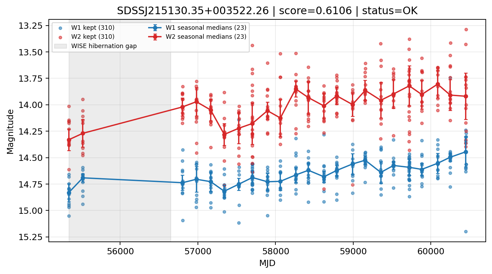

# Candidate Card: SDSSJ215130.35+003522.26 (Rank 32)

## Basic Metadata

- `source_id`: `SDSSJJ215130.35+003522.26`
- `canonical_id`: `SDSSJ215130.35+003522.26`
- `source_id_normalized`: `SDSSJ215130.35+003522.26`
- `score`: `0.610625`
- `status`: `OK`
- `final_label`: `Known AGN`
- `stage_a_positive`: `True`
- `gate_blazar_veto`: `True`
- `gate_wise_qc_pass`: `True`
- `gate_data_sufficient`: `True`
- `decision_trace`: `stage_a_positive=pass;gate_blazar_veto=pass;gate_wise_qc_pass=pass;gate_data_sufficient=pass;gate_state_change_ratio_pass=pass;gate_transient_spike_pass=pass`

## Sampling / Variability Summary

- `n_points` (results table): `203`
- `baseline_days`: `5114.15`
- `baseline_years`: `14.002`
- `band_coverage`: `W1,W2`
- `delta_mag`: `0.262`
- `delta_mag_method`: `seasonal_median_flux`

## Coordinates

- `ra`: `327.876500`
- `dec`: `0.589500`
- `coordinate_source`: `benchmark_master`

## WISE Light Curve

## WISE QA / Rejection Accounting

| Metric | Value |
| --- | --- |
| Raw points total | 622 |
| Raw points W1 | 311 |
| Raw points W2 | 311 |
| Kept points total | 620 |
| Kept points W1 | 310 |
| Kept points W2 | 310 |
| Fraction rejected | 0.00321543 |
| Reject: missing time | 0 |
| Reject: missing mag | 2 |
| Reject: invalid band | 0 |
| Reject: cc_flags | 0 |
| Reject: qual_frame | 0 |
| Reject: moon_lev | 0 |

### QA Reject Reason Counts

| reject_reason | count |
| --- | --- |
| reject_cc_flags | 0 |
| reject_invalid_band | 0 |
| reject_missing_mag | 2 |
| reject_missing_time | 0 |
| reject_moon_lev | 0 |
| reject_qual_frame | 0 |

## Flag Summary

### `cc_flags`

| value | count | fraction |
| --- | --- | --- |
| 0000 | 622 | 1 |

### `qual_frame`

| value | count | fraction |
| --- | --- | --- |
| <NA> | 622 | 1 |

### `moon_lev`

| value | count | fraction |
| --- | --- | --- |
| 00 | 512 | 0.823151 |
| 0000 | 50 | 0.0803859 |
| 11 | 34 | 0.0546624 |
| 01 | 26 | 0.0418006 |

### `qi_fact`

| value | count | fraction |
| --- | --- | --- |
| 1.0 | 502 | 0.807074 |
| 0.5 | 104 | 0.167203 |
| 0.0 | 16 | 0.0257235 |

### `saa_sep`

| value | count | fraction |
| --- | --- | --- |
| 5.0 | 4 | 0.00643087 |
| 43.0 | 4 | 0.00643087 |
| 116.0 | 4 | 0.00643087 |
| 97.31099700927734 | 4 | 0.00643087 |
| 17.0 | 2 | 0.00321543 |
| 18.3700008392334 | 2 | 0.00321543 |
| 40.334999084472656 | 2 | 0.00321543 |
| 113.9000015258789 | 2 | 0.00321543 |

### `ph_qual`

| value | count | fraction |
| --- | --- | --- |
| AB | 478 | 0.768489 |
| BB | 70 | 0.11254 |
| <NA> | 50 | 0.0803859 |
| AC | 12 | 0.0192926 |
| BC | 4 | 0.00643087 |
| AA | 2 | 0.00321543 |
| XB | 2 | 0.00321543 |
| AX | 2 | 0.00321543 |

## Coverage Summary

- Seasonal bins (W1): `23`
- Seasonal bins (W2): `23`
- Pre-gap coverage: `True`
- Post-gap coverage: `True`
- Both-sides coverage: `True`

## Systematics Verdict

- Verdict: `PASS`
- Summary: QA-clean points and seasonal coverage support the observed variability signal.
- QA-dominated signal check: Not obviously dominated by flagged/low-quality points

Reasons:
- Seasonal trend supported by sufficient QA-clean W1/W2 points

## Catalog Checks

- Known blazar match: `NO`
- Known CLAGN match: `NO`
- Gaia metrics: not provided / no match

## Final Label

**Known AGN**

- Rank 32 with score=0.6106
- Sampling: n_points=203, baseline_years=14.001770617029424, band_coverage=W1,W2
- QA rejection fraction=0.3% (main causes summarized in card QA section)
- Systematics verdict=PASS: QA-clean points and seasonal coverage support the observed variability signal.
- Known blazar catalog match=NO
- Dataset metadata class=clagn

## Reproducibility

- `run_timestamp_utc`: `2026-02-28T17:09:43.673413+00:00`
- `results_file`: `data/real_clagn/benchmark_scores.csv`
- `wise_file`: `data/wise/SDSSJ215130.35+003522.26.csv`
- `score_threshold`: `0.0`
- `t_recall`: `0.3493918746`
