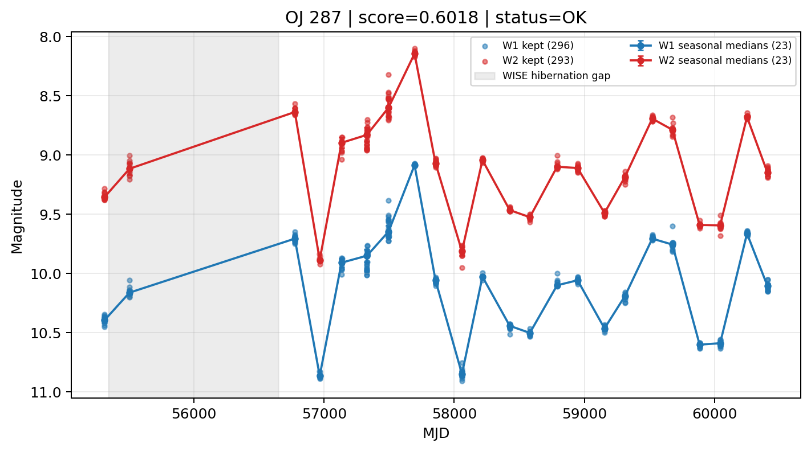

# Candidate Card: OJ 287 (Rank 35)

## Basic Metadata

- `source_id`: `OJ 287`
- `canonical_id`: `OJ 287`
- `score`: `0.601788`
- `status`: `OK`
- `final_label`: `Known blazar`
- `stage_a_positive`: `True`
- `gate_blazar_veto`: `False`
- `gate_wise_qc_pass`: `True`
- `gate_data_sufficient`: `True`
- `decision_trace`: `stage_a_positive=pass;gate_blazar_veto=fail;gate_wise_qc_pass=pass;gate_data_sufficient=pass;gate_state_change_ratio_pass=pass;gate_transient_spike_pass=pass`

## Sampling / Variability Summary

- `n_points` (results table): `222`
- `baseline_days`: `5096.02`
- `baseline_years`: `13.952`
- `band_coverage`: `W1,W2`
- `delta_mag`: `0.352`
- `delta_mag_method`: `seasonal_median_flux`

## Coordinates

- `ra`: `133.703600`
- `dec`: `20.108500`
- `coordinate_source`: `benchmark_master`

## WISE Light Curve

## WISE QA / Rejection Accounting

| Metric | Value |
| --- | --- |
| Raw points total | 592 |
| Raw points W1 | 296 |
| Raw points W2 | 296 |
| Kept points total | 589 |
| Kept points W1 | 296 |
| Kept points W2 | 293 |
| Fraction rejected | 0.00506757 |
| Reject: missing time | 0 |
| Reject: missing mag | 3 |
| Reject: invalid band | 0 |
| Reject: cc_flags | 0 |
| Reject: qual_frame | 0 |
| Reject: moon_lev | 0 |

### QA Reject Reason Counts

| reject_reason | count |
| --- | --- |
| reject_cc_flags | 0 |
| reject_invalid_band | 0 |
| reject_missing_mag | 3 |
| reject_missing_time | 0 |
| reject_moon_lev | 0 |
| reject_qual_frame | 0 |

## Flag Summary

### `cc_flags`

| value | count | fraction |
| --- | --- | --- |
| 0000 | 592 | 1 |

### `qual_frame`

| value | count | fraction |
| --- | --- | --- |
| <NA> | 592 | 1 |

### `moon_lev`

| value | count | fraction |
| --- | --- | --- |
| 00 | 474 | 0.800676 |
| 11 | 54 | 0.0912162 |
| 0000 | 48 | 0.0810811 |
| 01 | 16 | 0.027027 |

### `qi_fact`

| value | count | fraction |
| --- | --- | --- |
| 1.0 | 530 | 0.89527 |
| 0.5 | 62 | 0.10473 |

### `saa_sep`

| value | count | fraction |
| --- | --- | --- |
| 107.0 | 4 | 0.00675676 |
| 115.0 | 4 | 0.00675676 |
| 40.69599914550781 | 2 | 0.00337838 |
| 116.06900024414062 | 2 | 0.00337838 |
| 115.51399993896484 | 2 | 0.00337838 |
| 94.98799896240234 | 2 | 0.00337838 |
| 123.31800079345703 | 2 | 0.00337838 |
| 123.23999786376953 | 2 | 0.00337838 |

### `ph_qual`

| value | count | fraction |
| --- | --- | --- |
| AA | 538 | 0.908784 |
| <NA> | 48 | 0.0810811 |
| AX | 6 | 0.0101351 |

## Coverage Summary

- Seasonal bins (W1): `23`
- Seasonal bins (W2): `23`
- Pre-gap coverage: `True`
- Post-gap coverage: `True`
- Both-sides coverage: `True`

## Systematics Verdict

- Verdict: `PASS`
- Summary: QA-clean points and seasonal coverage support the observed variability signal.
- QA-dominated signal check: Not obviously dominated by flagged/low-quality points

Reasons:
- Seasonal trend supported by sufficient QA-clean W1/W2 points

## Catalog Checks

- Known blazar match: `YES` via `source_id` token `OJ 287`
- Known CLAGN match: `NO`
- Gaia metrics: not provided / no match

## Final Label

**Known blazar**

- Rank 35 with score=0.6018
- Sampling: n_points=222, baseline_years=13.952155306885688, band_coverage=W1,W2
- QA rejection fraction=0.5% (main causes summarized in card QA section)
- Systematics verdict=PASS: QA-clean points and seasonal coverage support the observed variability signal.
- Known blazar catalog match=YES
- Dataset metadata class=blazar

## Reproducibility

- `run_timestamp_utc`: `2026-02-28T17:09:43.673413+00:00`
- `results_file`: `data/real_clagn/benchmark_scores.csv`
- `wise_file`: `data/wise/OJ 287.csv`
- `score_threshold`: `0.0`
- `t_recall`: `0.3493918746`
