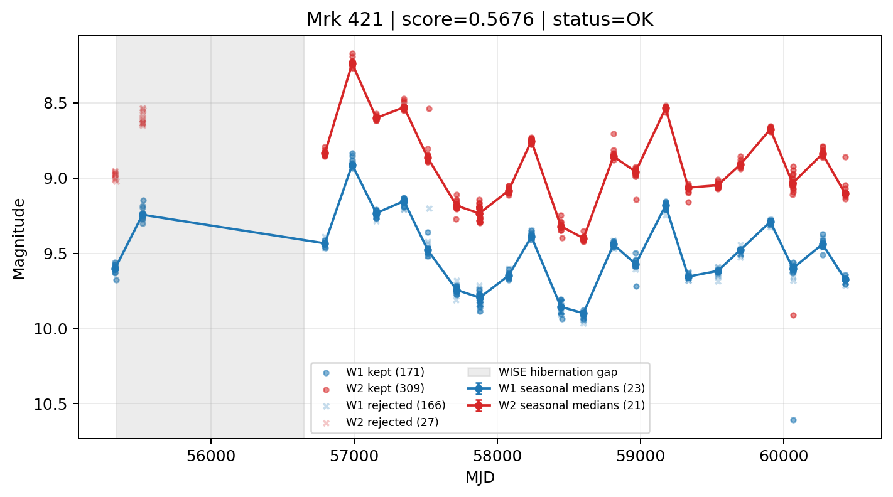

# Candidate Card: Mrk 421 (Rank 44)

## Basic Metadata

- `source_id`: `Mrk 421`
- `canonical_id`: `Mrk 421`
- `source_id_normalized`: `MRK 421`
- `canonical_id_normalized`: `MRK 421`
- `score`: `0.567627`
- `status`: `OK`
- `final_label`: `Known blazar`
- `stage_a_positive`: `True`
- `gate_blazar_veto`: `False`
- `gate_wise_qc_pass`: `True`
- `gate_data_sufficient`: `True`
- `decision_trace`: `stage_a_positive=pass;gate_blazar_veto=fail;gate_wise_qc_pass=pass;gate_data_sufficient=pass;gate_state_change_ratio_pass=pass;gate_transient_spike_pass=pass`

## Sampling / Variability Summary

- `n_points` (results table): `259`
- `baseline_days`: `5098.40`
- `baseline_years`: `13.959`
- `band_coverage`: `W1,W2`
- `delta_mag`: `-0.118`
- `delta_mag_method`: `seasonal_median_flux`

## Coordinates

- `ra`: `166.113800`
- `dec`: `38.208800`
- `coordinate_source`: `benchmark_master`

## WISE Light Curve

## WISE QA / Rejection Accounting

| Metric | Value |
| --- | --- |
| Raw points total | 674 |
| Raw points W1 | 337 |
| Raw points W2 | 337 |
| Kept points total | 480 |
| Kept points W1 | 171 |
| Kept points W2 | 309 |
| Fraction rejected | 0.287834 |
| Reject: missing time | 0 |
| Reject: missing mag | 1 |
| Reject: invalid band | 0 |
| Reject: cc_flags | 193 |
| Reject: qual_frame | 0 |
| Reject: moon_lev | 0 |

### QA Reject Reason Counts

| reject_reason | count |
| --- | --- |
| reject_cc_flags | 193 |
| reject_invalid_band | 0 |
| reject_missing_mag | 1 |
| reject_missing_time | 0 |
| reject_moon_lev | 0 |
| reject_qual_frame | 0 |

## Flag Summary

### `cc_flags`

| value | count | fraction |
| --- | --- | --- |
| h000 | 332 | 0.492582 |
| 0000 | 288 | 0.4273 |
| 0h00 | 54 | 0.0801187 |

### `qual_frame`

| value | count | fraction |
| --- | --- | --- |
| <NA> | 674 | 1 |

### `moon_lev`

| value | count | fraction |
| --- | --- | --- |
| 00 | 620 | 0.919881 |
| 0000 | 50 | 0.074184 |
| 0011 | 4 | 0.00593472 |

### `qi_fact`

| value | count | fraction |
| --- | --- | --- |
| 1.0 | 538 | 0.79822 |
| 0.5 | 126 | 0.186944 |
| 0.0 | 10 | 0.0148368 |

### `saa_sep`

| value | count | fraction |
| --- | --- | --- |
| 48.0 | 4 | 0.00593472 |
| 72.0 | 4 | 0.00593472 |
| 80.0 | 4 | 0.00593472 |
| 77.7030029296875 | 4 | 0.00593472 |
| 111.0 | 4 | 0.00593472 |
| 54.0 | 2 | 0.00296736 |
| 70.48300170898438 | 2 | 0.00296736 |
| 41.99700164794922 | 2 | 0.00296736 |

### `ph_qual`

| value | count | fraction |
| --- | --- | --- |
| AA | 618 | 0.916914 |
| <NA> | 54 | 0.0801187 |
| AX | 2 | 0.00296736 |

## Coverage Summary

- Seasonal bins (W1): `23`
- Seasonal bins (W2): `21`
- Pre-gap coverage: `True`
- Post-gap coverage: `True`
- Both-sides coverage: `True`

## Systematics Verdict

- Verdict: `PASS`
- Summary: QA-clean points and seasonal coverage support the observed variability signal.
- QA-dominated signal check: Not obviously dominated by flagged/low-quality points

Reasons:
- Seasonal trend supported by sufficient QA-clean W1/W2 points

## Catalog Checks

- Known blazar match: `YES` via `source_id` token `MRK 421`
- Known CLAGN match: `NO`
- Gaia metrics: not provided / no match

## Final Label

**Known blazar**

- Rank 44 with score=0.5676
- Sampling: n_points=259, baseline_years=13.9586653311978, band_coverage=W1,W2
- QA rejection fraction=28.8% (main causes summarized in card QA section)
- Systematics verdict=PASS: QA-clean points and seasonal coverage support the observed variability signal.
- Known blazar catalog match=YES
- Dataset metadata class=blazar

## Reproducibility

- `run_timestamp_utc`: `2026-02-28T17:09:43.673413+00:00`
- `results_file`: `data/real_clagn/benchmark_scores.csv`
- `wise_file`: `data/wise/Mrk 421.csv`
- `score_threshold`: `0.0`
- `t_recall`: `0.3493918746`
