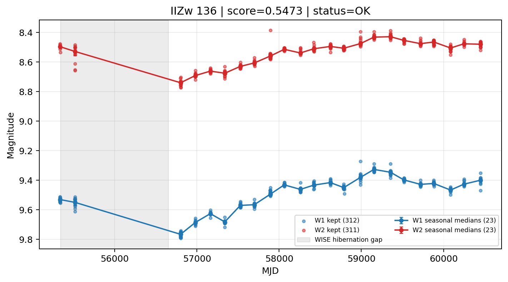

# Candidate Card: IIZw 136 (Rank 51)

## Basic Metadata

- `source_id`: `IIZw 136`
- `canonical_id`: `IIZw 136`
- `source_id_normalized`: `IIZW 136`
- `canonical_id_normalized`: `IIZW 136`
- `score`: `0.547307`
- `status`: `OK`
- `final_label`: `Known blazar`
- `stage_a_positive`: `True`
- `gate_blazar_veto`: `False`
- `gate_wise_qc_pass`: `True`
- `gate_data_sufficient`: `True`
- `decision_trace`: `stage_a_positive=pass;gate_blazar_veto=fail;gate_wise_qc_pass=pass;gate_data_sufficient=pass;gate_state_change_ratio_pass=pass;gate_transient_spike_pass=pass`

## Sampling / Variability Summary

- `n_points` (results table): `248`
- `baseline_days`: `5114.06`
- `baseline_years`: `14.002`
- `band_coverage`: `W1,W2`
- `delta_mag`: `0.125`
- `delta_mag_method`: `seasonal_median_flux`

## Coordinates

- `ra`: `323.116300`
- `dec`: `10.138500`
- `coordinate_source`: `benchmark_master`

## WISE Light Curve

## WISE QA / Rejection Accounting

| Metric | Value |
| --- | --- |
| Raw points total | 626 |
| Raw points W1 | 313 |
| Raw points W2 | 313 |
| Kept points total | 623 |
| Kept points W1 | 312 |
| Kept points W2 | 311 |
| Fraction rejected | 0.00479233 |
| Reject: missing time | 0 |
| Reject: missing mag | 3 |
| Reject: invalid band | 0 |
| Reject: cc_flags | 0 |
| Reject: qual_frame | 0 |
| Reject: moon_lev | 0 |

### QA Reject Reason Counts

| reject_reason | count |
| --- | --- |
| reject_cc_flags | 0 |
| reject_invalid_band | 0 |
| reject_missing_mag | 3 |
| reject_missing_time | 0 |
| reject_moon_lev | 0 |
| reject_qual_frame | 0 |

## Flag Summary

### `cc_flags`

| value | count | fraction |
| --- | --- | --- |
| 0000 | 626 | 1 |

### `qual_frame`

| value | count | fraction |
| --- | --- | --- |
| <NA> | 626 | 1 |

### `moon_lev`

| value | count | fraction |
| --- | --- | --- |
| 00 | 566 | 0.904153 |
| 0000 | 46 | 0.0734824 |
| 01 | 10 | 0.0159744 |
| 0111 | 2 | 0.00319489 |
| 0011 | 2 | 0.00319489 |

### `qi_fact`

| value | count | fraction |
| --- | --- | --- |
| 1.0 | 554 | 0.884984 |
| 0.5 | 70 | 0.111821 |
| 0.0 | 2 | 0.00319489 |

### `saa_sep`

| value | count | fraction |
| --- | --- | --- |
| 25.0 | 4 | 0.00638978 |
| 15.0 | 4 | 0.00638978 |
| 16.0 | 4 | 0.00638978 |
| 56.0 | 4 | 0.00638978 |
| 47.034000396728516 | 2 | 0.00319489 |
| 110.66000366210938 | 2 | 0.00319489 |
| 111.0469970703125 | 2 | 0.00319489 |
| 82.91000366210938 | 2 | 0.00319489 |

### `ph_qual`

| value | count | fraction |
| --- | --- | --- |
| AA | 572 | 0.913738 |
| <NA> | 50 | 0.0798722 |
| AX | 2 | 0.00319489 |
| XA | 2 | 0.00319489 |

## Coverage Summary

- Seasonal bins (W1): `23`
- Seasonal bins (W2): `23`
- Pre-gap coverage: `True`
- Post-gap coverage: `True`
- Both-sides coverage: `True`

## Systematics Verdict

- Verdict: `PASS`
- Summary: QA-clean points and seasonal coverage support the observed variability signal.
- QA-dominated signal check: Not obviously dominated by flagged/low-quality points

Reasons:
- Seasonal trend supported by sufficient QA-clean W1/W2 points

## Catalog Checks

- Known blazar match: `YES` via `source_id` token `IIZW 136`
- Known CLAGN match: `NO`
- Gaia metrics: not provided / no match

## Final Label

**Known blazar**

- Rank 51 with score=0.5473
- Sampling: n_points=248, baseline_years=14.00152377409994, band_coverage=W1,W2
- QA rejection fraction=0.5% (main causes summarized in card QA section)
- Systematics verdict=PASS: QA-clean points and seasonal coverage support the observed variability signal.
- Known blazar catalog match=YES
- Dataset metadata class=blazar

## Reproducibility

- `run_timestamp_utc`: `2026-02-28T17:09:43.673413+00:00`
- `results_file`: `data/real_clagn/benchmark_scores.csv`
- `wise_file`: `data/wise/IIZw 136.csv`
- `score_threshold`: `0.0`
- `t_recall`: `0.3493918746`
