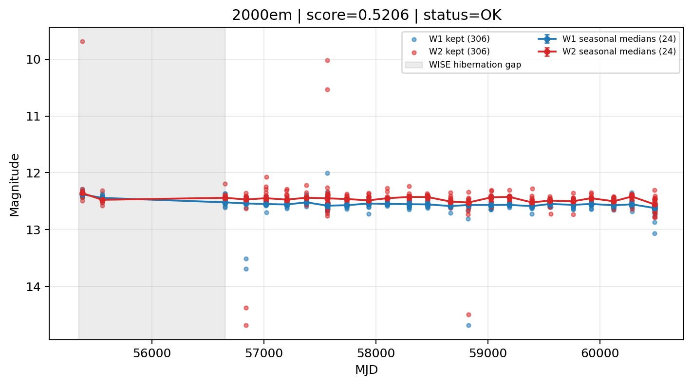

# Candidate Card: 2000em (Rank 58)

## Basic Metadata

- `source_id`: `2000em`
- `canonical_id`: `2000em`
- `source_id_normalized`: `2000EM`
- `canonical_id_normalized`: `2000EM`
- `score`: `0.520629`
- `status`: `OK`
- `final_label`: `Needs more data`
- `stage_a_positive`: `True`
- `gate_blazar_veto`: `True`
- `gate_wise_qc_pass`: `True`
- `gate_data_sufficient`: `False`
- `decision_trace`: `stage_a_positive=pass;gate_blazar_veto=pass;gate_wise_qc_pass=pass;gate_data_sufficient=fail;gate_state_change_ratio_pass=pass;gate_transient_spike_pass=pass`

## Sampling / Variability Summary

- `n_points` (results table): `87`
- `baseline_days`: `5116.75`
- `baseline_years`: `14.009`
- `band_coverage`: `W1,W2`
- `delta_mag`: `-0.112`
- `delta_mag_method`: `seasonal_median_flux`

## Coordinates

- `ra`: `8.874250`
- `dec`: `-2.657611`
- `coordinate_source`: `benchmark_master`

## WISE Light Curve

## WISE QA / Rejection Accounting

| Metric | Value |
| --- | --- |
| Raw points total | 612 |
| Raw points W1 | 306 |
| Raw points W2 | 306 |
| Kept points total | 612 |
| Kept points W1 | 306 |
| Kept points W2 | 306 |
| Fraction rejected | 0 |
| Reject: missing time | 0 |
| Reject: missing mag | 0 |
| Reject: invalid band | 0 |
| Reject: cc_flags | 0 |
| Reject: qual_frame | 0 |
| Reject: moon_lev | 0 |

### QA Reject Reason Counts

| reject_reason | count |
| --- | --- |
| reject_cc_flags | 0 |
| reject_invalid_band | 0 |
| reject_missing_mag | 0 |
| reject_missing_time | 0 |
| reject_moon_lev | 0 |
| reject_qual_frame | 0 |

## Flag Summary

### `cc_flags`

| value | count | fraction |
| --- | --- | --- |
| 0000 | 612 | 1 |

### `qual_frame`

| value | count | fraction |
| --- | --- | --- |
| <NA> | 612 | 1 |

### `moon_lev`

| value | count | fraction |
| --- | --- | --- |
| 00 | 492 | 0.803922 |
| 11 | 58 | 0.0947712 |
| 0000 | 48 | 0.0784314 |
| 01 | 14 | 0.0228758 |

### `qi_fact`

| value | count | fraction |
| --- | --- | --- |
| 0.5 | 376 | 0.614379 |
| 1.0 | 226 | 0.369281 |
| 0.0 | 10 | 0.0163399 |

### `saa_sep`

| value | count | fraction |
| --- | --- | --- |
| 63.176998138427734 | 4 | 0.00653595 |
| 98.52999877929688 | 4 | 0.00653595 |
| 24.0 | 4 | 0.00653595 |
| 2.0 | 4 | 0.00653595 |
| 21.0 | 4 | 0.00653595 |
| 107.0 | 2 | 0.00326797 |
| 51.542999267578125 | 2 | 0.00326797 |
| 31.635000228881836 | 2 | 0.00326797 |

### `ph_qual`

| value | count | fraction |
| --- | --- | --- |
| AA | 526 | 0.859477 |
| <NA> | 48 | 0.0784314 |
| AB | 26 | 0.0424837 |
| AC | 6 | 0.00980392 |
| BU | 4 | 0.00653595 |
| BC | 2 | 0.00326797 |

## Coverage Summary

- Seasonal bins (W1): `24`
- Seasonal bins (W2): `24`
- Pre-gap coverage: `False`
- Post-gap coverage: `True`
- Both-sides coverage: `False`

## Systematics Verdict

- Verdict: `CAUTION`
- Summary: Variability signal is present but data quality/coverage limitations weaken confidence.
- QA-dominated signal check: Not obviously dominated by flagged/low-quality points

Reasons:
- No clean coverage on both sides of WISE hibernation gap

## Catalog Checks

- Known blazar match: `NO`
- Known CLAGN match: `NO`
- Gaia metrics: not provided / no match

## Final Label

**Needs more data**

- Rank 58 with score=0.5206
- Sampling: n_points=87, baseline_years=14.008884993976723, band_coverage=W1,W2
- QA rejection fraction=0.0% (main causes summarized in card QA section)
- Systematics verdict=CAUTION: Variability signal is present but data quality/coverage limitations weaken confidence.
- Known blazar catalog match=NO
- Dataset metadata class=sn

## Reproducibility

- `run_timestamp_utc`: `2026-02-28T17:09:43.673413+00:00`
- `results_file`: `data/real_clagn/benchmark_scores.csv`
- `wise_file`: `data/wise/2000em.csv`
- `score_threshold`: `0.0`
- `t_recall`: `0.3493918746`
