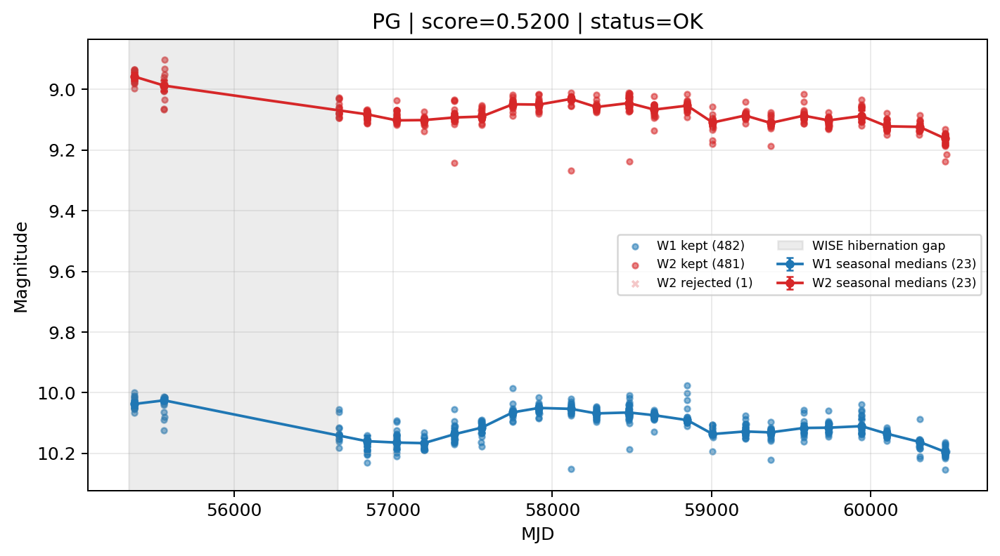

# Candidate Card: PG (Rank 60)

## Basic Metadata

- `source_id`: `PG`
- `canonical_id`: `PG`
- `score`: `0.520014`
- `status`: `OK`
- `final_label`: `Known blazar`
- `stage_a_positive`: `True`
- `gate_blazar_veto`: `False`
- `gate_wise_qc_pass`: `True`
- `gate_data_sufficient`: `False`
- `decision_trace`: `stage_a_positive=pass;gate_blazar_veto=fail;gate_wise_qc_pass=pass;gate_data_sufficient=fail;gate_state_change_ratio_pass=pass;gate_transient_spike_pass=pass`

## Sampling / Variability Summary

- `n_points` (results table): `253`
- `baseline_days`: `5104.95`
- `baseline_years`: `13.977`
- `band_coverage`: `W1,W2`
- `delta_mag`: `-0.154`
- `delta_mag_method`: `seasonal_median_flux`

## Coordinates

- `ra`: `213.451400`
- `dec`: `44.003900`
- `coordinate_source`: `benchmark_master`

## WISE Light Curve

## WISE QA / Rejection Accounting

| Metric | Value |
| --- | --- |
| Raw points total | 964 |
| Raw points W1 | 482 |
| Raw points W2 | 482 |
| Kept points total | 963 |
| Kept points W1 | 482 |
| Kept points W2 | 481 |
| Fraction rejected | 0.00103734 |
| Reject: missing time | 0 |
| Reject: missing mag | 0 |
| Reject: invalid band | 0 |
| Reject: cc_flags | 1 |
| Reject: qual_frame | 0 |
| Reject: moon_lev | 0 |

### QA Reject Reason Counts

| reject_reason | count |
| --- | --- |
| reject_cc_flags | 1 |
| reject_invalid_band | 0 |
| reject_missing_mag | 0 |
| reject_missing_time | 0 |
| reject_moon_lev | 0 |
| reject_qual_frame | 0 |

## Flag Summary

### `cc_flags`

| value | count | fraction |
| --- | --- | --- |
| 0000 | 962 | 0.997925 |
| 0h00 | 2 | 0.00207469 |

### `qual_frame`

| value | count | fraction |
| --- | --- | --- |
| <NA> | 964 | 1 |

### `moon_lev`

| value | count | fraction |
| --- | --- | --- |
| 00 | 896 | 0.929461 |
| 0000 | 68 | 0.0705394 |

### `qi_fact`

| value | count | fraction |
| --- | --- | --- |
| 1.0 | 546 | 0.56639 |
| 0.5 | 396 | 0.410788 |
| 0.0 | 22 | 0.0228216 |

### `saa_sep`

| value | count | fraction |
| --- | --- | --- |
| 131.0 | 4 | 0.00414938 |
| 102.0 | 4 | 0.00414938 |
| 82.0 | 4 | 0.00414938 |
| 54.9010009765625 | 4 | 0.00414938 |
| 58.0 | 4 | 0.00414938 |
| 59.0 | 4 | 0.00414938 |
| 77.0 | 2 | 0.00207469 |
| 76.40599822998047 | 2 | 0.00207469 |

### `ph_qual`

| value | count | fraction |
| --- | --- | --- |
| AA | 896 | 0.929461 |
| <NA> | 68 | 0.0705394 |

## Coverage Summary

- Seasonal bins (W1): `23`
- Seasonal bins (W2): `23`
- Pre-gap coverage: `False`
- Post-gap coverage: `True`
- Both-sides coverage: `False`

## Systematics Verdict

- Verdict: `CAUTION`
- Summary: Variability signal is present but data quality/coverage limitations weaken confidence.
- QA-dominated signal check: Not obviously dominated by flagged/low-quality points

Reasons:
- No clean coverage on both sides of WISE hibernation gap

## Catalog Checks

- Known blazar match: `YES` via `source_id` token `PG`
- Known CLAGN match: `NO`
- Gaia metrics: not provided / no match

## Final Label

**Known blazar**

- Rank 60 with score=0.5200
- Sampling: n_points=253, baseline_years=13.976587720465442, band_coverage=W1,W2
- QA rejection fraction=0.1% (main causes summarized in card QA section)
- Systematics verdict=CAUTION: Variability signal is present but data quality/coverage limitations weaken confidence.
- Known blazar catalog match=YES
- Dataset metadata class=blazar

## Reproducibility

- `run_timestamp_utc`: `2026-02-28T17:09:43.673413+00:00`
- `results_file`: `data/real_clagn/benchmark_scores.csv`
- `wise_file`: `data/wise/PG.csv`
- `score_threshold`: `0.0`
- `t_recall`: `0.3493918746`
