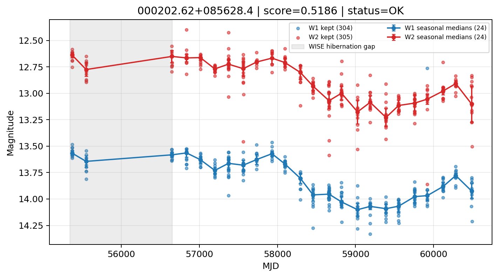

# Candidate Card: 000202.62+085628.4 (Rank 62)

## Basic Metadata

- `source_id`: `000202.62+085628.4`
- `canonical_id`: `000202.62+085628.4`
- `score`: `0.518570`
- `status`: `OK`
- `final_label`: `Needs more data`
- `stage_a_positive`: `True`
- `gate_blazar_veto`: `True`
- `gate_wise_qc_pass`: `True`
- `gate_data_sufficient`: `False`
- `decision_trace`: `stage_a_positive=pass;gate_blazar_veto=pass;gate_wise_qc_pass=pass;gate_data_sufficient=fail;gate_state_change_ratio_pass=pass;gate_transient_spike_pass=pass`

## Sampling / Variability Summary

- `n_points` (results table): `214`
- `baseline_days`: `5114.03`
- `baseline_years`: `14.001`
- `band_coverage`: `W1,W2`
- `delta_mag`: `-0.239`
- `delta_mag_method`: `seasonal_median_flux`

## Coordinates

- `ra`: `0.510943`
- `dec`: `8.941235`
- `coordinate_source`: `benchmark_master`

## WISE Light Curve

## WISE QA / Rejection Accounting

| Metric | Value |
| --- | --- |
| Raw points total | 610 |
| Raw points W1 | 305 |
| Raw points W2 | 305 |
| Kept points total | 609 |
| Kept points W1 | 304 |
| Kept points W2 | 305 |
| Fraction rejected | 0.00163934 |
| Reject: missing time | 0 |
| Reject: missing mag | 1 |
| Reject: invalid band | 0 |
| Reject: cc_flags | 0 |
| Reject: qual_frame | 0 |
| Reject: moon_lev | 0 |

### QA Reject Reason Counts

| reject_reason | count |
| --- | --- |
| reject_cc_flags | 0 |
| reject_invalid_band | 0 |
| reject_missing_mag | 1 |
| reject_missing_time | 0 |
| reject_moon_lev | 0 |
| reject_qual_frame | 0 |

## Flag Summary

### `cc_flags`

| value | count | fraction |
| --- | --- | --- |
| 0000 | 610 | 1 |

### `qual_frame`

| value | count | fraction |
| --- | --- | --- |
| <NA> | 610 | 1 |

### `moon_lev`

| value | count | fraction |
| --- | --- | --- |
| 00 | 514 | 0.842623 |
| 11 | 46 | 0.0754098 |
| 0000 | 44 | 0.0721311 |
| 01 | 6 | 0.00983607 |

### `qi_fact`

| value | count | fraction |
| --- | --- | --- |
| 1.0 | 512 | 0.839344 |
| 0.5 | 96 | 0.157377 |
| 0.0 | 2 | 0.00327869 |

### `saa_sep`

| value | count | fraction |
| --- | --- | --- |
| 90.08799743652344 | 4 | 0.00655738 |
| 15.0 | 4 | 0.00655738 |
| 37.358001708984375 | 4 | 0.00655738 |
| 32.0 | 4 | 0.00655738 |
| 75.52999877929688 | 2 | 0.00327869 |
| 116.22799682617188 | 2 | 0.00327869 |
| 75.36599731445312 | 2 | 0.00327869 |
| 25.54800033569336 | 2 | 0.00327869 |

### `ph_qual`

| value | count | fraction |
| --- | --- | --- |
| AA | 478 | 0.783607 |
| AB | 80 | 0.131148 |
| <NA> | 44 | 0.0721311 |
| BB | 2 | 0.00327869 |
| BU | 2 | 0.00327869 |
| XA | 2 | 0.00327869 |
| BA | 2 | 0.00327869 |

## Coverage Summary

- Seasonal bins (W1): `24`
- Seasonal bins (W2): `24`
- Pre-gap coverage: `False`
- Post-gap coverage: `True`
- Both-sides coverage: `False`

## Systematics Verdict

- Verdict: `CAUTION`
- Summary: Variability signal is present but data quality/coverage limitations weaken confidence.
- QA-dominated signal check: Not obviously dominated by flagged/low-quality points

Reasons:
- No clean coverage on both sides of WISE hibernation gap

## Catalog Checks

- Known blazar match: `NO`
- Known CLAGN match: `NO`
- Gaia metrics: not provided / no match

## Final Label

**Needs more data**

- Rank 62 with score=0.5186
- Sampling: n_points=214, baseline_years=14.0014587667351, band_coverage=W1,W2
- QA rejection fraction=0.2% (main causes summarized in card QA section)
- Systematics verdict=CAUTION: Variability signal is present but data quality/coverage limitations weaken confidence.
- Known blazar catalog match=NO
- Dataset metadata class=normal_agn

## Reproducibility

- `run_timestamp_utc`: `2026-02-28T17:09:43.673413+00:00`
- `results_file`: `data/real_clagn/benchmark_scores.csv`
- `wise_file`: `data/wise/000202.62+085628.4.csv`
- `score_threshold`: `0.0`
- `t_recall`: `0.3493918746`
