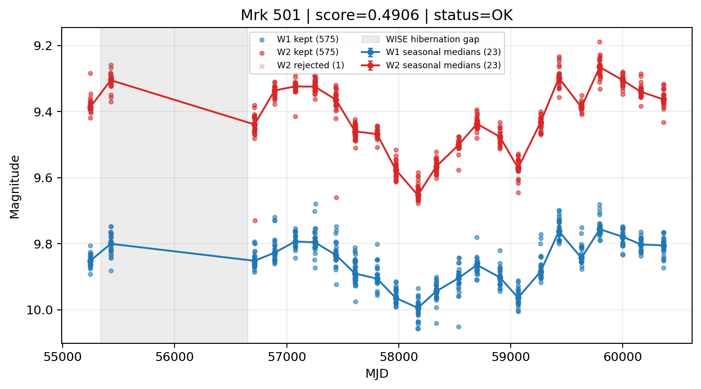

# Candidate Card: Mrk 501 (Rank 71)

## Basic Metadata

- `source_id`: `Mrk 501`
- `canonical_id`: `Mrk 501`
- `source_id_normalized`: `MRK 501`
- `canonical_id_normalized`: `MRK 501`
- `score`: `0.490638`
- `status`: `OK`
- `final_label`: `Known blazar`
- `stage_a_positive`: `True`
- `gate_blazar_veto`: `False`
- `gate_wise_qc_pass`: `True`
- `gate_data_sufficient`: `True`
- `decision_trace`: `stage_a_positive=pass;gate_blazar_veto=fail;gate_wise_qc_pass=pass;gate_data_sufficient=pass;gate_state_change_ratio_pass=pass;gate_transient_spike_pass=pass`

## Sampling / Variability Summary

- `n_points` (results table): `397`
- `baseline_days`: `5114.53`
- `baseline_years`: `14.003`
- `band_coverage`: `W1,W2`
- `delta_mag`: `0.026`
- `delta_mag_method`: `seasonal_median_flux`

## Coordinates

- `ra`: `253.467600`
- `dec`: `39.760200`
- `coordinate_source`: `benchmark_master`

## WISE Light Curve

## WISE QA / Rejection Accounting

| Metric | Value |
| --- | --- |
| Raw points total | 1152 |
| Raw points W1 | 576 |
| Raw points W2 | 576 |
| Kept points total | 1150 |
| Kept points W1 | 575 |
| Kept points W2 | 575 |
| Fraction rejected | 0.00173611 |
| Reject: missing time | 0 |
| Reject: missing mag | 1 |
| Reject: invalid band | 0 |
| Reject: cc_flags | 1 |
| Reject: qual_frame | 0 |
| Reject: moon_lev | 0 |

### QA Reject Reason Counts

| reject_reason | count |
| --- | --- |
| reject_cc_flags | 1 |
| reject_invalid_band | 0 |
| reject_missing_mag | 1 |
| reject_missing_time | 0 |
| reject_moon_lev | 0 |
| reject_qual_frame | 0 |

## Flag Summary

### `cc_flags`

| value | count | fraction |
| --- | --- | --- |
| 0000 | 1150 | 0.998264 |
| 0h00 | 2 | 0.00173611 |

### `qual_frame`

| value | count | fraction |
| --- | --- | --- |
| <NA> | 1152 | 1 |

### `moon_lev`

| value | count | fraction |
| --- | --- | --- |
| 00 | 1056 | 0.916667 |
| 0000 | 96 | 0.0833333 |

### `qi_fact`

| value | count | fraction |
| --- | --- | --- |
| 1.0 | 880 | 0.763889 |
| 0.5 | 256 | 0.222222 |
| 0.0 | 16 | 0.0138889 |

### `saa_sep`

| value | count | fraction |
| --- | --- | --- |
| 71.0 | 6 | 0.00520833 |
| 52.0 | 6 | 0.00520833 |
| 46.0 | 4 | 0.00347222 |
| 62.0 | 4 | 0.00347222 |
| 92.0 | 4 | 0.00347222 |
| 130.0 | 4 | 0.00347222 |
| 50.0 | 4 | 0.00347222 |
| 48.0 | 4 | 0.00347222 |

### `ph_qual`

| value | count | fraction |
| --- | --- | --- |
| AA | 1054 | 0.914931 |
| <NA> | 96 | 0.0833333 |
| XA | 2 | 0.00173611 |

## Coverage Summary

- Seasonal bins (W1): `23`
- Seasonal bins (W2): `23`
- Pre-gap coverage: `True`
- Post-gap coverage: `True`
- Both-sides coverage: `True`

## Systematics Verdict

- Verdict: `PASS`
- Summary: QA-clean points and seasonal coverage support the observed variability signal.
- QA-dominated signal check: Not obviously dominated by flagged/low-quality points

Reasons:
- Seasonal trend supported by sufficient QA-clean W1/W2 points

## Catalog Checks

- Known blazar match: `YES` via `source_id` token `MRK 501`
- Known CLAGN match: `NO`
- Gaia metrics: not provided / no match

## Final Label

**Known blazar**

- Rank 71 with score=0.4906
- Sampling: n_points=397, baseline_years=14.002814223490756, band_coverage=W1,W2
- QA rejection fraction=0.2% (main causes summarized in card QA section)
- Systematics verdict=PASS: QA-clean points and seasonal coverage support the observed variability signal.
- Known blazar catalog match=YES
- Dataset metadata class=blazar

## Reproducibility

- `run_timestamp_utc`: `2026-02-28T17:09:43.673413+00:00`
- `results_file`: `data/real_clagn/benchmark_scores.csv`
- `wise_file`: `data/wise/Mrk 501.csv`
- `score_threshold`: `0.0`
- `t_recall`: `0.3493918746`
