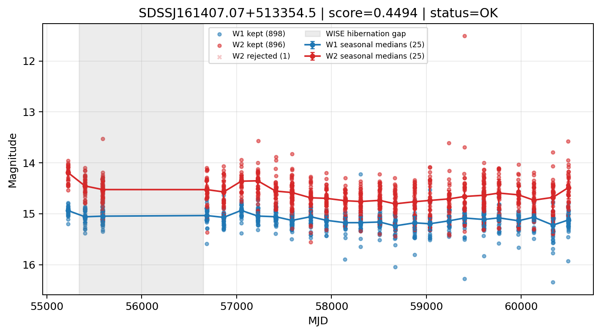

# Candidate Card: SDSSJ161407.07+513354.5 (Rank 81)

## Basic Metadata

- `source_id`: `SDSSJ161407.07+513354.5`
- `canonical_id`: `SDSSJ161407.07+513354.5`
- `score`: `0.449402`
- `status`: `OK`
- `final_label`: `Known AGN`
- `stage_a_positive`: `True`
- `gate_blazar_veto`: `True`
- `gate_wise_qc_pass`: `True`
- `gate_data_sufficient`: `True`
- `decision_trace`: `stage_a_positive=pass;gate_blazar_veto=pass;gate_wise_qc_pass=pass;gate_data_sufficient=pass;gate_state_change_ratio_pass=pass;gate_transient_spike_pass=pass`

## Sampling / Variability Summary

- `n_points` (results table): `616`
- `baseline_days`: `5275.92`
- `baseline_years`: `14.445`
- `band_coverage`: `W1,W2`
- `delta_mag`: `-0.097`
- `delta_mag_method`: `seasonal_median_flux`

## Coordinates

- `ra`: `243.529500`
- `dec`: `51.565160`
- `coordinate_source`: `benchmark_master`

## WISE Light Curve

## WISE QA / Rejection Accounting

| Metric | Value |
| --- | --- |
| Raw points total | 1796 |
| Raw points W1 | 898 |
| Raw points W2 | 898 |
| Kept points total | 1794 |
| Kept points W1 | 898 |
| Kept points W2 | 896 |
| Fraction rejected | 0.00111359 |
| Reject: missing time | 0 |
| Reject: missing mag | 1 |
| Reject: invalid band | 0 |
| Reject: cc_flags | 1 |
| Reject: qual_frame | 0 |
| Reject: moon_lev | 0 |

### QA Reject Reason Counts

| reject_reason | count |
| --- | --- |
| reject_cc_flags | 1 |
| reject_invalid_band | 0 |
| reject_missing_mag | 1 |
| reject_missing_time | 0 |
| reject_moon_lev | 0 |
| reject_qual_frame | 0 |

## Flag Summary

### `cc_flags`

| value | count | fraction |
| --- | --- | --- |
| 0000 | 1794 | 0.998886 |
| 0D00 | 2 | 0.00111359 |

### `qual_frame`

| value | count | fraction |
| --- | --- | --- |
| <NA> | 1796 | 1 |

### `moon_lev`

| value | count | fraction |
| --- | --- | --- |
| 00 | 1568 | 0.873051 |
| 0000 | 228 | 0.126949 |

### `qi_fact`

| value | count | fraction |
| --- | --- | --- |
| 1.0 | 1344 | 0.74833 |
| 0.5 | 406 | 0.226058 |
| 0.0 | 46 | 0.0256125 |

### `saa_sep`

| value | count | fraction |
| --- | --- | --- |
| 63.0 | 24 | 0.013363 |
| 69.0 | 10 | 0.00556793 |
| 115.0 | 8 | 0.00445434 |
| 88.0 | 8 | 0.00445434 |
| 92.0 | 8 | 0.00445434 |
| 93.0 | 8 | 0.00445434 |
| 64.0 | 8 | 0.00445434 |
| 62.0 | 8 | 0.00445434 |

### `ph_qual`

| value | count | fraction |
| --- | --- | --- |
| AB | 544 | 0.302895 |
| BB | 534 | 0.297327 |
| <NA> | 228 | 0.126949 |
| BC | 202 | 0.112472 |
| AC | 122 | 0.0679287 |
| BU | 108 | 0.0601336 |
| AU | 52 | 0.0289532 |
| CC | 2 | 0.00111359 |

## Coverage Summary

- Seasonal bins (W1): `25`
- Seasonal bins (W2): `25`
- Pre-gap coverage: `True`
- Post-gap coverage: `True`
- Both-sides coverage: `True`

## Systematics Verdict

- Verdict: `PASS`
- Summary: QA-clean points and seasonal coverage support the observed variability signal.
- QA-dominated signal check: Not obviously dominated by flagged/low-quality points

Reasons:
- Seasonal trend supported by sufficient QA-clean W1/W2 points

## Catalog Checks

- Known blazar match: `NO`
- Known CLAGN match: `NO`
- Gaia metrics: not provided / no match

## Final Label

**Known AGN**

- Rank 81 with score=0.4494
- Sampling: n_points=616, baseline_years=14.444674347077342, band_coverage=W1,W2
- QA rejection fraction=0.1% (main causes summarized in card QA section)
- Systematics verdict=PASS: QA-clean points and seasonal coverage support the observed variability signal.
- Known blazar catalog match=NO
- Dataset metadata class=clagn

## Reproducibility

- `run_timestamp_utc`: `2026-02-28T17:09:43.673413+00:00`
- `results_file`: `data/real_clagn/benchmark_scores.csv`
- `wise_file`: `data/wise/SDSSJ161407.07+513354.5.csv`
- `score_threshold`: `0.0`
- `t_recall`: `0.3493918746`
