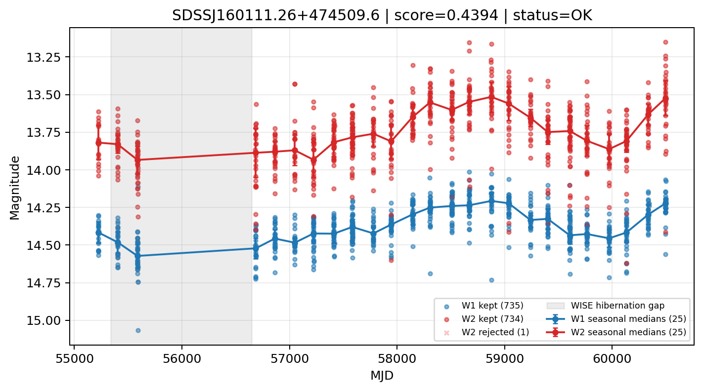

# Candidate Card: SDSSJ160111.26+474509.6 (Rank 82)

## Basic Metadata

- `source_id`: `SDSSJ160111.26+474509.6`
- `canonical_id`: `SDSSJ160111.26+474509.6`
- `score`: `0.439375`
- `status`: `OK`
- `final_label`: `Known AGN`
- `stage_a_positive`: `True`
- `gate_blazar_veto`: `True`
- `gate_wise_qc_pass`: `True`
- `gate_data_sufficient`: `True`
- `decision_trace`: `stage_a_positive=pass;gate_blazar_veto=pass;gate_wise_qc_pass=pass;gate_data_sufficient=pass;gate_state_change_ratio_pass=pass;gate_transient_spike_pass=pass`

## Sampling / Variability Summary

- `n_points` (results table): `411`
- `baseline_days`: `5275.90`
- `baseline_years`: `14.445`
- `band_coverage`: `W1,W2`
- `delta_mag`: `0.196`
- `delta_mag_method`: `seasonal_median_flux`

## Coordinates

- `ra`: `240.296900`
- `dec`: `47.752670`
- `coordinate_source`: `benchmark_master`

## WISE Light Curve

## WISE QA / Rejection Accounting

| Metric | Value |
| --- | --- |
| Raw points total | 1470 |
| Raw points W1 | 735 |
| Raw points W2 | 735 |
| Kept points total | 1469 |
| Kept points W1 | 735 |
| Kept points W2 | 734 |
| Fraction rejected | 0.000680272 |
| Reject: missing time | 0 |
| Reject: missing mag | 0 |
| Reject: invalid band | 0 |
| Reject: cc_flags | 1 |
| Reject: qual_frame | 0 |
| Reject: moon_lev | 0 |

### QA Reject Reason Counts

| reject_reason | count |
| --- | --- |
| reject_cc_flags | 1 |
| reject_invalid_band | 0 |
| reject_missing_mag | 0 |
| reject_missing_time | 0 |
| reject_moon_lev | 0 |
| reject_qual_frame | 0 |

## Flag Summary

### `cc_flags`

| value | count | fraction |
| --- | --- | --- |
| 0000 | 1468 | 0.998639 |
| 0h00 | 2 | 0.00136054 |

### `qual_frame`

| value | count | fraction |
| --- | --- | --- |
| <NA> | 1470 | 1 |

### `moon_lev`

| value | count | fraction |
| --- | --- | --- |
| 00 | 1300 | 0.884354 |
| 0000 | 170 | 0.115646 |

### `qi_fact`

| value | count | fraction |
| --- | --- | --- |
| 1.0 | 866 | 0.589116 |
| 0.5 | 542 | 0.368707 |
| 0.0 | 62 | 0.0421769 |

### `saa_sep`

| value | count | fraction |
| --- | --- | --- |
| 59.0 | 14 | 0.00952381 |
| 58.0 | 10 | 0.00680272 |
| 63.0 | 8 | 0.00544218 |
| 89.0 | 6 | 0.00408163 |
| 113.0 | 6 | 0.00408163 |
| 94.0 | 4 | 0.00272109 |
| 86.0 | 4 | 0.00272109 |
| 106.0 | 4 | 0.00272109 |

### `ph_qual`

| value | count | fraction |
| --- | --- | --- |
| AB | 1028 | 0.69932 |
| AA | 254 | 0.172789 |
| <NA> | 170 | 0.115646 |
| BB | 16 | 0.0108844 |
| AC | 2 | 0.00136054 |

## Coverage Summary

- Seasonal bins (W1): `25`
- Seasonal bins (W2): `25`
- Pre-gap coverage: `True`
- Post-gap coverage: `True`
- Both-sides coverage: `True`

## Systematics Verdict

- Verdict: `PASS`
- Summary: QA-clean points and seasonal coverage support the observed variability signal.
- QA-dominated signal check: Not obviously dominated by flagged/low-quality points

Reasons:
- Seasonal trend supported by sufficient QA-clean W1/W2 points

## Catalog Checks

- Known blazar match: `NO`
- Known CLAGN match: `YES` (method=coordinate)
- Gaia metrics: not provided / no match

## Final Label

**Known AGN**

- Rank 82 with score=0.4394
- Sampling: n_points=411, baseline_years=14.444631811033544, band_coverage=W1,W2
- QA rejection fraction=0.1% (main causes summarized in card QA section)
- Systematics verdict=PASS: QA-clean points and seasonal coverage support the observed variability signal.
- Known blazar catalog match=NO
- Dataset metadata class=clagn
- Known CLAGN file match=YES

## Reproducibility

- `run_timestamp_utc`: `2026-02-28T17:09:43.673413+00:00`
- `results_file`: `data/real_clagn/benchmark_scores.csv`
- `wise_file`: `data/wise/SDSSJ160111.26+474509.6.csv`
- `score_threshold`: `0.0`
- `t_recall`: `0.3493918746`
