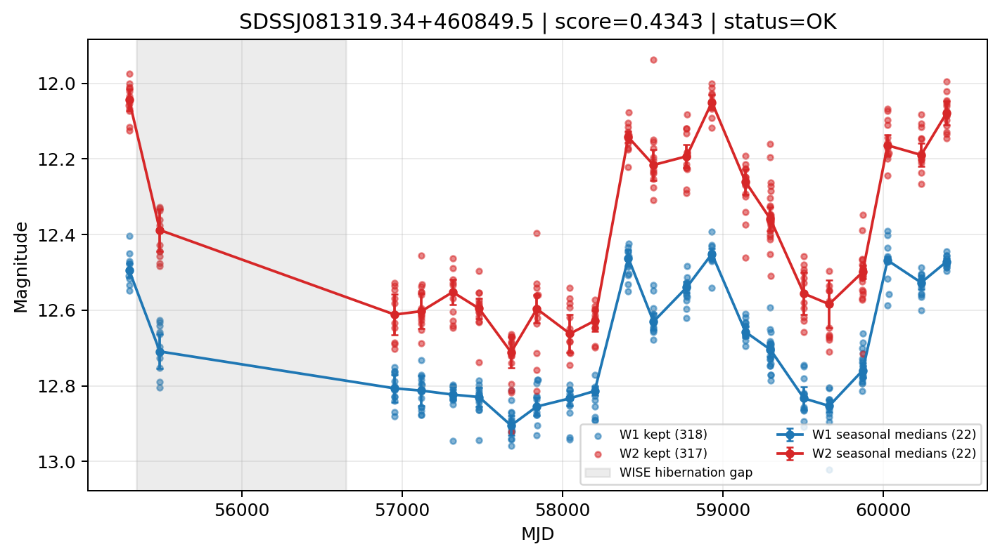

# Candidate Card: SDSSJ081319.34+460849.5 (Rank 86)

## Basic Metadata

- `source_id`: `SDSSJJ081319.34+460849.5`
- `canonical_id`: `SDSSJ081319.34+460849.5`
- `source_id_normalized`: `SDSSJ081319.34+460849.5`
- `score`: `0.434335`
- `status`: `OK`
- `final_label`: `Known AGN`
- `stage_a_positive`: `True`
- `gate_blazar_veto`: `True`
- `gate_wise_qc_pass`: `True`
- `gate_data_sufficient`: `True`
- `decision_trace`: `stage_a_positive=pass;gate_blazar_veto=pass;gate_wise_qc_pass=pass;gate_data_sufficient=pass;gate_state_change_ratio_pass=pass;gate_transient_spike_pass=pass`

## Sampling / Variability Summary

- `n_points` (results table): `267`
- `baseline_days`: `5098.82`
- `baseline_years`: `13.960`
- `band_coverage`: `W1,W2`
- `delta_mag`: `0.103`
- `delta_mag_method`: `seasonal_median_flux`

## Coordinates

- `ra`: `123.330560`
- `dec`: `46.147156`
- `coordinate_source`: `benchmark_master`

## WISE Light Curve

## WISE QA / Rejection Accounting

| Metric | Value |
| --- | --- |
| Raw points total | 636 |
| Raw points W1 | 318 |
| Raw points W2 | 318 |
| Kept points total | 635 |
| Kept points W1 | 318 |
| Kept points W2 | 317 |
| Fraction rejected | 0.00157233 |
| Reject: missing time | 0 |
| Reject: missing mag | 1 |
| Reject: invalid band | 0 |
| Reject: cc_flags | 0 |
| Reject: qual_frame | 0 |
| Reject: moon_lev | 0 |

### QA Reject Reason Counts

| reject_reason | count |
| --- | --- |
| reject_cc_flags | 0 |
| reject_invalid_band | 0 |
| reject_missing_mag | 1 |
| reject_missing_time | 0 |
| reject_moon_lev | 0 |
| reject_qual_frame | 0 |

## Flag Summary

### `cc_flags`

| value | count | fraction |
| --- | --- | --- |
| 0000 | 636 | 1 |

### `qual_frame`

| value | count | fraction |
| --- | --- | --- |
| <NA> | 636 | 1 |

### `moon_lev`

| value | count | fraction |
| --- | --- | --- |
| 00 | 566 | 0.889937 |
| 0000 | 52 | 0.081761 |
| 01 | 18 | 0.0283019 |

### `qi_fact`

| value | count | fraction |
| --- | --- | --- |
| 1.0 | 558 | 0.877358 |
| 0.5 | 66 | 0.103774 |
| 0.0 | 12 | 0.0188679 |

### `saa_sep`

| value | count | fraction |
| --- | --- | --- |
| 54.0 | 6 | 0.00943396 |
| 57.0 | 6 | 0.00943396 |
| 55.0 | 4 | 0.00628931 |
| 62.0 | 4 | 0.00628931 |
| 66.0 | 4 | 0.00628931 |
| 72.36799621582031 | 2 | 0.00314465 |
| 51.444000244140625 | 2 | 0.00314465 |
| 64.56500244140625 | 2 | 0.00314465 |

### `ph_qual`

| value | count | fraction |
| --- | --- | --- |
| AA | 580 | 0.91195 |
| <NA> | 52 | 0.081761 |
| AB | 2 | 0.00314465 |
| AX | 2 | 0.00314465 |

## Coverage Summary

- Seasonal bins (W1): `22`
- Seasonal bins (W2): `22`
- Pre-gap coverage: `True`
- Post-gap coverage: `True`
- Both-sides coverage: `True`

## Systematics Verdict

- Verdict: `PASS`
- Summary: QA-clean points and seasonal coverage support the observed variability signal.
- QA-dominated signal check: Not obviously dominated by flagged/low-quality points

Reasons:
- Seasonal trend supported by sufficient QA-clean W1/W2 points

## Catalog Checks

- Known blazar match: `NO`
- Known CLAGN match: `NO`
- Gaia metrics: not provided / no match

## Final Label

**Known AGN**

- Rank 86 with score=0.4343
- Sampling: n_points=267, baseline_years=13.959800833839823, band_coverage=W1,W2
- QA rejection fraction=0.2% (main causes summarized in card QA section)
- Systematics verdict=PASS: QA-clean points and seasonal coverage support the observed variability signal.
- Known blazar catalog match=NO
- Dataset metadata class=clagn

## Reproducibility

- `run_timestamp_utc`: `2026-02-28T17:09:43.673413+00:00`
- `results_file`: `data/real_clagn/benchmark_scores.csv`
- `wise_file`: `data/wise/SDSSJ081319.34+460849.5.csv`
- `score_threshold`: `0.0`
- `t_recall`: `0.3493918746`
