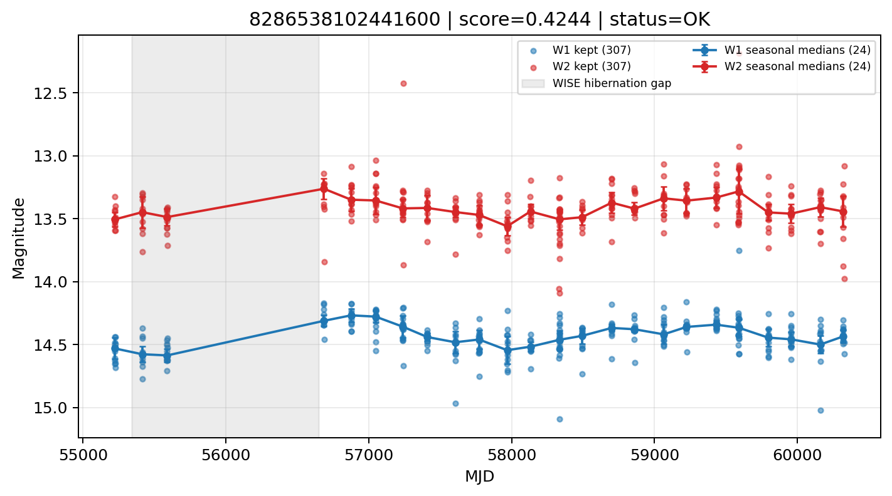

# Candidate Card: 8286538102441600 (Rank 91)

## Basic Metadata

- `source_id`: `8286538102441600`
- `canonical_id`: `8286538102441600`
- `score`: `0.424447`
- `status`: `OK`
- `final_label`: `Rejected`
- `stage_a_positive`: `True`
- `gate_blazar_veto`: `True`
- `gate_wise_qc_pass`: `True`
- `gate_data_sufficient`: `True`
- `decision_trace`: `stage_a_positive=pass;gate_blazar_veto=pass;gate_wise_qc_pass=pass;gate_data_sufficient=pass;gate_state_change_ratio_pass=pass;gate_transient_spike_pass=pass`

## Sampling / Variability Summary

- `n_points` (results table): `203`
- `baseline_days`: `5096.44`
- `baseline_years`: `13.953`
- `band_coverage`: `W1,W2`
- `delta_mag`: `0.129`
- `delta_mag_method`: `seasonal_median_flux`

## Coordinates

- `ra`: `42.750148`
- `dec`: `7.393637`
- `coordinate_source`: `benchmark_master`

## WISE Light Curve

## WISE QA / Rejection Accounting

| Metric | Value |
| --- | --- |
| Raw points total | 614 |
| Raw points W1 | 307 |
| Raw points W2 | 307 |
| Kept points total | 614 |
| Kept points W1 | 307 |
| Kept points W2 | 307 |
| Fraction rejected | 0 |
| Reject: missing time | 0 |
| Reject: missing mag | 0 |
| Reject: invalid band | 0 |
| Reject: cc_flags | 0 |
| Reject: qual_frame | 0 |
| Reject: moon_lev | 0 |

### QA Reject Reason Counts

| reject_reason | count |
| --- | --- |
| reject_cc_flags | 0 |
| reject_invalid_band | 0 |
| reject_missing_mag | 0 |
| reject_missing_time | 0 |
| reject_moon_lev | 0 |
| reject_qual_frame | 0 |

## Flag Summary

### `cc_flags`

| value | count | fraction |
| --- | --- | --- |
| 0000 | 614 | 1 |

### `qual_frame`

| value | count | fraction |
| --- | --- | --- |
| <NA> | 614 | 1 |

### `moon_lev`

| value | count | fraction |
| --- | --- | --- |
| 00 | 464 | 0.7557 |
| 0000 | 70 | 0.114007 |
| 11 | 64 | 0.104235 |
| 01 | 16 | 0.0260586 |

### `qi_fact`

| value | count | fraction |
| --- | --- | --- |
| 1.0 | 502 | 0.81759 |
| 0.5 | 100 | 0.162866 |
| 0.0 | 12 | 0.019544 |

### `saa_sep`

| value | count | fraction |
| --- | --- | --- |
| 21.0 | 8 | 0.0130293 |
| 88.0 | 6 | 0.00977199 |
| 10.0 | 4 | 0.00651466 |
| 11.0 | 4 | 0.00651466 |
| 90.0 | 4 | 0.00651466 |
| 27.0 | 4 | 0.00651466 |
| 48.0 | 4 | 0.00651466 |
| 29.42099952697754 | 4 | 0.00651466 |

### `ph_qual`

| value | count | fraction |
| --- | --- | --- |
| AA | 272 | 0.442997 |
| AB | 228 | 0.371336 |
| <NA> | 70 | 0.114007 |
| BB | 24 | 0.0390879 |
| BA | 10 | 0.0162866 |
| BU | 4 | 0.00651466 |
| BC | 4 | 0.00651466 |
| AU | 2 | 0.00325733 |

## Coverage Summary

- Seasonal bins (W1): `24`
- Seasonal bins (W2): `24`
- Pre-gap coverage: `True`
- Post-gap coverage: `True`
- Both-sides coverage: `True`

## Systematics Verdict

- Verdict: `PASS`
- Summary: QA-clean points and seasonal coverage support the observed variability signal.
- QA-dominated signal check: Not obviously dominated by flagged/low-quality points

Reasons:
- Seasonal trend supported by sufficient QA-clean W1/W2 points

## Catalog Checks

- Known blazar match: `NO`
- Known CLAGN match: `NO`
- Gaia metrics: not provided / no match

## Final Label

**Rejected**

- Rank 91 with score=0.4244
- Sampling: n_points=203, baseline_years=13.953301649034902, band_coverage=W1,W2
- QA rejection fraction=0.0% (main causes summarized in card QA section)
- Systematics verdict=PASS: QA-clean points and seasonal coverage support the observed variability signal.
- Known blazar catalog match=NO
- Dataset metadata class=star
- Rejected because dataset metadata class=star is a known contaminant class

## Reproducibility

- `run_timestamp_utc`: `2026-02-28T17:09:43.673413+00:00`
- `results_file`: `data/real_clagn/benchmark_scores.csv`
- `wise_file`: `data/wise/8286538102441600.csv`
- `score_threshold`: `0.0`
- `t_recall`: `0.3493918746`
