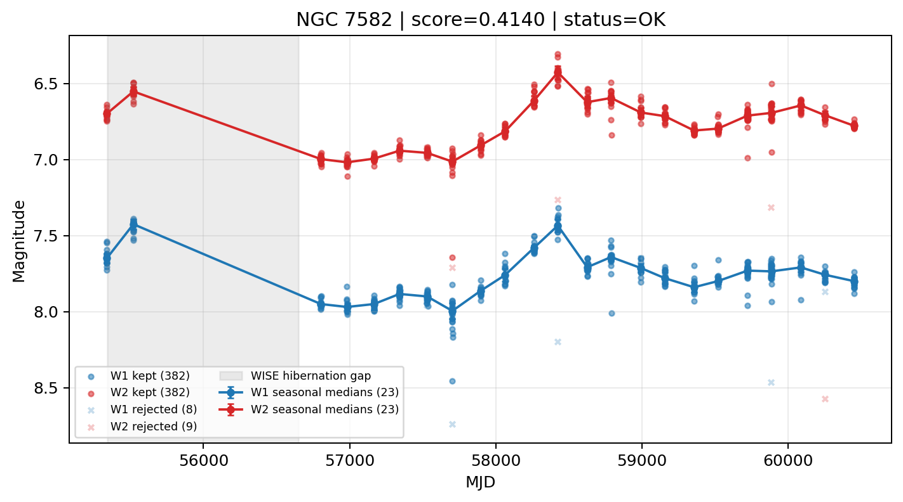

# Candidate Card: NGC 7582 (Rank 93)

## Basic Metadata

- `source_id`: `NGC 7582`
- `canonical_id`: `NGC 7582`
- `score`: `0.414027`
- `status`: `OK`
- `final_label`: `Known AGN`
- `stage_a_positive`: `True`
- `gate_blazar_veto`: `True`
- `gate_wise_qc_pass`: `True`
- `gate_data_sufficient`: `True`
- `decision_trace`: `stage_a_positive=pass;gate_blazar_veto=pass;gate_wise_qc_pass=pass;gate_data_sufficient=pass;gate_state_change_ratio_pass=pass;gate_transient_spike_pass=pass`

## Sampling / Variability Summary

- `n_points` (results table): `31`
- `baseline_days`: `5113.52`
- `baseline_years`: `14.000`
- `band_coverage`: `W1,W2`
- `delta_mag`: `0.000`
- `delta_mag_method`: `seasonal_median_flux`

## Coordinates

- `ra`: `349.598000`
- `dec`: `-42.369999`
- `coordinate_source`: `benchmark_master`

## WISE Light Curve

## WISE QA / Rejection Accounting

| Metric | Value |
| --- | --- |
| Raw points total | 782 |
| Raw points W1 | 391 |
| Raw points W2 | 391 |
| Kept points total | 764 |
| Kept points W1 | 382 |
| Kept points W2 | 382 |
| Fraction rejected | 0.0230179 |
| Reject: missing time | 0 |
| Reject: missing mag | 1 |
| Reject: invalid band | 0 |
| Reject: cc_flags | 17 |
| Reject: qual_frame | 0 |
| Reject: moon_lev | 0 |

### QA Reject Reason Counts

| reject_reason | count |
| --- | --- |
| reject_cc_flags | 17 |
| reject_invalid_band | 0 |
| reject_missing_mag | 1 |
| reject_missing_time | 0 |
| reject_moon_lev | 0 |
| reject_qual_frame | 0 |

## Flag Summary

### `cc_flags`

| value | count | fraction |
| --- | --- | --- |
| 0000 | 762 | 0.974425 |
| HH00 | 6 | 0.00767263 |
| hh00 | 4 | 0.00511509 |
| dH00 | 4 | 0.00511509 |
| 0h00 | 2 | 0.00255754 |
| h000 | 2 | 0.00255754 |
| dd00 | 2 | 0.00255754 |

### `qual_frame`

| value | count | fraction |
| --- | --- | --- |
| <NA> | 782 | 1 |

### `moon_lev`

| value | count | fraction |
| --- | --- | --- |
| 00 | 722 | 0.923274 |
| 0000 | 60 | 0.0767263 |

### `qi_fact`

| value | count | fraction |
| --- | --- | --- |
| 0.5 | 630 | 0.805627 |
| 1.0 | 96 | 0.122762 |
| 0.0 | 56 | 0.0716113 |

### `saa_sep`

| value | count | fraction |
| --- | --- | --- |
| 5.0 | 4 | 0.00511509 |
| 47.0 | 4 | 0.00511509 |
| 2.0 | 4 | 0.00511509 |
| 63.444000244140625 | 4 | 0.00511509 |
| 20.0 | 4 | 0.00511509 |
| 78.0 | 4 | 0.00511509 |
| 72.41899871826172 | 2 | 0.00255754 |
| 34.68899917602539 | 2 | 0.00255754 |

### `ph_qual`

| value | count | fraction |
| --- | --- | --- |
| AA | 720 | 0.920716 |
| <NA> | 60 | 0.0767263 |
| XB | 2 | 0.00255754 |

## Coverage Summary

- Seasonal bins (W1): `23`
- Seasonal bins (W2): `23`
- Pre-gap coverage: `True`
- Post-gap coverage: `True`
- Both-sides coverage: `True`

## Systematics Verdict

- Verdict: `PASS`
- Summary: QA-clean points and seasonal coverage support the observed variability signal.
- QA-dominated signal check: Not obviously dominated by flagged/low-quality points

Reasons:
- Seasonal trend supported by sufficient QA-clean W1/W2 points

## Catalog Checks

- Known blazar match: `NO`
- Known CLAGN match: `NO`
- Gaia metrics: not provided / no match

## Final Label

**Known AGN**

- Rank 93 with score=0.4140
- Sampling: n_points=31, baseline_years=14.000066159644074, band_coverage=W1,W2
- QA rejection fraction=2.3% (main causes summarized in card QA section)
- Systematics verdict=PASS: QA-clean points and seasonal coverage support the observed variability signal.
- Known blazar catalog match=NO
- Dataset metadata class=clagn

## Reproducibility

- `run_timestamp_utc`: `2026-02-28T17:09:43.673413+00:00`
- `results_file`: `data/real_clagn/benchmark_scores.csv`
- `wise_file`: `data/wise/NGC 7582.csv`
- `score_threshold`: `0.0`
- `t_recall`: `0.3493918746`
