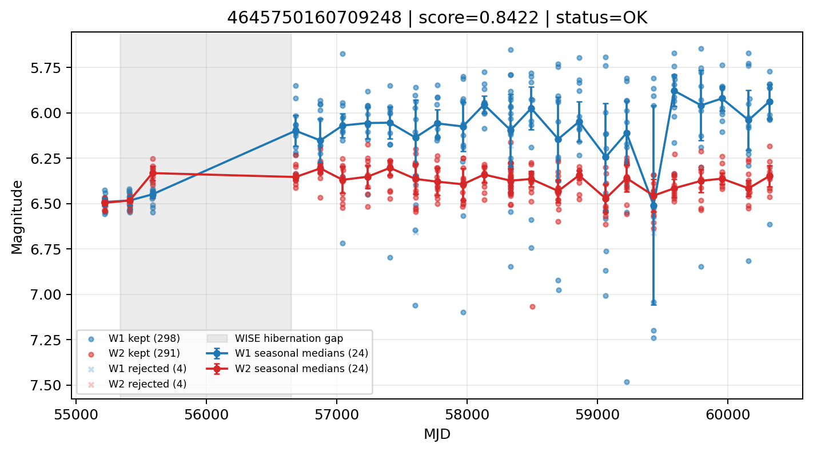

# Candidate Card: 4645750160709248 (Rank 1)

## Basic Metadata

- `source_id`: `4645750160709248`
- `canonical_id`: `4645750160709248`
- `score`: `0.842179`
- `status`: `OK`
- `final_label`: `Rejected`
- `stage_a_positive`: `True`
- `gate_blazar_veto`: `True`
- `gate_wise_qc_pass`: `True`
- `gate_data_sufficient`: `True`
- `decision_trace`: `stage_a_positive=pass;gate_blazar_veto=pass;gate_wise_qc_pass=pass;gate_data_sufficient=pass`

## Sampling / Variability Summary

- `n_points` (results table): `190`
- `baseline_days`: `5096.47`
- `baseline_years`: `13.953`
- `band_coverage`: `W1,W2`
- `delta_mag`: `0.538`
- `delta_mag_method`: `seasonal_median_flux`

## Coordinates

- `ra`: `42.836650`
- `dec`: `3.056789`
- `coordinate_source`: `benchmark_master`

## WISE Light Curve

## WISE QA / Rejection Accounting

| Metric | Value |
| --- | --- |
| Raw points total | 604 |
| Raw points W1 | 302 |
| Raw points W2 | 302 |
| Kept points total | 589 |
| Kept points W1 | 298 |
| Kept points W2 | 291 |
| Fraction rejected | 0.0248344 |
| Reject: missing time | 0 |
| Reject: missing mag | 7 |
| Reject: invalid band | 0 |
| Reject: cc_flags | 8 |
| Reject: qual_frame | 0 |
| Reject: moon_lev | 0 |

### QA Reject Reason Counts

| reject_reason | count |
| --- | --- |
| reject_cc_flags | 8 |
| reject_invalid_band | 0 |
| reject_missing_mag | 7 |
| reject_missing_time | 0 |
| reject_moon_lev | 0 |
| reject_qual_frame | 0 |

## Flag Summary

### `cc_flags`

| value | count | fraction |
| --- | --- | --- |
| 0000 | 596 | 0.986755 |
| dd00 | 4 | 0.00662252 |
| dH00 | 2 | 0.00331126 |
| HH00 | 2 | 0.00331126 |

### `qual_frame`

| value | count | fraction |
| --- | --- | --- |
| <NA> | 604 | 1 |

### `moon_lev`

| value | count | fraction |
| --- | --- | --- |
| 00 | 488 | 0.807947 |
| 0000 | 68 | 0.112583 |
| 11 | 28 | 0.0463576 |
| 0111 | 14 | 0.0231788 |
| 01 | 4 | 0.00662252 |
| 0011 | 2 | 0.00331126 |

### `qi_fact`

| value | count | fraction |
| --- | --- | --- |
| 1.0 | 452 | 0.748344 |
| 0.5 | 128 | 0.211921 |
| 0.0 | 24 | 0.0397351 |

### `saa_sep`

| value | count | fraction |
| --- | --- | --- |
| 16.0 | 4 | 0.00662252 |
| 16.086999893188477 | 4 | 0.00662252 |
| 106.0 | 4 | 0.00662252 |
| 105.0 | 4 | 0.00662252 |
| 64.0 | 4 | 0.00662252 |
| 63.0 | 4 | 0.00662252 |
| 7.0 | 4 | 0.00662252 |
| 43.0 | 4 | 0.00662252 |

### `ph_qual`

| value | count | fraction |
| --- | --- | --- |
| AA | 520 | 0.860927 |
| <NA> | 84 | 0.139073 |

## Coverage Summary

- Seasonal bins (W1): `24`
- Seasonal bins (W2): `24`
- Pre-gap coverage: `True`
- Post-gap coverage: `True`
- Both-sides coverage: `True`

## Systematics Verdict

- Verdict: `PASS`
- Summary: QA-clean points and seasonal coverage support the observed variability signal.
- QA-dominated signal check: Not obviously dominated by flagged/low-quality points

Reasons:
- Seasonal trend supported by sufficient QA-clean W1/W2 points

## Catalog Checks

- Known blazar match: `NO`
- Known CLAGN match: `NO`
- Gaia metrics: not provided / no match

## Final Label

**Rejected**

- Rank 1 with score=0.8422
- Sampling: n_points=190, baseline_years=13.953375211334707, band_coverage=W1,W2
- QA rejection fraction=2.5% (main causes summarized in card QA section)
- Systematics verdict=PASS: QA-clean points and seasonal coverage support the observed variability signal.
- Known blazar catalog match=NO
- Dataset metadata class=star
- Rejected because dataset metadata class=star is a known contaminant class

## Reproducibility

- `run_timestamp_utc`: `2026-02-27T18:10:09.937450+00:00`
- `results_file`: `data/real_clagn/benchmark_scores.csv`
- `wise_file`: `data/wise/4645750160709248.csv`
- `score_threshold`: `0.7`
- `t_recall`: `0.3493918746`
