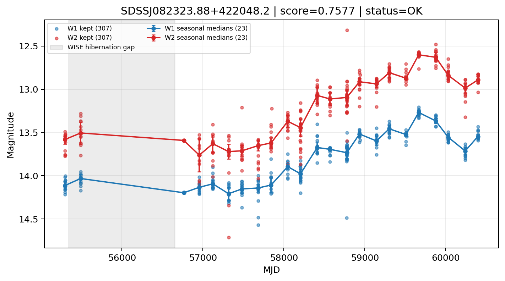

# Candidate Card: SDSSJ082323.88+422048.2 (Rank 5)

## Basic Metadata

- `source_id`: `SDSSJJ082323.88+422048.2`
- `canonical_id`: `SDSSJ082323.88+422048.2`
- `source_id_normalized`: `SDSSJ082323.88+422048.2`
- `score`: `0.757734`
- `status`: `OK`
- `final_label`: `Known AGN`
- `stage_a_positive`: `True`
- `gate_blazar_veto`: `True`
- `gate_wise_qc_pass`: `True`
- `gate_data_sufficient`: `True`
- `decision_trace`: `stage_a_positive=pass;gate_blazar_veto=pass;gate_wise_qc_pass=pass;gate_data_sufficient=pass;gate_state_change_ratio_pass=pass;gate_transient_spike_pass=pass`

## Sampling / Variability Summary

- `n_points` (results table): `253`
- `baseline_days`: `5098.61`
- `baseline_years`: `13.959`
- `band_coverage`: `W1,W2`
- `delta_mag`: `0.437`
- `delta_mag_method`: `seasonal_median_flux`

## Coordinates

- `ra`: `125.849550`
- `dec`: `42.346741`
- `coordinate_source`: `benchmark_master`

## WISE Light Curve

## WISE QA / Rejection Accounting

| Metric | Value |
| --- | --- |
| Raw points total | 614 |
| Raw points W1 | 307 |
| Raw points W2 | 307 |
| Kept points total | 614 |
| Kept points W1 | 307 |
| Kept points W2 | 307 |
| Fraction rejected | 0 |
| Reject: missing time | 0 |
| Reject: missing mag | 0 |
| Reject: invalid band | 0 |
| Reject: cc_flags | 0 |
| Reject: qual_frame | 0 |
| Reject: moon_lev | 0 |

### QA Reject Reason Counts

| reject_reason | count |
| --- | --- |
| reject_cc_flags | 0 |
| reject_invalid_band | 0 |
| reject_missing_mag | 0 |
| reject_missing_time | 0 |
| reject_moon_lev | 0 |
| reject_qual_frame | 0 |

## Flag Summary

### `cc_flags`

| value | count | fraction |
| --- | --- | --- |
| 0000 | 614 | 1 |

### `qual_frame`

| value | count | fraction |
| --- | --- | --- |
| <NA> | 614 | 1 |

### `moon_lev`

| value | count | fraction |
| --- | --- | --- |
| 00 | 556 | 0.905537 |
| 0000 | 50 | 0.0814332 |
| 01 | 4 | 0.00651466 |
| 11 | 4 | 0.00651466 |

### `qi_fact`

| value | count | fraction |
| --- | --- | --- |
| 1.0 | 530 | 0.863192 |
| 0.5 | 66 | 0.107492 |
| 0.0 | 18 | 0.029316 |

### `saa_sep`

| value | count | fraction |
| --- | --- | --- |
| 72.0 | 6 | 0.00977199 |
| 73.0 | 4 | 0.00651466 |
| 50.0 | 2 | 0.00325733 |
| 79.01799774169922 | 2 | 0.00325733 |
| 72.56700134277344 | 2 | 0.00325733 |
| 71.96099853515625 | 2 | 0.00325733 |
| 90.4000015258789 | 2 | 0.00325733 |
| 90.04000091552734 | 2 | 0.00325733 |

### `ph_qual`

| value | count | fraction |
| --- | --- | --- |
| AA | 384 | 0.625407 |
| AB | 176 | 0.286645 |
| <NA> | 50 | 0.0814332 |
| BA | 2 | 0.00325733 |
| AC | 2 | 0.00325733 |

## Coverage Summary

- Seasonal bins (W1): `23`
- Seasonal bins (W2): `23`
- Pre-gap coverage: `True`
- Post-gap coverage: `True`
- Both-sides coverage: `True`

## Systematics Verdict

- Verdict: `PASS`
- Summary: QA-clean points and seasonal coverage support the observed variability signal.
- QA-dominated signal check: Not obviously dominated by flagged/low-quality points

Reasons:
- Seasonal trend supported by sufficient QA-clean W1/W2 points

## Catalog Checks

- Known blazar match: `NO`
- Known CLAGN match: `NO`
- Gaia metrics: not provided / no match

## Final Label

**Known AGN**

- Rank 5 with score=0.7577
- Sampling: n_points=253, baseline_years=13.95923640372346, band_coverage=W1,W2
- QA rejection fraction=0.0% (main causes summarized in card QA section)
- Systematics verdict=PASS: QA-clean points and seasonal coverage support the observed variability signal.
- Known blazar catalog match=NO
- Dataset metadata class=clagn

## Reproducibility

- `run_timestamp_utc`: `2026-02-27T20:24:02.884796+00:00`
- `results_file`: `data/real_clagn/benchmark_scores.csv`
- `wise_file`: `data/wise/SDSSJ082323.88+422048.2.csv`
- `score_threshold`: `0.0`
- `t_recall`: `0.3493918746`
