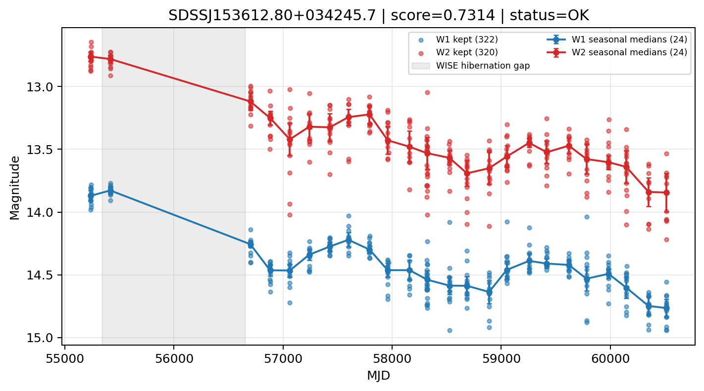

# Candidate Card: SDSSJ153612.80+034245.7 (Rank 7)

## Basic Metadata

- `source_id`: `SDSSJ153612.80+034245.7`
- `canonical_id`: `SDSSJ153612.80+034245.7`
- `score`: `0.731372`
- `status`: `OK`
- `final_label`: `Known AGN`
- `stage_a_positive`: `True`
- `gate_blazar_veto`: `True`
- `gate_wise_qc_pass`: `True`
- `gate_data_sufficient`: `True`
- `decision_trace`: `stage_a_positive=pass;gate_blazar_veto=pass;gate_wise_qc_pass=pass;gate_data_sufficient=pass;gate_state_change_ratio_pass=pass;gate_transient_spike_pass=pass`

## Sampling / Variability Summary

- `n_points` (results table): `269.0`
- `baseline_days`: `5276.73`
- `baseline_years`: `14.447`
- `band_coverage`: `W1,W2`
- `delta_mag`: `-0.925`
- `delta_mag_method`: `seasonal_median_flux`

## Coordinates

- `ra`: `234.053350`
- `dec`: `3.712720`
- `coordinate_source`: `benchmark_master`

## WISE Light Curve

## WISE QA / Rejection Accounting

| Metric | Value |
| --- | --- |
| Raw points total | 644 |
| Raw points W1 | 322 |
| Raw points W2 | 322 |
| Kept points total | 642 |
| Kept points W1 | 322 |
| Kept points W2 | 320 |
| Fraction rejected | 0.00310559 |
| Reject: missing time | 0 |
| Reject: missing mag | 2 |
| Reject: invalid band | 0 |
| Reject: cc_flags | 0 |
| Reject: qual_frame | 0 |
| Reject: moon_lev | 0 |

### QA Reject Reason Counts

| reject_reason | count |
| --- | --- |
| reject_cc_flags | 0 |
| reject_invalid_band | 0 |
| reject_missing_mag | 2 |
| reject_missing_time | 0 |
| reject_moon_lev | 0 |
| reject_qual_frame | 0 |

## Flag Summary

### `cc_flags`

| value | count | fraction |
| --- | --- | --- |
| 0000 | 644 | 1 |

### `qual_frame`

| value | count | fraction |
| --- | --- | --- |
| <NA> | 644 | 1 |

### `moon_lev`

| value | count | fraction |
| --- | --- | --- |
| 00 | 570 | 0.885093 |
| 0000 | 56 | 0.0869565 |
| 01 | 16 | 0.0248447 |
| 11 | 2 | 0.00310559 |

### `qi_fact`

| value | count | fraction |
| --- | --- | --- |
| 1.0 | 594 | 0.92236 |
| 0.5 | 40 | 0.0621118 |
| 0.0 | 10 | 0.015528 |

### `saa_sep`

| value | count | fraction |
| --- | --- | --- |
| 44.0 | 4 | 0.00621118 |
| 11.0 | 4 | 0.00621118 |
| 58.0 | 4 | 0.00621118 |
| 94.0 | 4 | 0.00621118 |
| 30.858999252319336 | 2 | 0.00310559 |
| 91.13700103759766 | 2 | 0.00310559 |
| 74.3499984741211 | 2 | 0.00310559 |
| 52.5369987487793 | 2 | 0.00310559 |

### `ph_qual`

| value | count | fraction |
| --- | --- | --- |
| AB | 276 | 0.428571 |
| AA | 252 | 0.391304 |
| <NA> | 56 | 0.0869565 |
| BB | 40 | 0.0621118 |
| BA | 8 | 0.0124224 |
| AC | 4 | 0.00621118 |
| AX | 2 | 0.00310559 |
| BX | 2 | 0.00310559 |

## Coverage Summary

- Seasonal bins (W1): `24`
- Seasonal bins (W2): `24`
- Pre-gap coverage: `True`
- Post-gap coverage: `True`
- Both-sides coverage: `True`

## Systematics Verdict

- Verdict: `PASS`
- Summary: QA-clean points and seasonal coverage support the observed variability signal.
- QA-dominated signal check: Not obviously dominated by flagged/low-quality points

Reasons:
- Seasonal trend supported by sufficient QA-clean W1/W2 points

## Catalog Checks

- Known blazar match: `NO`
- Known CLAGN match: `YES` (method=coordinate)
- Gaia metrics: not provided / no match

## Final Label

**Known AGN**

- Rank 7 with score=0.7314
- Sampling: n_points=269.0, baseline_years=14.4469058996, band_coverage=W1,W2
- QA rejection fraction=0.3% (main causes summarized in card QA section)
- Systematics verdict=PASS: QA-clean points and seasonal coverage support the observed variability signal.
- Known blazar catalog match=NO
- Dataset metadata class=clagn
- Known CLAGN file match=YES

## Reproducibility

- `run_timestamp_utc`: `2026-03-02T06:47:01.885248+00:00`
- `results_file`: `data/real_clagn/benchmark_scores_v2.csv`
- `wise_file`: `data/wise/SDSSJ153612.80+034245.7.csv`
- `score_threshold`: `0.0`
- `t_recall`: `0.3493918746`
