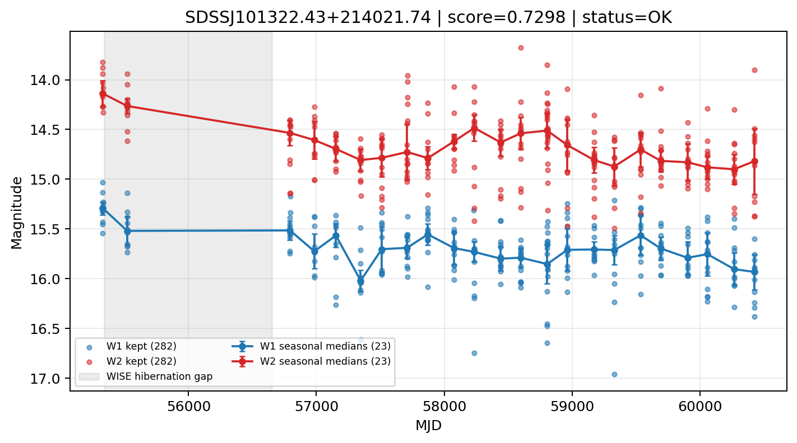

# Candidate Card: SDSSJ101322.43+214021.74 (Rank 8)

## Basic Metadata

- `source_id`: `SDSSJJ101322.43+214021.74`
- `canonical_id`: `SDSSJ101322.43+214021.74`
- `source_id_normalized`: `SDSSJ101322.43+214021.74`
- `score`: `0.729755`
- `status`: `OK`
- `final_label`: `Known AGN`
- `stage_a_positive`: `True`
- `gate_blazar_veto`: `True`
- `gate_wise_qc_pass`: `True`
- `gate_data_sufficient`: `True`
- `decision_trace`: `stage_a_positive=pass;gate_blazar_veto=pass;gate_wise_qc_pass=pass;gate_data_sufficient=pass;gate_state_change_ratio_pass=pass;gate_transient_spike_pass=pass`

## Sampling / Variability Summary

- `n_points` (results table): `180.0`
- `baseline_days`: `5098.38`
- `baseline_years`: `13.959`
- `band_coverage`: `W1,W2`
- `delta_mag`: `-0.510`
- `delta_mag_method`: `seasonal_median_flux`

## Coordinates

- `ra`: `153.343500`
- `dec`: `21.672710`
- `coordinate_source`: `benchmark_master`

## WISE Light Curve

## WISE QA / Rejection Accounting

| Metric | Value |
| --- | --- |
| Raw points total | 564 |
| Raw points W1 | 282 |
| Raw points W2 | 282 |
| Kept points total | 564 |
| Kept points W1 | 282 |
| Kept points W2 | 282 |
| Fraction rejected | 0 |
| Reject: missing time | 0 |
| Reject: missing mag | 0 |
| Reject: invalid band | 0 |
| Reject: cc_flags | 0 |
| Reject: qual_frame | 0 |
| Reject: moon_lev | 0 |

### QA Reject Reason Counts

| reject_reason | count |
| --- | --- |
| reject_cc_flags | 0 |
| reject_invalid_band | 0 |
| reject_missing_mag | 0 |
| reject_missing_time | 0 |
| reject_moon_lev | 0 |
| reject_qual_frame | 0 |

## Flag Summary

### `cc_flags`

| value | count | fraction |
| --- | --- | --- |
| 0000 | 564 | 1 |

### `qual_frame`

| value | count | fraction |
| --- | --- | --- |
| <NA> | 564 | 1 |

### `moon_lev`

| value | count | fraction |
| --- | --- | --- |
| 00 | 488 | 0.865248 |
| 0000 | 42 | 0.0744681 |
| 11 | 20 | 0.035461 |
| 01 | 14 | 0.0248227 |

### `qi_fact`

| value | count | fraction |
| --- | --- | --- |
| 1.0 | 428 | 0.758865 |
| 0.5 | 136 | 0.241135 |

### `saa_sep`

| value | count | fraction |
| --- | --- | --- |
| 85.29100036621094 | 4 | 0.0070922 |
| 25.884000778198242 | 4 | 0.0070922 |
| 52.51100158691406 | 4 | 0.0070922 |
| 76.54900360107422 | 2 | 0.0035461 |
| 59.6870002746582 | 2 | 0.0035461 |
| 86.69300079345703 | 2 | 0.0035461 |
| 114.11000061035156 | 2 | 0.0035461 |
| 15.687000274658203 | 2 | 0.0035461 |

### `ph_qual`

| value | count | fraction |
| --- | --- | --- |
| BB | 252 | 0.446809 |
| BC | 156 | 0.276596 |
| BU | 84 | 0.148936 |
| <NA> | 42 | 0.0744681 |
| CU | 12 | 0.0212766 |
| CC | 8 | 0.0141844 |
| CB | 6 | 0.0106383 |
| UB | 4 | 0.0070922 |

## Coverage Summary

- Seasonal bins (W1): `23`
- Seasonal bins (W2): `23`
- Pre-gap coverage: `True`
- Post-gap coverage: `True`
- Both-sides coverage: `True`

## Systematics Verdict

- Verdict: `PASS`
- Summary: QA-clean points and seasonal coverage support the observed variability signal.
- QA-dominated signal check: Not obviously dominated by flagged/low-quality points

Reasons:
- Seasonal trend supported by sufficient QA-clean W1/W2 points

## Catalog Checks

- Known blazar match: `NO`
- Known CLAGN match: `NO`
- Gaia metrics: not provided / no match

## Final Label

**Known AGN**

- Rank 8 with score=0.7298
- Sampling: n_points=180.0, baseline_years=13.9585952231, band_coverage=W1,W2
- QA rejection fraction=0.0% (main causes summarized in card QA section)
- Systematics verdict=PASS: QA-clean points and seasonal coverage support the observed variability signal.
- Known blazar catalog match=NO
- Dataset metadata class=clagn

## Reproducibility

- `run_timestamp_utc`: `2026-03-02T06:47:01.885248+00:00`
- `results_file`: `data/real_clagn/benchmark_scores_v2.csv`
- `wise_file`: `data/wise/SDSSJ101322.43+214021.74.csv`
- `score_threshold`: `0.0`
- `t_recall`: `0.3493918746`
