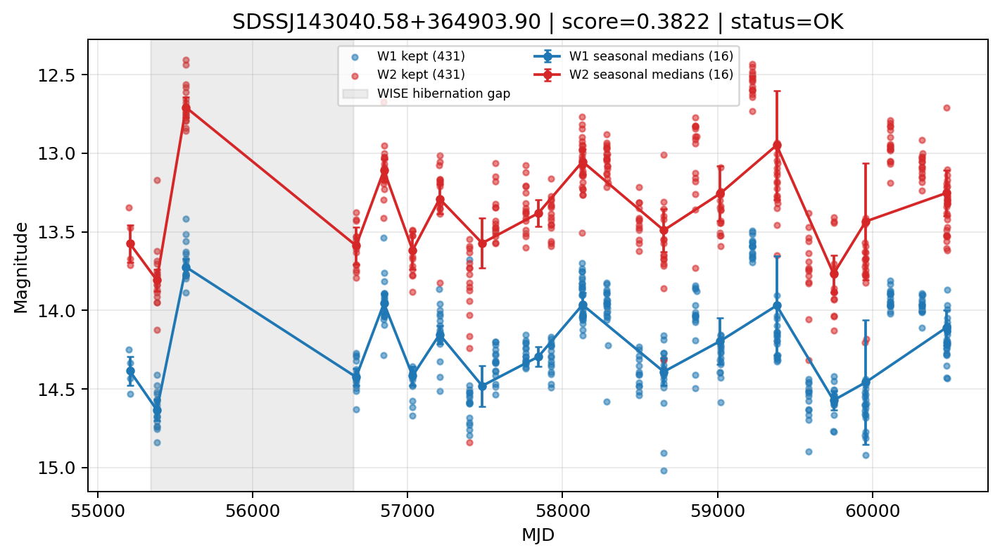

# Candidate Card: SDSSJ143040.58+364903.90 (Rank 101)

## Basic Metadata

- `source_id`: `SDSSJJ143040.58+364903.90`
- `canonical_id`: `SDSSJ143040.58+364903.90`
- `source_id_normalized`: `SDSSJ143040.58+364903.90`
- `score`: `0.382188`
- `status`: `OK`
- `final_label`: `Known AGN`
- `stage_a_positive`: `True`
- `gate_blazar_veto`: `True`
- `gate_wise_qc_pass`: `True`
- `gate_data_sufficient`: `True`
- `decision_trace`: `stage_a_positive=pass;gate_blazar_veto=pass;gate_wise_qc_pass=pass;gate_data_sufficient=pass;gate_state_change_ratio_pass=pass;gate_transient_spike_pass=pass`

## Sampling / Variability Summary

- `n_points` (results table): `304.0`
- `baseline_days`: `5277.42`
- `baseline_years`: `14.449`
- `band_coverage`: `W1,W2`
- `delta_mag`: `0.496`
- `delta_mag_method`: `seasonal_median_flux`

## Coordinates

- `ra`: `217.669100`
- `dec`: `36.817750`
- `coordinate_source`: `benchmark_master`

## WISE Light Curve

## WISE QA / Rejection Accounting

| Metric | Value |
| --- | --- |
| Raw points total | 862 |
| Raw points W1 | 431 |
| Raw points W2 | 431 |
| Kept points total | 862 |
| Kept points W1 | 431 |
| Kept points W2 | 431 |
| Fraction rejected | 0 |
| Reject: missing time | 0 |
| Reject: missing mag | 0 |
| Reject: invalid band | 0 |
| Reject: cc_flags | 0 |
| Reject: qual_frame | 0 |
| Reject: moon_lev | 0 |

### QA Reject Reason Counts

| reject_reason | count |
| --- | --- |
| reject_cc_flags | 0 |
| reject_invalid_band | 0 |
| reject_missing_mag | 0 |
| reject_missing_time | 0 |
| reject_moon_lev | 0 |
| reject_qual_frame | 0 |

## Flag Summary

### `cc_flags`

| value | count | fraction |
| --- | --- | --- |
| 0000 | 862 | 1 |

### `qual_frame`

| value | count | fraction |
| --- | --- | --- |
| <NA> | 862 | 1 |

### `moon_lev`

| value | count | fraction |
| --- | --- | --- |
| 00 | 780 | 0.904872 |
| 0000 | 82 | 0.0951276 |

### `qi_fact`

| value | count | fraction |
| --- | --- | --- |
| 1.0 | 658 | 0.763341 |
| 0.5 | 186 | 0.215777 |
| 0.0 | 18 | 0.0208817 |

### `saa_sep`

| value | count | fraction |
| --- | --- | --- |
| 48.0 | 8 | 0.00928074 |
| 49.38800048828125 | 4 | 0.00464037 |
| 131.0 | 4 | 0.00464037 |
| 92.0 | 4 | 0.00464037 |
| 52.0 | 4 | 0.00464037 |
| 62.0 | 4 | 0.00464037 |
| 87.65899658203125 | 2 | 0.00232019 |
| 35.46200180053711 | 2 | 0.00232019 |

### `ph_qual`

| value | count | fraction |
| --- | --- | --- |
| AA | 480 | 0.556845 |
| AB | 282 | 0.327146 |
| <NA> | 82 | 0.0951276 |
| BB | 10 | 0.0116009 |
| BA | 8 | 0.00928074 |

## Coverage Summary

- Seasonal bins (W1): `16`
- Seasonal bins (W2): `16`
- Pre-gap coverage: `True`
- Post-gap coverage: `True`
- Both-sides coverage: `True`

## Systematics Verdict

- Verdict: `PASS`
- Summary: QA-clean points and seasonal coverage support the observed variability signal.
- QA-dominated signal check: Not obviously dominated by flagged/low-quality points

Reasons:
- Seasonal trend supported by sufficient QA-clean W1/W2 points

## Catalog Checks

- Known blazar match: `NO`
- Known CLAGN match: `NO`
- Gaia metrics: not provided / no match

## Final Label

**Known AGN**

- Rank 101 with score=0.3822
- Sampling: n_points=304.0, baseline_years=14.4487813641, band_coverage=W1,W2
- QA rejection fraction=0.0% (main causes summarized in card QA section)
- Systematics verdict=PASS: QA-clean points and seasonal coverage support the observed variability signal.
- Known blazar catalog match=NO
- Dataset metadata class=clagn

## Reproducibility

- `run_timestamp_utc`: `2026-03-02T06:47:01.885248+00:00`
- `results_file`: `data/real_clagn/benchmark_scores_v2.csv`
- `wise_file`: `data/wise/SDSSJ143040.58+364903.90.csv`
- `score_threshold`: `0.0`
- `t_recall`: `0.3493918746`
