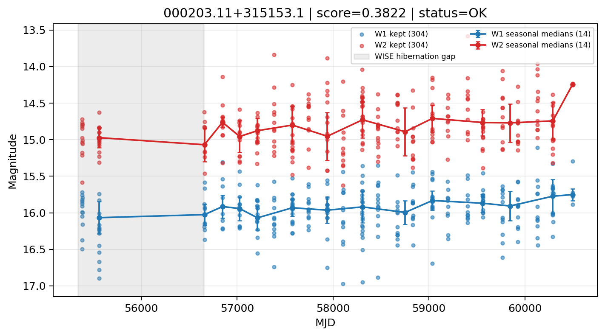

# Candidate Card: 000203.11+315153.1 (Rank 102)

## Basic Metadata

- `source_id`: `000203.11+315153.1`
- `canonical_id`: `000203.11+315153.1`
- `score`: `0.382174`
- `status`: `OK`
- `final_label`: `Known AGN`
- `stage_a_positive`: `True`
- `gate_blazar_veto`: `True`
- `gate_wise_qc_pass`: `True`
- `gate_data_sufficient`: `True`
- `decision_trace`: `stage_a_positive=pass;gate_blazar_veto=pass;gate_wise_qc_pass=pass;gate_data_sufficient=pass;gate_state_change_ratio_pass=pass;gate_transient_spike_pass=pass`

## Sampling / Variability Summary

- `n_points` (results table): `171.0`
- `baseline_days`: `4908.63`
- `baseline_years`: `13.439`
- `band_coverage`: `W1,W2`
- `delta_mag`: `0.397`
- `delta_mag_method`: `seasonal_median_flux`

## Coordinates

- `ra`: `0.512959`
- `dec`: `31.864774`
- `coordinate_source`: `benchmark_master`

## WISE Light Curve

## WISE QA / Rejection Accounting

| Metric | Value |
| --- | --- |
| Raw points total | 608 |
| Raw points W1 | 304 |
| Raw points W2 | 304 |
| Kept points total | 608 |
| Kept points W1 | 304 |
| Kept points W2 | 304 |
| Fraction rejected | 0 |
| Reject: missing time | 0 |
| Reject: missing mag | 0 |
| Reject: invalid band | 0 |
| Reject: cc_flags | 0 |
| Reject: qual_frame | 0 |
| Reject: moon_lev | 0 |

### QA Reject Reason Counts

| reject_reason | count |
| --- | --- |
| reject_cc_flags | 0 |
| reject_invalid_band | 0 |
| reject_missing_mag | 0 |
| reject_missing_time | 0 |
| reject_moon_lev | 0 |
| reject_qual_frame | 0 |

## Flag Summary

### `cc_flags`

| value | count | fraction |
| --- | --- | --- |
| 0000 | 608 | 1 |

### `qual_frame`

| value | count | fraction |
| --- | --- | --- |
| <NA> | 608 | 1 |

### `moon_lev`

| value | count | fraction |
| --- | --- | --- |
| 00 | 552 | 0.907895 |
| 0000 | 56 | 0.0921053 |

### `qi_fact`

| value | count | fraction |
| --- | --- | --- |
| 1.0 | 416 | 0.684211 |
| 0.5 | 178 | 0.292763 |
| 0.0 | 14 | 0.0230263 |

### `saa_sep`

| value | count | fraction |
| --- | --- | --- |
| 108.0 | 4 | 0.00657895 |
| 99.0 | 4 | 0.00657895 |
| 42.0 | 4 | 0.00657895 |
| 93.0 | 4 | 0.00657895 |
| 51.0 | 4 | 0.00657895 |
| 65.73699951171875 | 4 | 0.00657895 |
| 119.0 | 2 | 0.00328947 |
| 66.8740005493164 | 2 | 0.00328947 |

### `ph_qual`

| value | count | fraction |
| --- | --- | --- |
| BC | 176 | 0.289474 |
| BU | 164 | 0.269737 |
| BB | 152 | 0.25 |
| <NA> | 56 | 0.0921053 |
| CU | 20 | 0.0328947 |
| CB | 16 | 0.0263158 |
| CC | 12 | 0.0197368 |
| UB | 8 | 0.0131579 |

## Coverage Summary

- Seasonal bins (W1): `14`
- Seasonal bins (W2): `14`
- Pre-gap coverage: `False`
- Post-gap coverage: `True`
- Both-sides coverage: `False`

## Systematics Verdict

- Verdict: `CAUTION`
- Summary: Variability signal is present but data quality/coverage limitations weaken confidence.
- QA-dominated signal check: Not obviously dominated by flagged/low-quality points

Reasons:
- No clean coverage on both sides of WISE hibernation gap

## Catalog Checks

- Known blazar match: `NO`
- Known CLAGN match: `NO`
- Gaia metrics: not provided / no match

## Final Label

**Known AGN**

- Rank 102 with score=0.3822
- Sampling: n_points=171.0, baseline_years=13.4391066344, band_coverage=W1,W2
- QA rejection fraction=0.0% (main causes summarized in card QA section)
- Systematics verdict=CAUTION: Variability signal is present but data quality/coverage limitations weaken confidence.
- Known blazar catalog match=NO
- Dataset metadata class=normal_agn

## Reproducibility

- `run_timestamp_utc`: `2026-03-02T06:47:01.885248+00:00`
- `results_file`: `data/real_clagn/benchmark_scores_v2.csv`
- `wise_file`: `data/wise/000203.11+315153.1.csv`
- `score_threshold`: `0.0`
- `t_recall`: `0.3493918746`
