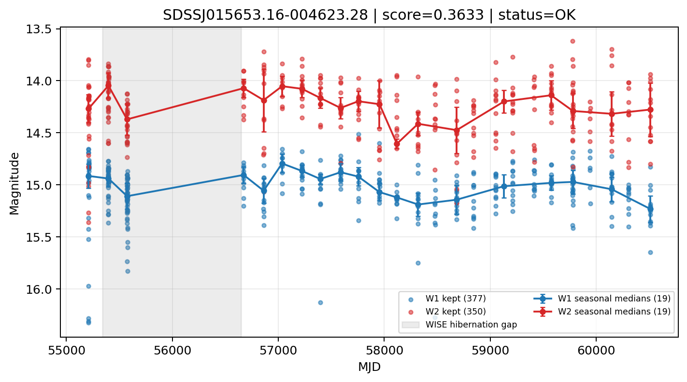

# Candidate Card: SDSSJ015653.16-004623.28 (Rank 105)

## Basic Metadata

- `source_id`: `SDSSJJ015653.16-004623.28`
- `canonical_id`: `SDSSJ015653.16-004623.28`
- `source_id_normalized`: `SDSSJ015653.16-004623.28`
- `score`: `0.363264`
- `status`: `OK`
- `final_label`: `Known AGN`
- `stage_a_positive`: `True`
- `gate_blazar_veto`: `True`
- `gate_wise_qc_pass`: `True`
- `gate_data_sufficient`: `True`
- `decision_trace`: `stage_a_positive=pass;gate_blazar_veto=pass;gate_wise_qc_pass=pass;gate_data_sufficient=pass;gate_state_change_ratio_pass=pass;gate_transient_spike_pass=pass`

## Sampling / Variability Summary

- `n_points` (results table): `217.0`
- `baseline_days`: `5301.01`
- `baseline_years`: `14.513`
- `band_coverage`: `W1,W2`
- `delta_mag`: `-0.289`
- `delta_mag_method`: `seasonal_median_flux`

## Coordinates

- `ra`: `29.221540`
- `dec`: `-0.773140`
- `coordinate_source`: `benchmark_master`

## WISE Light Curve

## WISE QA / Rejection Accounting

| Metric | Value |
| --- | --- |
| Raw points total | 754 |
| Raw points W1 | 377 |
| Raw points W2 | 377 |
| Kept points total | 727 |
| Kept points W1 | 377 |
| Kept points W2 | 350 |
| Fraction rejected | 0.035809 |
| Reject: missing time | 0 |
| Reject: missing mag | 27 |
| Reject: invalid band | 0 |
| Reject: cc_flags | 0 |
| Reject: qual_frame | 0 |
| Reject: moon_lev | 0 |

### QA Reject Reason Counts

| reject_reason | count |
| --- | --- |
| reject_cc_flags | 0 |
| reject_invalid_band | 0 |
| reject_missing_mag | 27 |
| reject_missing_time | 0 |
| reject_moon_lev | 0 |
| reject_qual_frame | 0 |

## Flag Summary

### `cc_flags`

| value | count | fraction |
| --- | --- | --- |
| 0000 | 754 | 1 |

### `qual_frame`

| value | count | fraction |
| --- | --- | --- |
| <NA> | 754 | 1 |

### `moon_lev`

| value | count | fraction |
| --- | --- | --- |
| 00 | 488 | 0.647215 |
| 0000 | 156 | 0.206897 |
| 0111 | 54 | 0.071618 |
| 0011 | 30 | 0.0397878 |
| 11 | 22 | 0.0291777 |
| 01 | 4 | 0.00530504 |

### `qi_fact`

| value | count | fraction |
| --- | --- | --- |
| 1.0 | 538 | 0.713528 |
| 0.5 | 184 | 0.244032 |
| 0.0 | 32 | 0.0424403 |

### `saa_sep`

| value | count | fraction |
| --- | --- | --- |
| 2.0 | 18 | 0.0238727 |
| 105.0 | 18 | 0.0238727 |
| 9.0 | 12 | 0.0159151 |
| 24.0 | 12 | 0.0159151 |
| 21.0 | 12 | 0.0159151 |
| 4.0 | 12 | 0.0159151 |
| 20.0 | 12 | 0.0159151 |
| 63.0 | 12 | 0.0159151 |

### `ph_qual`

| value | count | fraction |
| --- | --- | --- |
| BB | 254 | 0.33687 |
| <NA> | 240 | 0.318302 |
| AB | 198 | 0.262599 |
| BC | 40 | 0.0530504 |
| BU | 12 | 0.0159151 |
| AC | 6 | 0.00795756 |
| AU | 4 | 0.00530504 |

## Coverage Summary

- Seasonal bins (W1): `19`
- Seasonal bins (W2): `19`
- Pre-gap coverage: `True`
- Post-gap coverage: `True`
- Both-sides coverage: `True`

## Systematics Verdict

- Verdict: `PASS`
- Summary: QA-clean points and seasonal coverage support the observed variability signal.
- QA-dominated signal check: Not obviously dominated by flagged/low-quality points

Reasons:
- Seasonal trend supported by sufficient QA-clean W1/W2 points

## Catalog Checks

- Known blazar match: `NO`
- Known CLAGN match: `NO`
- Gaia metrics: not provided / no match

## Final Label

**Known AGN**

- Rank 105 with score=0.3633
- Sampling: n_points=217.0, baseline_years=14.5133635258, band_coverage=W1,W2
- QA rejection fraction=3.6% (main causes summarized in card QA section)
- Systematics verdict=PASS: QA-clean points and seasonal coverage support the observed variability signal.
- Known blazar catalog match=NO
- Dataset metadata class=clagn

## Reproducibility

- `run_timestamp_utc`: `2026-03-02T06:47:01.885248+00:00`
- `results_file`: `data/real_clagn/benchmark_scores_v2.csv`
- `wise_file`: `data/wise/SDSSJ015653.16-004623.28.csv`
- `score_threshold`: `0.0`
- `t_recall`: `0.3493918746`
